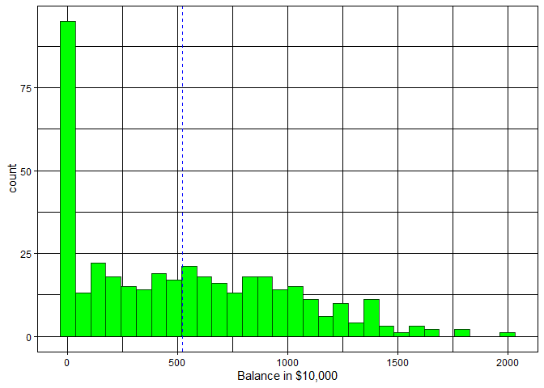
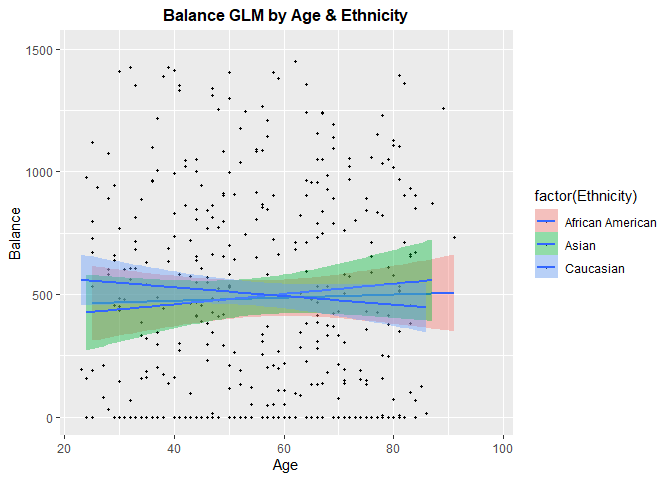
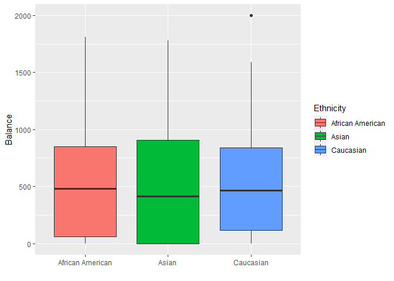

Different Techniches to Analyze Credit Balance
================

How good can we predict Credit balance?

What is the best way to check it?

In order to race our models, we will use the Credit data from ILSR
package.

About this data:

“A simulated data set containing information on ten thousand customers.
The aim here is to predict which customers will default on their credit
card debt.”\*

<font size="2">\*[RDocumentation](https://www.rdocumentation.org/packages/ISLR/versions/1.2/topics/Credit)</font>

# prologue

## set Data

first, let’s set the Environment

libraries:

``` r
library(easypackages)

#collect data:
library(ISLR)
attach(Credit)
#random Forest
library(randomForest)
#other models
libraries('glmnet','Rcmdr','MASS')
#neural network
libraries('tensorflow','keras')
#install_tensorflow() #install_keras() #install_minicomda
#data tools:
libraries('dplyr','tidyr')
libraries('Matrix','scales')
#visual
libraries('ggplot2', 'hrbrthemes','viridis')
libraries('knitr','kableExtra','sjPlot')
```

Now we will see the data’s structure

6 top rows of our table:

``` r
head(Credit[,-1],6) %>%
  kbl() %>%
  kable_material(c("striped", "hover"))
```

<table class=" lightable-material lightable-striped lightable-hover" style="font-family: &quot;Source Sans Pro&quot;, helvetica, sans-serif; margin-left: auto; margin-right: auto;">
<thead>
<tr>
<th style="text-align:right;">
Income
</th>
<th style="text-align:right;">
Limit
</th>
<th style="text-align:right;">
Rating
</th>
<th style="text-align:right;">
Cards
</th>
<th style="text-align:right;">
Age
</th>
<th style="text-align:right;">
Education
</th>
<th style="text-align:left;">
Gender
</th>
<th style="text-align:left;">
Student
</th>
<th style="text-align:left;">
Married
</th>
<th style="text-align:left;">
Ethnicity
</th>
<th style="text-align:right;">
Balance
</th>
</tr>
</thead>
<tbody>
<tr>
<td style="text-align:right;">
14.891
</td>
<td style="text-align:right;">
3606
</td>
<td style="text-align:right;">
283
</td>
<td style="text-align:right;">
2
</td>
<td style="text-align:right;">
34
</td>
<td style="text-align:right;">
11
</td>
<td style="text-align:left;">
Male
</td>
<td style="text-align:left;">
No
</td>
<td style="text-align:left;">
Yes
</td>
<td style="text-align:left;">
Caucasian
</td>
<td style="text-align:right;">
333
</td>
</tr>
<tr>
<td style="text-align:right;">
106.025
</td>
<td style="text-align:right;">
6645
</td>
<td style="text-align:right;">
483
</td>
<td style="text-align:right;">
3
</td>
<td style="text-align:right;">
82
</td>
<td style="text-align:right;">
15
</td>
<td style="text-align:left;">
Female
</td>
<td style="text-align:left;">
Yes
</td>
<td style="text-align:left;">
Yes
</td>
<td style="text-align:left;">
Asian
</td>
<td style="text-align:right;">
903
</td>
</tr>
<tr>
<td style="text-align:right;">
104.593
</td>
<td style="text-align:right;">
7075
</td>
<td style="text-align:right;">
514
</td>
<td style="text-align:right;">
4
</td>
<td style="text-align:right;">
71
</td>
<td style="text-align:right;">
11
</td>
<td style="text-align:left;">
Male
</td>
<td style="text-align:left;">
No
</td>
<td style="text-align:left;">
No
</td>
<td style="text-align:left;">
Asian
</td>
<td style="text-align:right;">
580
</td>
</tr>
<tr>
<td style="text-align:right;">
148.924
</td>
<td style="text-align:right;">
9504
</td>
<td style="text-align:right;">
681
</td>
<td style="text-align:right;">
3
</td>
<td style="text-align:right;">
36
</td>
<td style="text-align:right;">
11
</td>
<td style="text-align:left;">
Female
</td>
<td style="text-align:left;">
No
</td>
<td style="text-align:left;">
No
</td>
<td style="text-align:left;">
Asian
</td>
<td style="text-align:right;">
964
</td>
</tr>
<tr>
<td style="text-align:right;">
55.882
</td>
<td style="text-align:right;">
4897
</td>
<td style="text-align:right;">
357
</td>
<td style="text-align:right;">
2
</td>
<td style="text-align:right;">
68
</td>
<td style="text-align:right;">
16
</td>
<td style="text-align:left;">
Male
</td>
<td style="text-align:left;">
No
</td>
<td style="text-align:left;">
Yes
</td>
<td style="text-align:left;">
Caucasian
</td>
<td style="text-align:right;">
331
</td>
</tr>
<tr>
<td style="text-align:right;">
80.180
</td>
<td style="text-align:right;">
8047
</td>
<td style="text-align:right;">
569
</td>
<td style="text-align:right;">
4
</td>
<td style="text-align:right;">
77
</td>
<td style="text-align:right;">
10
</td>
<td style="text-align:left;">
Male
</td>
<td style="text-align:left;">
No
</td>
<td style="text-align:left;">
No
</td>
<td style="text-align:left;">
Caucasian
</td>
<td style="text-align:right;">
1151
</td>
</tr>
</tbody>
</table>

Here a histogram of he credit balance:

``` r
Credit %>%
  ggplot(aes(x=Balance))+
  geom_histogram(color= alpha("black", 0.7),fill= alpha("green", 0.8) )+
  geom_vline(xintercept= mean(Balance), color= "red",lty= "dashed")+
  theme_bw()+labs(title = "Balance Histogram")+ theme(plot.title = element_text(size=12,hjust = 0.5,face = "bold"))
```

<!-- -->
As we can see, *B**a**l**a**n**c**e* is not normal, and has a right
tail.

trying to predict the Balance, one cal ask about race and/or gender
bias. Does this factor alone predict the result? and age?

``` r
Credit %>%
  ggplot(aes(y=Balance, x=Age,fill= factor(Ethnicity) ))+
  geom_point(size= 0.7)+
  geom_smooth(method = "glm", level= 0.9)+ylim(min(Balance), max(1500))+
  labs(title = "Balance GLM by Age & Ethnicity")+ theme(plot.title = element_text(size=12,hjust = 0.5,face = "bold"))
```

<!-- -->

``` r
Credit %>%
  ggplot(aes(y=Balance, x=Ethnicity,fill= Ethnicity))+
  geom_boxplot(size= 0.7)+labs(x = "")
```

<!-- -->

and what if we will predict by race & gender?

``` r
Credit %>%
  ggplot(aes(y=Balance,x= factor(Ethnicity),fill=factor(Gender) ))+
  geom_point(size= 0.7)+
  geom_boxplot(size= 0.7)+scale_fill_brewer(palette="Dark2")+
  labs(x= "", title = "Balance by Gender & Ethnicity")+theme(plot.title = element_text(size=12,hjust = 0.5,face = "bold"))
```

<!-- -->
Again, there is no clear effect.

One can ask, can all of the weak predictors create a good one together?

So let’s start!

We will ad some variables.

1.  High_deg= *T* if got more than 12 years of education
2.  Age_2= *A**g**e*<sup>2</sup> in order to allaw parabolic age effect
3.  Bride= interaction of gender ans marriage

also, we will set seed and sample train & test.

``` r
Credit <- na.omit(Credit)
n <- nrow(Credit)
set.seed (13)
ntest <- trunc(n / 3)
testid <- sample (1:n, ntest)

Credit<- Credit[,-1] %>%
  mutate(High_deg= Education>=13)%>% 
  mutate(Age_2= Age^2)%>%
  mutate(Bride= (Gender== 'Female')&(Married== 'Yes'))
```

Finally, we can predict with our models

# Models

## Linear

### Classic LM

Assumption: knowing X matrix, Y distributed normal:
(*Y*\|*X*) ∼ *N*(*B**X*,*σ*<sup>2</sup>)

``` r
lmfit <- lm(Balance ~ ., data = Credit[-testid , ])
lmpred <- predict(lmfit , Credit[testid , ])
err_lm<- abs(Credit$Balance[testid] - lmpred)
mean(err_lm)
```

    ## [1] 81.98279

Now, what is our best predictors, if we filter our variables and prevent
over fitting?

### step wise method

Adding each time variable according to AIC method.

``` r
null_model <- lm(Balance ~1, data =  Credit[-testid , ]) #null model for starting Stepwise
step_fit <- stepAIC (null_model,k= 2, direction = "forward",scope = list(lower= formula(null_model),upper= formula(lmfit) ) )
```

    ## Start:  AIC=3272.52
    ## Balance ~ 1
    ## 
    ##             Df Sum of Sq      RSS    AIC
    ## + Rating     1  42983266 12765871 2880.9
    ## + Limit      1  42665558 13083579 2887.5
    ## + Income     1  14067752 41681384 3196.9
    ## + Student    1   2545810 53203327 3262.0
    ## + Cards      1    709007 55040130 3271.1
    ## <none>                   55749137 3272.5
    ## + Bride      1    120789 55628348 3273.9
    ## + Gender     1    108379 55640758 3274.0
    ## + Education  1     70388 55678749 3274.2
    ## + High_deg   1     19601 55729536 3274.4
    ## + Married    1     14332 55734805 3274.4
    ## + Age_2      1      9102 55740035 3274.5
    ## + Age        1      5888 55743249 3274.5
    ## + Ethnicity  2    382851 55366286 3274.7
    ## 
    ## Step:  AIC=2880.93
    ## Balance ~ Rating
    ## 
    ##             Df Sum of Sq      RSS    AIC
    ## + Income     1   6250282  6515589 2703.4
    ## + Student    1   3491531  9274340 2797.6
    ## + Age        1    234960 12530911 2878.0
    ## + Age_2      1    232863 12533008 2878.0
    ## + Cards      1    106184 12659687 2880.7
    ## <none>                   12765871 2880.9
    ## + Gender     1     41244 12724627 2882.1
    ## + Education  1     39023 12726848 2882.1
    ## + High_deg   1     21417 12744454 2882.5
    ## + Bride      1     14981 12750890 2882.6
    ## + Married    1      9318 12756553 2882.7
    ## + Limit      1      2048 12763823 2882.9
    ## + Ethnicity  2     36404 12729467 2884.2
    ## 
    ## Step:  AIC=2703.36
    ## Balance ~ Rating + Income
    ## 
    ##             Df Sum of Sq     RSS    AIC
    ## + Student    1   3707337 2808252 2480.6
    ## + Age_2      1     63016 6452573 2702.8
    ## + Age        1     61830 6453759 2702.8
    ## + Limit      1     51786 6463803 2703.2
    ## <none>                   6515589 2703.4
    ## + Married    1     29598 6485991 2704.1
    ## + High_deg   1     18377 6497212 2704.6
    ## + Education  1     11870 6503719 2704.9
    ## + Cards      1      8424 6507165 2705.0
    ## + Bride      1      5923 6509666 2705.1
    ## + Gender     1       135 6515454 2705.3
    ## + Ethnicity  2        67 6515522 2707.3
    ## 
    ## Step:  AIC=2480.64
    ## Balance ~ Rating + Income + Student
    ## 
    ##             Df Sum of Sq     RSS    AIC
    ## + Limit      1    101900 2706353 2472.8
    ## + Age        1     26842 2781410 2480.1
    ## + Age_2      1     22227 2786026 2480.5
    ## <none>                   2808252 2480.6
    ## + Bride      1     16147 2792106 2481.1
    ## + Married    1     12260 2795992 2481.5
    ## + Cards      1     11145 2797108 2481.6
    ## + Gender     1      6938 2801314 2482.0
    ## + Education  1      4829 2803424 2482.2
    ## + High_deg   1        36 2808216 2482.6
    ## + Ethnicity  2      2507 2805746 2484.4
    ## 
    ## Step:  AIC=2472.77
    ## Balance ~ Rating + Income + Student + Limit
    ## 
    ##             Df Sum of Sq     RSS    AIC
    ## + Cards      1    106493 2599860 2464.1
    ## + Age        1     21700 2684652 2472.6
    ## + Bride      1     20840 2685512 2472.7
    ## <none>                   2706353 2472.8
    ## + Age_2      1     18270 2688083 2473.0
    ## + Education  1     10189 2696164 2473.8
    ## + Gender     1      9232 2697120 2473.9
    ## + Married    1      8696 2697657 2473.9
    ## + High_deg   1      1417 2704936 2474.6
    ## + Ethnicity  2      2384 2703969 2476.5
    ## 
    ## Step:  AIC=2464.05
    ## Balance ~ Rating + Income + Student + Limit + Cards
    ## 
    ##             Df Sum of Sq     RSS    AIC
    ## <none>                   2599860 2464.1
    ## + Age        1   18750.9 2581109 2464.1
    ## + Age_2      1   14297.8 2585562 2464.6
    ## + Bride      1   13594.8 2586265 2464.7
    ## + Gender     1    9221.8 2590638 2465.1
    ## + Education  1    7502.7 2592357 2465.3
    ## + Married    1    2729.9 2597130 2465.8
    ## + High_deg   1     206.5 2599653 2466.0
    ## + Ethnicity  2    2144.3 2597716 2467.8

``` r
step_pred <- predict(step_fit , Credit[testid , ])
err_step<- abs(Credit$Balance[testid] - step_pred)
mean(abs(err_step))
```

    ## [1] 80.93863

lets see the regression vs the step wise. it is clear that the AIC
method choose only the variables with P-value \< 5 %

``` r
tab_model(lmfit,step_fit, show.ci= F,show.se = T,show.loglik= T)
```

<table style="border-collapse:collapse; border:none;">
<tr>
<th style="border-top: double; text-align:center; font-style:normal; font-weight:bold; padding:0.2cm;  text-align:left; ">
 
</th>
<th colspan="3" style="border-top: double; text-align:center; font-style:normal; font-weight:bold; padding:0.2cm; ">
Balance
</th>
<th colspan="3" style="border-top: double; text-align:center; font-style:normal; font-weight:bold; padding:0.2cm; ">
Balance
</th>
</tr>
<tr>
<td style=" text-align:center; border-bottom:1px solid; font-style:italic; font-weight:normal;  text-align:left; ">
Predictors
</td>
<td style=" text-align:center; border-bottom:1px solid; font-style:italic; font-weight:normal;  ">
Estimates
</td>
<td style=" text-align:center; border-bottom:1px solid; font-style:italic; font-weight:normal;  ">
std. Error
</td>
<td style=" text-align:center; border-bottom:1px solid; font-style:italic; font-weight:normal;  ">
p
</td>
<td style=" text-align:center; border-bottom:1px solid; font-style:italic; font-weight:normal;  ">
Estimates
</td>
<td style=" text-align:center; border-bottom:1px solid; font-style:italic; font-weight:normal;  ">
std. Error
</td>
<td style=" text-align:center; border-bottom:1px solid; font-style:italic; font-weight:normal;  col7">
p
</td>
</tr>
<tr>
<td style=" padding:0.2cm; text-align:left; vertical-align:top; text-align:left; ">
(Intercept)
</td>
<td style=" padding:0.2cm; text-align:left; vertical-align:top; text-align:center;  ">
-384.03
</td>
<td style=" padding:0.2cm; text-align:left; vertical-align:top; text-align:center;  ">
78.39
</td>
<td style=" padding:0.2cm; text-align:left; vertical-align:top; text-align:center;  ">
<strong>\<0.001</strong>
</td>
<td style=" padding:0.2cm; text-align:left; vertical-align:top; text-align:center;  ">
-530.91
</td>
<td style=" padding:0.2cm; text-align:left; vertical-align:top; text-align:center;  ">
23.67
</td>
<td style=" padding:0.2cm; text-align:left; vertical-align:top; text-align:center;  col7">
<strong>\<0.001</strong>
</td>
</tr>
<tr>
<td style=" padding:0.2cm; text-align:left; vertical-align:top; text-align:left; ">
Income
</td>
<td style=" padding:0.2cm; text-align:left; vertical-align:top; text-align:center;  ">
-7.55
</td>
<td style=" padding:0.2cm; text-align:left; vertical-align:top; text-align:center;  ">
0.30
</td>
<td style=" padding:0.2cm; text-align:left; vertical-align:top; text-align:center;  ">
<strong>\<0.001</strong>
</td>
<td style=" padding:0.2cm; text-align:left; vertical-align:top; text-align:center;  ">
-7.56
</td>
<td style=" padding:0.2cm; text-align:left; vertical-align:top; text-align:center;  ">
0.30
</td>
<td style=" padding:0.2cm; text-align:left; vertical-align:top; text-align:center;  col7">
<strong>\<0.001</strong>
</td>
</tr>
<tr>
<td style=" padding:0.2cm; text-align:left; vertical-align:top; text-align:left; ">
Limit
</td>
<td style=" padding:0.2cm; text-align:left; vertical-align:top; text-align:center;  ">
0.17
</td>
<td style=" padding:0.2cm; text-align:left; vertical-align:top; text-align:center;  ">
0.04
</td>
<td style=" padding:0.2cm; text-align:left; vertical-align:top; text-align:center;  ">
<strong>\<0.001</strong>
</td>
<td style=" padding:0.2cm; text-align:left; vertical-align:top; text-align:center;  ">
0.18
</td>
<td style=" padding:0.2cm; text-align:left; vertical-align:top; text-align:center;  ">
0.04
</td>
<td style=" padding:0.2cm; text-align:left; vertical-align:top; text-align:center;  col7">
<strong>\<0.001</strong>
</td>
</tr>
<tr>
<td style=" padding:0.2cm; text-align:left; vertical-align:top; text-align:left; ">
Rating
</td>
<td style=" padding:0.2cm; text-align:left; vertical-align:top; text-align:center;  ">
1.40
</td>
<td style=" padding:0.2cm; text-align:left; vertical-align:top; text-align:center;  ">
0.60
</td>
<td style=" padding:0.2cm; text-align:left; vertical-align:top; text-align:center;  ">
<strong>0.020</strong>
</td>
<td style=" padding:0.2cm; text-align:left; vertical-align:top; text-align:center;  ">
1.33
</td>
<td style=" padding:0.2cm; text-align:left; vertical-align:top; text-align:center;  ">
0.59
</td>
<td style=" padding:0.2cm; text-align:left; vertical-align:top; text-align:center;  col7">
<strong>0.024</strong>
</td>
</tr>
<tr>
<td style=" padding:0.2cm; text-align:left; vertical-align:top; text-align:left; ">
Cards
</td>
<td style=" padding:0.2cm; text-align:left; vertical-align:top; text-align:center;  ">
17.55
</td>
<td style=" padding:0.2cm; text-align:left; vertical-align:top; text-align:center;  ">
5.50
</td>
<td style=" padding:0.2cm; text-align:left; vertical-align:top; text-align:center;  ">
<strong>0.002</strong>
</td>
<td style=" padding:0.2cm; text-align:left; vertical-align:top; text-align:center;  ">
17.54
</td>
<td style=" padding:0.2cm; text-align:left; vertical-align:top; text-align:center;  ">
5.36
</td>
<td style=" padding:0.2cm; text-align:left; vertical-align:top; text-align:center;  col7">
<strong>0.001</strong>
</td>
</tr>
<tr>
<td style=" padding:0.2cm; text-align:left; vertical-align:top; text-align:left; ">
Age
</td>
<td style=" padding:0.2cm; text-align:left; vertical-align:top; text-align:center;  ">
-3.52
</td>
<td style=" padding:0.2cm; text-align:left; vertical-align:top; text-align:center;  ">
2.58
</td>
<td style=" padding:0.2cm; text-align:left; vertical-align:top; text-align:center;  ">
0.173
</td>
<td style=" padding:0.2cm; text-align:left; vertical-align:top; text-align:center;  ">
</td>
<td style=" padding:0.2cm; text-align:left; vertical-align:top; text-align:center;  ">
</td>
<td style=" padding:0.2cm; text-align:left; vertical-align:top; text-align:center;  col7">
</td>
</tr>
<tr>
<td style=" padding:0.2cm; text-align:left; vertical-align:top; text-align:left; ">
Education
</td>
<td style=" padding:0.2cm; text-align:left; vertical-align:top; text-align:center;  ">
-4.55
</td>
<td style=" padding:0.2cm; text-align:left; vertical-align:top; text-align:center;  ">
3.61
</td>
<td style=" padding:0.2cm; text-align:left; vertical-align:top; text-align:center;  ">
0.208
</td>
<td style=" padding:0.2cm; text-align:left; vertical-align:top; text-align:center;  ">
</td>
<td style=" padding:0.2cm; text-align:left; vertical-align:top; text-align:center;  ">
</td>
<td style=" padding:0.2cm; text-align:left; vertical-align:top; text-align:center;  col7">
</td>
</tr>
<tr>
<td style=" padding:0.2cm; text-align:left; vertical-align:top; text-align:left; ">
Gender \[Female\]
</td>
<td style=" padding:0.2cm; text-align:left; vertical-align:top; text-align:center;  ">
-4.60
</td>
<td style=" padding:0.2cm; text-align:left; vertical-align:top; text-align:center;  ">
20.49
</td>
<td style=" padding:0.2cm; text-align:left; vertical-align:top; text-align:center;  ">
0.823
</td>
<td style=" padding:0.2cm; text-align:left; vertical-align:top; text-align:center;  ">
</td>
<td style=" padding:0.2cm; text-align:left; vertical-align:top; text-align:center;  ">
</td>
<td style=" padding:0.2cm; text-align:left; vertical-align:top; text-align:center;  col7">
</td>
</tr>
<tr>
<td style=" padding:0.2cm; text-align:left; vertical-align:top; text-align:left; ">
Student \[Yes\]
</td>
<td style=" padding:0.2cm; text-align:left; vertical-align:top; text-align:center;  ">
421.42
</td>
<td style=" padding:0.2cm; text-align:left; vertical-align:top; text-align:center;  ">
21.75
</td>
<td style=" padding:0.2cm; text-align:left; vertical-align:top; text-align:center;  ">
<strong>\<0.001</strong>
</td>
<td style=" padding:0.2cm; text-align:left; vertical-align:top; text-align:center;  ">
418.37
</td>
<td style=" padding:0.2cm; text-align:left; vertical-align:top; text-align:center;  ">
21.42
</td>
<td style=" padding:0.2cm; text-align:left; vertical-align:top; text-align:center;  col7">
<strong>\<0.001</strong>
</td>
</tr>
<tr>
<td style=" padding:0.2cm; text-align:left; vertical-align:top; text-align:left; ">
Married \[Yes\]
</td>
<td style=" padding:0.2cm; text-align:left; vertical-align:top; text-align:center;  ">
-3.29
</td>
<td style=" padding:0.2cm; text-align:left; vertical-align:top; text-align:center;  ">
18.24
</td>
<td style=" padding:0.2cm; text-align:left; vertical-align:top; text-align:center;  ">
0.857
</td>
<td style=" padding:0.2cm; text-align:left; vertical-align:top; text-align:center;  ">
</td>
<td style=" padding:0.2cm; text-align:left; vertical-align:top; text-align:center;  ">
</td>
<td style=" padding:0.2cm; text-align:left; vertical-align:top; text-align:center;  col7">
</td>
</tr>
<tr>
<td style=" padding:0.2cm; text-align:left; vertical-align:top; text-align:left; ">
Ethnicity \[Asian\]
</td>
<td style=" padding:0.2cm; text-align:left; vertical-align:top; text-align:center;  ">
7.39
</td>
<td style=" padding:0.2cm; text-align:left; vertical-align:top; text-align:center;  ">
17.56
</td>
<td style=" padding:0.2cm; text-align:left; vertical-align:top; text-align:center;  ">
0.674
</td>
<td style=" padding:0.2cm; text-align:left; vertical-align:top; text-align:center;  ">
</td>
<td style=" padding:0.2cm; text-align:left; vertical-align:top; text-align:center;  ">
</td>
<td style=" padding:0.2cm; text-align:left; vertical-align:top; text-align:center;  col7">
</td>
</tr>
<tr>
<td style=" padding:0.2cm; text-align:left; vertical-align:top; text-align:left; ">
Ethnicity \[Caucasian\]
</td>
<td style=" padding:0.2cm; text-align:left; vertical-align:top; text-align:center;  ">
11.48
</td>
<td style=" padding:0.2cm; text-align:left; vertical-align:top; text-align:center;  ">
15.01
</td>
<td style=" padding:0.2cm; text-align:left; vertical-align:top; text-align:center;  ">
0.445
</td>
<td style=" padding:0.2cm; text-align:left; vertical-align:top; text-align:center;  ">
</td>
<td style=" padding:0.2cm; text-align:left; vertical-align:top; text-align:center;  ">
</td>
<td style=" padding:0.2cm; text-align:left; vertical-align:top; text-align:center;  col7">
</td>
</tr>
<tr>
<td style=" padding:0.2cm; text-align:left; vertical-align:top; text-align:left; ">
High degTRUE
</td>
<td style=" padding:0.2cm; text-align:left; vertical-align:top; text-align:center;  ">
23.35
</td>
<td style=" padding:0.2cm; text-align:left; vertical-align:top; text-align:center;  ">
23.50
</td>
<td style=" padding:0.2cm; text-align:left; vertical-align:top; text-align:center;  ">
0.321
</td>
<td style=" padding:0.2cm; text-align:left; vertical-align:top; text-align:center;  ">
</td>
<td style=" padding:0.2cm; text-align:left; vertical-align:top; text-align:center;  ">
</td>
<td style=" padding:0.2cm; text-align:left; vertical-align:top; text-align:center;  col7">
</td>
</tr>
<tr>
<td style=" padding:0.2cm; text-align:left; vertical-align:top; text-align:left; ">
Age 2
</td>
<td style=" padding:0.2cm; text-align:left; vertical-align:top; text-align:center;  ">
0.03
</td>
<td style=" padding:0.2cm; text-align:left; vertical-align:top; text-align:center;  ">
0.02
</td>
<td style=" padding:0.2cm; text-align:left; vertical-align:top; text-align:center;  ">
0.249
</td>
<td style=" padding:0.2cm; text-align:left; vertical-align:top; text-align:center;  ">
</td>
<td style=" padding:0.2cm; text-align:left; vertical-align:top; text-align:center;  ">
</td>
<td style=" padding:0.2cm; text-align:left; vertical-align:top; text-align:center;  col7">
</td>
</tr>
<tr>
<td style=" padding:0.2cm; text-align:left; vertical-align:top; text-align:left; ">
BrideTRUE
</td>
<td style=" padding:0.2cm; text-align:left; vertical-align:top; text-align:center;  ">
-10.57
</td>
<td style=" padding:0.2cm; text-align:left; vertical-align:top; text-align:center;  ">
25.99
</td>
<td style=" padding:0.2cm; text-align:left; vertical-align:top; text-align:center;  ">
0.685
</td>
<td style=" padding:0.2cm; text-align:left; vertical-align:top; text-align:center;  ">
</td>
<td style=" padding:0.2cm; text-align:left; vertical-align:top; text-align:center;  ">
</td>
<td style=" padding:0.2cm; text-align:left; vertical-align:top; text-align:center;  col7">
</td>
</tr>
<tr>
<td style=" padding:0.2cm; text-align:left; vertical-align:top; text-align:left; padding-top:0.1cm; padding-bottom:0.1cm; border-top:1px solid;">
Observations
</td>
<td style=" padding:0.2cm; text-align:left; vertical-align:top; padding-top:0.1cm; padding-bottom:0.1cm; text-align:left; border-top:1px solid;" colspan="3">
267
</td>
<td style=" padding:0.2cm; text-align:left; vertical-align:top; padding-top:0.1cm; padding-bottom:0.1cm; text-align:left; border-top:1px solid;" colspan="3">
267
</td>
</tr>
<tr>
<td style=" padding:0.2cm; text-align:left; vertical-align:top; text-align:left; padding-top:0.1cm; padding-bottom:0.1cm;">
R<sup>2</sup> / R<sup>2</sup> adjusted
</td>
<td style=" padding:0.2cm; text-align:left; vertical-align:top; padding-top:0.1cm; padding-bottom:0.1cm; text-align:left;" colspan="3">
0.955 / 0.952
</td>
<td style=" padding:0.2cm; text-align:left; vertical-align:top; padding-top:0.1cm; padding-bottom:0.1cm; text-align:left;" colspan="3">
0.953 / 0.952
</td>
</tr>
<tr>
<td style=" padding:0.2cm; text-align:left; vertical-align:top; text-align:left; padding-top:0.1cm; padding-bottom:0.1cm;">
log-Likelihood
</td>
<td style=" padding:0.2cm; text-align:left; vertical-align:top; padding-top:0.1cm; padding-bottom:0.1cm; text-align:left;" colspan="3">
-1601.268
</td>
<td style=" padding:0.2cm; text-align:left; vertical-align:top; padding-top:0.1cm; padding-bottom:0.1cm; text-align:left;" colspan="3">
-1604.883
</td>
</tr>
</table>

### lasso

Assumption

(*Y*\|*X*) ∼ *N*(*B**X*,*σ*<sup>2</sup>), like LM.

But this time we use shrinkage method in order to reduce variance & over
fitting. so our minimizing function define as

*R**S**S* + *λ**Σ*<sub>*j* = 1</sub><sup>*p*</sup>\|*β*<sub>*j*</sub>\|

when *p* = *l**e**n**g**t**h*(*β*) and *λ* is a hyper parameter.

``` r
x <- scale(model.matrix(Balance ~ . - 1, data = Credit))
y <- Credit$Balance
#glmnet
cvfit <- cv.glmnet(x[-testid , ], y[-testid], type.measure = "mae")
```

this time, we need to set our hipper parameter, *λ* that lead to the
minimum mean cross-validated error\*

<font size="2"> [\*see
also](https://cran.r-project.org/web/packages/glmnet/vignettes/glmnet.pdf)
</font>

``` r
lambda.min<- cvfit$lambda.min
cpred <- predict(cvfit, x[testid , ], s = "lambda.min")
err_cp<- abs(y[testid] - cpred)
mean(abs(err_cp))
```

    ## [1] 81.0397

## Trees

The main algorithm in randomforest, adaboost, etc is splitting the data
each time into two samples, in the most effective way by reevaluating
the error function.

Mathematicaly, the tree assume a model of form

$f(x)= ^M\_{m=1} c_m\*I(x R_m) $

while *M* is the numbers of groups, R_m is the specific group &
*c*<sub>*m*</sub> is the parameter of the model.

for a small tree,This is a very weak learner, but it can be used to
create deeper learning. too big tree can lead to over-feeting.

### Random Forest

A mean of n-tree

``` r
rf_s<- randomForest(formula= Balance ~ ., data = Credit[-testid , ],
                    ntree= 1500, mtry= 6, na.action = na.omit )

pred_s<- predict(rf_s,newdata = Credit[-testid , ] )
rf_pred <- predict(rf_s , Credit[testid , ], s = "lambda.min")
err_rf<- abs(y[testid] - rf_pred)
mean(abs(err_rf))
```

    ## [1] 101.1024

### Adaboost

A mean of n-tree with weights

``` r
norm_y<- 2*y/(max(y)+min(y))-1

adb_s<-randomForest(formula= Balance ~ ., data = Credit[-testid , ],
                    ntree= 1500, mtry= 14, na.action = na.omit, importance= T )

pred_abs <- predict(adb_s , Credit[testid , ], s = "lambda.min")
pred_abs<- head(as.vector(pred_abs),133)
err_adb<- abs(y[testid] - pred_abs)
mean(abs(err_adb))
```

    ## [1] 85.32504

## Neural Network

Creating of network of nonlinear function and weights, that evaluate the
prediction.

this method is the hardest to present due to the coplexativity of the
net.

### set seed

we set our net using 2 layers of relu and then a dropout

``` r
modnn <- keras_model_sequential () %>%
  layer_dense(units = 50, activation = "relu",
              input_shape = ncol(x)) %>%
  layer_dropout(rate = 0.4) %>%
  layer_dense(units = 20, activation = 'relu') %>%
  layer_dropout(rate = 0.2) %>%
  layer_dense(units = 1)
```

    ## Loaded Tensorflow version 2.7.0

``` r
modnn %>% compile(loss = "mse",
                  optimizer = optimizer_rmsprop (),
                  metrics = list("mean_absolute_error")
                  )
modnn
```

    ## Model
    ## Model: "sequential"
    ## ________________________________________________________________________________
    ##  Layer (type)                       Output Shape                    Param #     
    ## ================================================================================
    ##  dense_2 (Dense)                    (None, 50)                      800         
    ##                                                                                 
    ##  dropout_1 (Dropout)                (None, 50)                      0           
    ##                                                                                 
    ##  dense_1 (Dense)                    (None, 20)                      1020        
    ##                                                                                 
    ##  dropout (Dropout)                  (None, 20)                      0           
    ##                                                                                 
    ##  dense (Dense)                      (None, 1)                       21          
    ##                                                                                 
    ## ================================================================================
    ## Total params: 1,841
    ## Trainable params: 1,841
    ## Non-trainable params: 0
    ## ________________________________________________________________________________

Using the net:

``` r
mod_Credit <- modnn %>% fit(
  x[-testid , ], y[-testid], epochs = 1500, batch_size = 32,
  validation_data = list(x[testid , ], y[testid ])
)
```

### Keras result

``` r
#show Keras result
summary(mod_Credit)
```

    ##         Length Class  Mode
    ## params  3      -none- list
    ## metrics 4      -none- list

``` r
plot(mod_Credit)+theme_gray()+
  theme(plot.caption = element_text(size = 6,hjust= 0),
        legend.position = c(.95, .95),
    legend.justification = c("right", "top"),
    legend.box.just = "right")#,
```

    ## `geom_smooth()` using formula 'y ~ x'

<!-- -->

``` r
    #legend.margin = margin(6, 6, 6, 6))

nnpred <- predict(modnn , x[testid , ])
err_nn<- abs(y[testid] - nnpred)
mean(abs(err_nn))
```

    ## [1] 21.96334

## Sum all result

We used the same seed to test all methods, so now we can compare the
error of each data.

-   Each time this scipt were running, we got different result, due to
    randomness of *t**e**s**t**i**d*, and of the deep learning models

``` r
my_pred<- data.frame(c(lmpred,cpred,rf_pred,pred_abs,nnpred)) #pred data frame
m<- length(testid)
modl_nam<-c("Linear", "Lasso", "Random_forrest","Adaboost","Neural_network")
my_pred$Model<- c(rep(modl_nam[1],m),rep(modl_nam[2],m),rep(modl_nam[3],m),
                  rep(modl_nam[4],m),rep(modl_nam[5],m) ) #naming each model in pred data frame
my_pred$Balance<-rep(y[testid],5)
colnames(my_pred)[1]<- "Predict"

my_err<- as.data.frame(cbind(err_lm,err_cp,err_rf,err_adb,err_nn))
my_var<- colMeans(my_err[sapply(my_err, is.numeric)]) 

#caption- var of the models alphabeticaly
order_script<- order(modl_nam)
script<- paste("var of models: ",modl_nam[order_script[1]], "is", round(my_var[order_script[1]],3))
for (i in order_script[-1]) {
  script<- paste(script, ", ", modl_nam[i], "is", round(my_var[i],3) )}

my_pred %>%
  ggplot( aes(x= Model ,y=Balance-Predict, fill= Model)) +
  geom_violin()+
  scale_fill_viridis(discrete = TRUE, alpha=0.6) +
  geom_jitter(color="black", size=0.45) +
  theme_dark() +
  theme(
    legend.position="none",
    plot.title = element_text(size=12,hjust = 0.5,face = "bold"),
    plot.caption = element_text(size = 8,hjust= 0),
    axis.title = element_text(size = 8))+ ylab("Error")+
  labs(title = "Error Violin",caption = script)
```

<!-- -->
# Discussion

If the winner of the error in prediction were not that clear, our
*H*<sub>0</sub> would will be the linear model, since it’s prediction is
the easiest to understand and present.

Amazingly, <b>the LM(var 82) did nothing compare to the NN(var 22)</b>,
with only almost quarter of the linear’s error.

At the same time, Lasso(var 81) did only slightly better then the liner,
both better than the ADB(var 85).

Another clear effect is this of the ADB comparing to the RF(var 101),
which had the worse prediction variance. The effect if weights is the
main advantage of ADB over RF.

To sum it up, though rerunning of this script might create a different
result, this modeling comparing to data frame prediction show us how
<b>using weights or regulation in models can get better models comparing
to the same model. In contrast, some time different models create worse
prediction than the unregulated ones</b>, like RF and LM. The most
complex model, NN, overcome all models, and known to have huge
potential, as long as understanding the effect of each variable is not
needed.

<b>In my opinion, the best models to predict with here are the Lasso and
the Neural network.</b>
