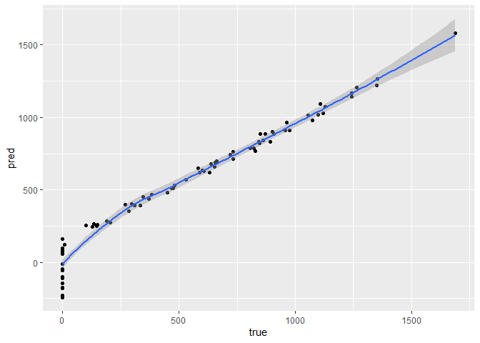
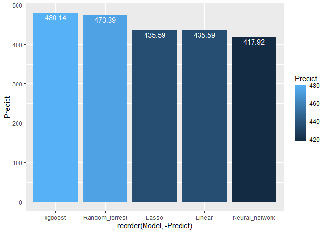

Different Techniches to Analyze Credit Balance
================

How good can we predict Credit balance?

What is the best way to check it?

In order to race our models, we will use the Credit data from ILSR
package.

About this data:

“A simulated data set containing information on ten thousand customers.
The aim here is to predict which customers will default on their credit
card debt.”\*

<font size="2">\*[RDocumentation](https://www.rdocumentation.org/packages/ISLR/versions/1.2/topics/Credit)</font>

# prologue

## set Data

first, let’s set the Environment

libraries:

``` r
library(easypackages)
library(tidymodels)
library(tidyverse)
#collect data:
library(ISLR)
attach(Credit)
#random Forest
library(randomForest)
library(doParallel)
#other models
libraries('glmnet','Rcmdr','MASS')
#neural network
libraries('tensorflow','keras')
#install_tensorflow() #install_keras() #install_minicomda
#data tools:
libraries('dplyr','tidyr')
libraries('Matrix','scales')
#visual
libraries('hrbrthemes','viridis')
libraries('knitr','kableExtra','sjPlot')
```

Now we will see the data’s structure

6 top rows of our table:

``` r
head(Credit[,-1],6) %>%
  kbl() %>%
  kable_material(c("striped", "hover"))
```

<table class=" lightable-material lightable-striped lightable-hover" style="font-family: &quot;Source Sans Pro&quot;, helvetica, sans-serif; margin-left: auto; margin-right: auto;">
<thead>
<tr>
<th style="text-align:right;">
Income
</th>
<th style="text-align:right;">
Limit
</th>
<th style="text-align:right;">
Rating
</th>
<th style="text-align:right;">
Cards
</th>
<th style="text-align:right;">
Age
</th>
<th style="text-align:right;">
Education
</th>
<th style="text-align:left;">
Gender
</th>
<th style="text-align:left;">
Student
</th>
<th style="text-align:left;">
Married
</th>
<th style="text-align:left;">
Ethnicity
</th>
<th style="text-align:right;">
Balance
</th>
</tr>
</thead>
<tbody>
<tr>
<td style="text-align:right;">
14.891
</td>
<td style="text-align:right;">
3606
</td>
<td style="text-align:right;">
283
</td>
<td style="text-align:right;">
2
</td>
<td style="text-align:right;">
34
</td>
<td style="text-align:right;">
11
</td>
<td style="text-align:left;">
Male
</td>
<td style="text-align:left;">
No
</td>
<td style="text-align:left;">
Yes
</td>
<td style="text-align:left;">
Caucasian
</td>
<td style="text-align:right;">
333
</td>
</tr>
<tr>
<td style="text-align:right;">
106.025
</td>
<td style="text-align:right;">
6645
</td>
<td style="text-align:right;">
483
</td>
<td style="text-align:right;">
3
</td>
<td style="text-align:right;">
82
</td>
<td style="text-align:right;">
15
</td>
<td style="text-align:left;">
Female
</td>
<td style="text-align:left;">
Yes
</td>
<td style="text-align:left;">
Yes
</td>
<td style="text-align:left;">
Asian
</td>
<td style="text-align:right;">
903
</td>
</tr>
<tr>
<td style="text-align:right;">
104.593
</td>
<td style="text-align:right;">
7075
</td>
<td style="text-align:right;">
514
</td>
<td style="text-align:right;">
4
</td>
<td style="text-align:right;">
71
</td>
<td style="text-align:right;">
11
</td>
<td style="text-align:left;">
Male
</td>
<td style="text-align:left;">
No
</td>
<td style="text-align:left;">
No
</td>
<td style="text-align:left;">
Asian
</td>
<td style="text-align:right;">
580
</td>
</tr>
<tr>
<td style="text-align:right;">
148.924
</td>
<td style="text-align:right;">
9504
</td>
<td style="text-align:right;">
681
</td>
<td style="text-align:right;">
3
</td>
<td style="text-align:right;">
36
</td>
<td style="text-align:right;">
11
</td>
<td style="text-align:left;">
Female
</td>
<td style="text-align:left;">
No
</td>
<td style="text-align:left;">
No
</td>
<td style="text-align:left;">
Asian
</td>
<td style="text-align:right;">
964
</td>
</tr>
<tr>
<td style="text-align:right;">
55.882
</td>
<td style="text-align:right;">
4897
</td>
<td style="text-align:right;">
357
</td>
<td style="text-align:right;">
2
</td>
<td style="text-align:right;">
68
</td>
<td style="text-align:right;">
16
</td>
<td style="text-align:left;">
Male
</td>
<td style="text-align:left;">
No
</td>
<td style="text-align:left;">
Yes
</td>
<td style="text-align:left;">
Caucasian
</td>
<td style="text-align:right;">
331
</td>
</tr>
<tr>
<td style="text-align:right;">
80.180
</td>
<td style="text-align:right;">
8047
</td>
<td style="text-align:right;">
569
</td>
<td style="text-align:right;">
4
</td>
<td style="text-align:right;">
77
</td>
<td style="text-align:right;">
10
</td>
<td style="text-align:left;">
Male
</td>
<td style="text-align:left;">
No
</td>
<td style="text-align:left;">
No
</td>
<td style="text-align:left;">
Caucasian
</td>
<td style="text-align:right;">
1151
</td>
</tr>
</tbody>
</table>

Here a histogram of he credit balance:

``` r
Credit %>%
  ggplot(aes(x=Balance))+
  geom_histogram(color= alpha("black", 0.7),fill= alpha("darkgreen", 0.8) )+
  geom_vline(xintercept= mean(Balance), color= "red",lty= "dashed")+
  theme_bw()+labs(title = "Balance Histogram")+ theme(plot.title = element_text(size=12,hjust = 0.5,face = "bold"))
```

<!-- -->
As we can see, $Balance$ is not normal, and has a right tail.

trying to predict the Balance, one cal ask about race and/or gender
bias. Does this factor alone predict the result? and age?

``` r
Credit %>%
  ggplot(aes(y=Balance, x=Age,fill= factor(Ethnicity) ))+
  geom_point(size= 0.7)+
  geom_smooth(method = "glm", level= 0.9, color= "black")+ylim(min(Balance), max(1500))+
  labs(title = "Balance GLM by Age & Ethnicity")+ theme(plot.title = element_text(size=12,hjust = 0.5,face = "bold"))
```

<!-- -->

``` r
Credit %>%
  ggplot(aes(y=Balance, x=Ethnicity,fill= Ethnicity))+
  geom_boxplot(size= 0.7)+labs(x = "")
```

<!-- -->

and what if we will predict by race & gender?

``` r
Credit %>%
  ggplot(aes(y=Balance,x= factor(Ethnicity),fill=factor(Gender) ))+
  geom_point(size= 0.7)+
  geom_boxplot(size= 0.7)+scale_fill_brewer(palette="Dark2")+
  labs(x= "", title = "Balance by Gender & Ethnicity")+theme(plot.title = element_text(size=12,hjust = 0.5,face = "bold"))
```

<!-- -->
Again, there is no clear effect.

One can ask, can all of the weak predictors create a good one together?

So let’s start!

We will ad some variables.

1.  High_deg= $T$ if got more than 12 years of education
2.  Age_2= $Age^2$ in order to allaw parabolic age effect
3.  Bride= interaction of gender ans marriage

also, we will set seed and sample train & test.

``` r
Credit<- Credit%>%
  mutate(High_deg= Education>=13,
  Age_2= Age^2,
  Bride= (Gender== 'Female')&(Married== 'Yes'))
```

``` r
credit_split<- initial_split(Credit, prop = 0.8)
credit_train_split<- training(credit_split)
credit_test_split<-  testing(credit_split)

dolche_de_leche<- function(df) {
  recipe(data=  df, Balance~.) %>% 
  update_role(Balance, new_role = "outcome") %>%
  step_novel    (all_nominal(), -all_outcomes(),  new_level = "the_rest")%>% 
  step_unknown  (all_nominal(), -all_outcomes(),  new_level= "step_unknown" )%>%
  step_other    (all_nominal(), -all_outcomes(), other = 'step_other', threshold = 10)%>%
  step_nzv      (all_numeric(), -all_outcomes(),freq_cut = 99/1) %>% 
  step_normalize(all_numeric(), -all_outcomes())
  }

dolche_credit_train<-credit_train_split%>% dolche_de_leche()%>% prep(credit_train_split)%>% bake(credit_train_split) 
dolche_credit_test<- credit_train_split%>% dolche_de_leche()%>% prep(credit_train_split)%>% bake(credit_test_split)
```

Finally, we can predict with our models

# Models

prologue: predict if Credit is 0.

this part is unfinished. here I create logistic prediction of Balance=0
in order to use in as another variable.

``` r
log_data<- dolche_credit_train %>% 
  mutate(Balance =  (Balance==0) %>% as.factor())

log_fit <- 
  logistic_reg(mode = "classification") %>%
  set_engine(engine = "glm") %>% 
  fit(Balance ~ ., data =log_data)

log_pred<- predict(log_fit, new_data = dolche_credit_test)

dolche_credit_train<- cbind(dolche_credit_train,log_data$Balance)
dolche_credit_test<- cbind(dolche_credit_test,log_pred )
```

## Linear

### Classic LM

Assumption: knowing X matrix, Y distributed normal:
$(Y|X) \sim N(BX,\sigma^2)$

``` r
lm_par <- linear_reg() %>% set_mode('regression') %>% 
  set_engine("lm")
lm_fit <- lm_par %>% fit(Balance ~ . , dolche_credit_train)
lm_pred<- predict(lm_fit, new_data = dolche_credit_test)
# abs(Credit$Balance[testid] - lmpred)

delta_lm<- lm_pred-dolche_credit_test$Balance
delta_lm %>% abs() %>% unlist() %>% mean(na.rm= T)
```

    ## [1] 71.74458

``` r
cbind(lm_pred,dolche_credit_test$Balance) %>%
  rename(pred= 1, true= 2) %>% 
  ggplot(aes(y=pred, x= true))+
  geom_point()+geom_smooth()
```

    ## `geom_smooth()` using method = 'loess' and formula 'y ~ x'

<!-- -->

Now, what is our best predictors, if we filter our variables and prevent
over fitting?

### step wise method

Adding each time variable according to AIC method.

``` r
lmfit <- lm(Balance ~ ., data = credit_train_split)

null_model <- lm(Balance ~1, data =  credit_train_split) #null model for starting Stepwise
step_fit <- stepAIC (null_model,k= 2, direction = "forward",scope = list(lower= formula(null_model),upper= formula(lmfit) ) )
```

    ## Start:  AIC=3931.69
    ## Balance ~ 1
    ## 
    ##             Df Sum of Sq      RSS    AIC
    ## + Rating     1  51825351 17103648 3487.7
    ## + Limit      1  51780230 17148769 3488.5
    ## + Income     1  15880972 53048027 3849.9
    ## + Student    1   3868041 65060958 3915.2
    ## + Cards      1    947782 67981217 3929.3
    ## <none>                   68928999 3931.7
    ## + High_deg   1    212082 68716917 3932.7
    ## + Bride      1     99346 68829653 3933.2
    ## + Education  1     24159 68904840 3933.6
    ## + Age        1     23962 68905036 3933.6
    ## + Gender     1     19554 68909445 3933.6
    ## + Age_2      1     18883 68910116 3933.6
    ## + Married    1     11246 68917753 3933.6
    ## + ID         1      7448 68921551 3933.7
    ## + Ethnicity  2    181050 68747949 3934.8
    ## 
    ## Step:  AIC=3487.67
    ## Balance ~ Rating
    ## 
    ##             Df Sum of Sq      RSS    AIC
    ## + Income     1   8625520  8478128 3265.1
    ## + Student    1   4399786 12703861 3394.5
    ## + Age_2      1    359910 16743737 3482.9
    ## + Age        1    301718 16801930 3484.0
    ## + Married    1    160244 16943404 3486.7
    ## <none>                   17103648 3487.7
    ## + Cards      1     65547 17038101 3488.4
    ## + Limit      1     55774 17047874 3488.6
    ## + Education  1     40209 17063438 3488.9
    ## + Gender     1     30410 17073238 3489.1
    ## + High_deg   1     15996 17087652 3489.4
    ## + ID         1      5788 17097859 3489.6
    ## + Bride      1      5701 17097947 3489.6
    ## + Ethnicity  2      5624 17098023 3491.6
    ## 
    ## Step:  AIC=3265.1
    ## Balance ~ Rating + Income
    ## 
    ##             Df Sum of Sq     RSS    AIC
    ## + Student    1   4910431 3567697 2990.1
    ## + Limit      1    137652 8340476 3261.9
    ## + Married    1    106784 8371344 3263.0
    ## <none>                   8478128 3265.1
    ## + Age_2      1     45476 8432652 3265.4
    ## + Age        1     39027 8439101 3265.6
    ## + High_deg   1     38411 8439717 3265.6
    ## + Education  1     24025 8454103 3266.2
    ## + Bride      1      8779 8469349 3266.8
    ## + Cards      1      2845 8475283 3267.0
    ## + Gender     1      1262 8476866 3267.0
    ## + ID         1       183 8477945 3267.1
    ## + Ethnicity  2     17204 8460924 3268.4
    ## 
    ## Step:  AIC=2990.12
    ## Balance ~ Rating + Income + Student
    ## 
    ##             Df Sum of Sq     RSS    AIC
    ## + Limit      1    205433 3362264 2973.1
    ## + Married    1     27451 3540246 2989.6
    ## <none>                   3567697 2990.1
    ## + Age_2      1     20594 3547104 2990.3
    ## + Age        1     20107 3547590 2990.3
    ## + Bride      1     18544 3549154 2990.4
    ## + Gender     1     13679 3554018 2990.9
    ## + ID         1      5398 3562300 2991.6
    ## + Cards      1      3504 3564193 2991.8
    ## + High_deg   1      3338 3564359 2991.8
    ## + Education  1       296 3567401 2992.1
    ## + Ethnicity  2      4764 3562933 2993.7
    ## 
    ## Step:  AIC=2973.14
    ## Balance ~ Rating + Income + Student + Limit
    ## 
    ##             Df Sum of Sq     RSS    AIC
    ## + Cards      1    106568 3255696 2964.8
    ## <none>                   3362264 2973.1
    ## + Married    1     17150 3345114 2973.5
    ## + Age_2      1     16159 3346105 2973.6
    ## + Age        1     16000 3346264 2973.6
    ## + Bride      1     15654 3346610 2973.6
    ## + Gender     1      9282 3352982 2974.2
    ## + ID         1      3241 3359023 2974.8
    ## + Education  1      2578 3359686 2974.9
    ## + High_deg   1       822 3361442 2975.1
    ## + Ethnicity  2      3046 3359217 2976.8
    ## 
    ## Step:  AIC=2964.83
    ## Balance ~ Rating + Income + Student + Limit + Cards
    ## 
    ##             Df Sum of Sq     RSS    AIC
    ## <none>                   3255696 2964.8
    ## + Age        1   17799.0 3237897 2965.1
    ## + Age_2      1   17463.4 3238232 2965.1
    ## + Married    1   11196.6 3244499 2965.7
    ## + Bride      1   10357.8 3245338 2965.8
    ## + Gender     1    9742.8 3245953 2965.9
    ## + ID         1    6824.4 3248871 2966.2
    ## + Education  1    2836.0 3252860 2966.6
    ## + High_deg   1    1749.4 3253946 2966.7
    ## + Ethnicity  2    3162.9 3252533 2968.5

``` r
step_pred <- predict(step_fit , credit_test_split)
err_step<- abs(credit_test_split$Balance - step_pred)
mean(abs(err_step))
```

    ## [1] 72.70782

the chosen model is
$$Balance ~ Rating + Income + Student + Limit + Cards$$ and we get sd of
80.94

lets see the regression vs the step wise. it is clear that the AIC
method choose only the variables with P-value \< 5 %

``` r
tab_model(lmfit,step_fit, show.ci= F,show.se = T,show.loglik= T)
```

<table style="border-collapse:collapse; border:none;">
<tr>
<th style="border-top: double; text-align:center; font-style:normal; font-weight:bold; padding:0.2cm;  text-align:left; ">
 
</th>
<th colspan="3" style="border-top: double; text-align:center; font-style:normal; font-weight:bold; padding:0.2cm; ">
Balance
</th>
<th colspan="3" style="border-top: double; text-align:center; font-style:normal; font-weight:bold; padding:0.2cm; ">
Balance
</th>
</tr>
<tr>
<td style=" text-align:center; border-bottom:1px solid; font-style:italic; font-weight:normal;  text-align:left; ">
Predictors
</td>
<td style=" text-align:center; border-bottom:1px solid; font-style:italic; font-weight:normal;  ">
Estimates
</td>
<td style=" text-align:center; border-bottom:1px solid; font-style:italic; font-weight:normal;  ">
std. Error
</td>
<td style=" text-align:center; border-bottom:1px solid; font-style:italic; font-weight:normal;  ">
p
</td>
<td style=" text-align:center; border-bottom:1px solid; font-style:italic; font-weight:normal;  ">
Estimates
</td>
<td style=" text-align:center; border-bottom:1px solid; font-style:italic; font-weight:normal;  ">
std. Error
</td>
<td style=" text-align:center; border-bottom:1px solid; font-style:italic; font-weight:normal;  col7">
p
</td>
</tr>
<tr>
<td style=" padding:0.2cm; text-align:left; vertical-align:top; text-align:left; ">
(Intercept)
</td>
<td style=" padding:0.2cm; text-align:left; vertical-align:top; text-align:center;  ">
-435.93
</td>
<td style=" padding:0.2cm; text-align:left; vertical-align:top; text-align:center;  ">
77.02
</td>
<td style=" padding:0.2cm; text-align:left; vertical-align:top; text-align:center;  ">
<strong>\<0.001</strong>
</td>
<td style=" padding:0.2cm; text-align:left; vertical-align:top; text-align:center;  ">
-513.34
</td>
<td style=" padding:0.2cm; text-align:left; vertical-align:top; text-align:center;  ">
22.58
</td>
<td style=" padding:0.2cm; text-align:left; vertical-align:top; text-align:center;  col7">
<strong>\<0.001</strong>
</td>
</tr>
<tr>
<td style=" padding:0.2cm; text-align:left; vertical-align:top; text-align:left; ">
ID
</td>
<td style=" padding:0.2cm; text-align:left; vertical-align:top; text-align:center;  ">
0.03
</td>
<td style=" padding:0.2cm; text-align:left; vertical-align:top; text-align:center;  ">
0.05
</td>
<td style=" padding:0.2cm; text-align:left; vertical-align:top; text-align:center;  ">
0.527
</td>
<td style=" padding:0.2cm; text-align:left; vertical-align:top; text-align:center;  ">
</td>
<td style=" padding:0.2cm; text-align:left; vertical-align:top; text-align:center;  ">
</td>
<td style=" padding:0.2cm; text-align:left; vertical-align:top; text-align:center;  col7">
</td>
</tr>
<tr>
<td style=" padding:0.2cm; text-align:left; vertical-align:top; text-align:left; ">
Income
</td>
<td style=" padding:0.2cm; text-align:left; vertical-align:top; text-align:center;  ">
-7.79
</td>
<td style=" padding:0.2cm; text-align:left; vertical-align:top; text-align:center;  ">
0.27
</td>
<td style=" padding:0.2cm; text-align:left; vertical-align:top; text-align:center;  ">
<strong>\<0.001</strong>
</td>
<td style=" padding:0.2cm; text-align:left; vertical-align:top; text-align:center;  ">
-7.80
</td>
<td style=" padding:0.2cm; text-align:left; vertical-align:top; text-align:center;  ">
0.26
</td>
<td style=" padding:0.2cm; text-align:left; vertical-align:top; text-align:center;  col7">
<strong>\<0.001</strong>
</td>
</tr>
<tr>
<td style=" padding:0.2cm; text-align:left; vertical-align:top; text-align:left; ">
Limit
</td>
<td style=" padding:0.2cm; text-align:left; vertical-align:top; text-align:center;  ">
0.19
</td>
<td style=" padding:0.2cm; text-align:left; vertical-align:top; text-align:center;  ">
0.04
</td>
<td style=" padding:0.2cm; text-align:left; vertical-align:top; text-align:center;  ">
<strong>\<0.001</strong>
</td>
<td style=" padding:0.2cm; text-align:left; vertical-align:top; text-align:center;  ">
0.20
</td>
<td style=" padding:0.2cm; text-align:left; vertical-align:top; text-align:center;  ">
0.04
</td>
<td style=" padding:0.2cm; text-align:left; vertical-align:top; text-align:center;  col7">
<strong>\<0.001</strong>
</td>
</tr>
<tr>
<td style=" padding:0.2cm; text-align:left; vertical-align:top; text-align:left; ">
Rating
</td>
<td style=" padding:0.2cm; text-align:left; vertical-align:top; text-align:center;  ">
1.08
</td>
<td style=" padding:0.2cm; text-align:left; vertical-align:top; text-align:center;  ">
0.55
</td>
<td style=" padding:0.2cm; text-align:left; vertical-align:top; text-align:center;  ">
<strong>0.050</strong>
</td>
<td style=" padding:0.2cm; text-align:left; vertical-align:top; text-align:center;  ">
1.03
</td>
<td style=" padding:0.2cm; text-align:left; vertical-align:top; text-align:center;  ">
0.54
</td>
<td style=" padding:0.2cm; text-align:left; vertical-align:top; text-align:center;  col7">
0.059
</td>
</tr>
<tr>
<td style=" padding:0.2cm; text-align:left; vertical-align:top; text-align:left; ">
Cards
</td>
<td style=" padding:0.2cm; text-align:left; vertical-align:top; text-align:center;  ">
17.06
</td>
<td style=" padding:0.2cm; text-align:left; vertical-align:top; text-align:center;  ">
5.14
</td>
<td style=" padding:0.2cm; text-align:left; vertical-align:top; text-align:center;  ">
<strong>0.001</strong>
</td>
<td style=" padding:0.2cm; text-align:left; vertical-align:top; text-align:center;  ">
16.16
</td>
<td style=" padding:0.2cm; text-align:left; vertical-align:top; text-align:center;  ">
5.04
</td>
<td style=" padding:0.2cm; text-align:left; vertical-align:top; text-align:center;  col7">
<strong>0.001</strong>
</td>
</tr>
<tr>
<td style=" padding:0.2cm; text-align:left; vertical-align:top; text-align:left; ">
Age
</td>
<td style=" padding:0.2cm; text-align:left; vertical-align:top; text-align:center;  ">
-0.63
</td>
<td style=" padding:0.2cm; text-align:left; vertical-align:top; text-align:center;  ">
2.32
</td>
<td style=" padding:0.2cm; text-align:left; vertical-align:top; text-align:center;  ">
0.787
</td>
<td style=" padding:0.2cm; text-align:left; vertical-align:top; text-align:center;  ">
</td>
<td style=" padding:0.2cm; text-align:left; vertical-align:top; text-align:center;  ">
</td>
<td style=" padding:0.2cm; text-align:left; vertical-align:top; text-align:center;  col7">
</td>
</tr>
<tr>
<td style=" padding:0.2cm; text-align:left; vertical-align:top; text-align:left; ">
Education
</td>
<td style=" padding:0.2cm; text-align:left; vertical-align:top; text-align:center;  ">
-5.07
</td>
<td style=" padding:0.2cm; text-align:left; vertical-align:top; text-align:center;  ">
3.40
</td>
<td style=" padding:0.2cm; text-align:left; vertical-align:top; text-align:center;  ">
0.137
</td>
<td style=" padding:0.2cm; text-align:left; vertical-align:top; text-align:center;  ">
</td>
<td style=" padding:0.2cm; text-align:left; vertical-align:top; text-align:center;  ">
</td>
<td style=" padding:0.2cm; text-align:left; vertical-align:top; text-align:center;  col7">
</td>
</tr>
<tr>
<td style=" padding:0.2cm; text-align:left; vertical-align:top; text-align:left; ">
Gender \[Female\]
</td>
<td style=" padding:0.2cm; text-align:left; vertical-align:top; text-align:center;  ">
-16.59
</td>
<td style=" padding:0.2cm; text-align:left; vertical-align:top; text-align:center;  ">
18.67
</td>
<td style=" padding:0.2cm; text-align:left; vertical-align:top; text-align:center;  ">
0.375
</td>
<td style=" padding:0.2cm; text-align:left; vertical-align:top; text-align:center;  ">
</td>
<td style=" padding:0.2cm; text-align:left; vertical-align:top; text-align:center;  ">
</td>
<td style=" padding:0.2cm; text-align:left; vertical-align:top; text-align:center;  col7">
</td>
</tr>
<tr>
<td style=" padding:0.2cm; text-align:left; vertical-align:top; text-align:left; ">
Student \[Yes\]
</td>
<td style=" padding:0.2cm; text-align:left; vertical-align:top; text-align:center;  ">
418.43
</td>
<td style=" padding:0.2cm; text-align:left; vertical-align:top; text-align:center;  ">
19.34
</td>
<td style=" padding:0.2cm; text-align:left; vertical-align:top; text-align:center;  ">
<strong>\<0.001</strong>
</td>
<td style=" padding:0.2cm; text-align:left; vertical-align:top; text-align:center;  ">
417.91
</td>
<td style=" padding:0.2cm; text-align:left; vertical-align:top; text-align:center;  ">
19.01
</td>
<td style=" padding:0.2cm; text-align:left; vertical-align:top; text-align:center;  col7">
<strong>\<0.001</strong>
</td>
</tr>
<tr>
<td style=" padding:0.2cm; text-align:left; vertical-align:top; text-align:left; ">
Married \[Yes\]
</td>
<td style=" padding:0.2cm; text-align:left; vertical-align:top; text-align:center;  ">
-18.10
</td>
<td style=" padding:0.2cm; text-align:left; vertical-align:top; text-align:center;  ">
17.19
</td>
<td style=" padding:0.2cm; text-align:left; vertical-align:top; text-align:center;  ">
0.293
</td>
<td style=" padding:0.2cm; text-align:left; vertical-align:top; text-align:center;  ">
</td>
<td style=" padding:0.2cm; text-align:left; vertical-align:top; text-align:center;  ">
</td>
<td style=" padding:0.2cm; text-align:left; vertical-align:top; text-align:center;  col7">
</td>
</tr>
<tr>
<td style=" padding:0.2cm; text-align:left; vertical-align:top; text-align:left; ">
Ethnicity \[Asian\]
</td>
<td style=" padding:0.2cm; text-align:left; vertical-align:top; text-align:center;  ">
0.44
</td>
<td style=" padding:0.2cm; text-align:left; vertical-align:top; text-align:center;  ">
16.80
</td>
<td style=" padding:0.2cm; text-align:left; vertical-align:top; text-align:center;  ">
0.979
</td>
<td style=" padding:0.2cm; text-align:left; vertical-align:top; text-align:center;  ">
</td>
<td style=" padding:0.2cm; text-align:left; vertical-align:top; text-align:center;  ">
</td>
<td style=" padding:0.2cm; text-align:left; vertical-align:top; text-align:center;  col7">
</td>
</tr>
<tr>
<td style=" padding:0.2cm; text-align:left; vertical-align:top; text-align:left; ">
Ethnicity \[Caucasian\]
</td>
<td style=" padding:0.2cm; text-align:left; vertical-align:top; text-align:center;  ">
6.37
</td>
<td style=" padding:0.2cm; text-align:left; vertical-align:top; text-align:center;  ">
14.15
</td>
<td style=" padding:0.2cm; text-align:left; vertical-align:top; text-align:center;  ">
0.653
</td>
<td style=" padding:0.2cm; text-align:left; vertical-align:top; text-align:center;  ">
</td>
<td style=" padding:0.2cm; text-align:left; vertical-align:top; text-align:center;  ">
</td>
<td style=" padding:0.2cm; text-align:left; vertical-align:top; text-align:center;  col7">
</td>
</tr>
<tr>
<td style=" padding:0.2cm; text-align:left; vertical-align:top; text-align:left; ">
High degTRUE
</td>
<td style=" padding:0.2cm; text-align:left; vertical-align:top; text-align:center;  ">
32.40
</td>
<td style=" padding:0.2cm; text-align:left; vertical-align:top; text-align:center;  ">
21.64
</td>
<td style=" padding:0.2cm; text-align:left; vertical-align:top; text-align:center;  ">
0.135
</td>
<td style=" padding:0.2cm; text-align:left; vertical-align:top; text-align:center;  ">
</td>
<td style=" padding:0.2cm; text-align:left; vertical-align:top; text-align:center;  ">
</td>
<td style=" padding:0.2cm; text-align:left; vertical-align:top; text-align:center;  col7">
</td>
</tr>
<tr>
<td style=" padding:0.2cm; text-align:left; vertical-align:top; text-align:left; ">
Age 2
</td>
<td style=" padding:0.2cm; text-align:left; vertical-align:top; text-align:center;  ">
0.00
</td>
<td style=" padding:0.2cm; text-align:left; vertical-align:top; text-align:center;  ">
0.02
</td>
<td style=" padding:0.2cm; text-align:left; vertical-align:top; text-align:center;  ">
0.948
</td>
<td style=" padding:0.2cm; text-align:left; vertical-align:top; text-align:center;  ">
</td>
<td style=" padding:0.2cm; text-align:left; vertical-align:top; text-align:center;  ">
</td>
<td style=" padding:0.2cm; text-align:left; vertical-align:top; text-align:center;  col7">
</td>
</tr>
<tr>
<td style=" padding:0.2cm; text-align:left; vertical-align:top; text-align:left; ">
BrideTRUE
</td>
<td style=" padding:0.2cm; text-align:left; vertical-align:top; text-align:center;  ">
10.20
</td>
<td style=" padding:0.2cm; text-align:left; vertical-align:top; text-align:center;  ">
24.10
</td>
<td style=" padding:0.2cm; text-align:left; vertical-align:top; text-align:center;  ">
0.672
</td>
<td style=" padding:0.2cm; text-align:left; vertical-align:top; text-align:center;  ">
</td>
<td style=" padding:0.2cm; text-align:left; vertical-align:top; text-align:center;  ">
</td>
<td style=" padding:0.2cm; text-align:left; vertical-align:top; text-align:center;  col7">
</td>
</tr>
<tr>
<td style=" padding:0.2cm; text-align:left; vertical-align:top; text-align:left; padding-top:0.1cm; padding-bottom:0.1cm; border-top:1px solid;">
Observations
</td>
<td style=" padding:0.2cm; text-align:left; vertical-align:top; padding-top:0.1cm; padding-bottom:0.1cm; text-align:left; border-top:1px solid;" colspan="3">
320
</td>
<td style=" padding:0.2cm; text-align:left; vertical-align:top; padding-top:0.1cm; padding-bottom:0.1cm; text-align:left; border-top:1px solid;" colspan="3">
320
</td>
</tr>
<tr>
<td style=" padding:0.2cm; text-align:left; vertical-align:top; text-align:left; padding-top:0.1cm; padding-bottom:0.1cm;">
R<sup>2</sup> / R<sup>2</sup> adjusted
</td>
<td style=" padding:0.2cm; text-align:left; vertical-align:top; padding-top:0.1cm; padding-bottom:0.1cm; text-align:left;" colspan="3">
0.954 / 0.952
</td>
<td style=" padding:0.2cm; text-align:left; vertical-align:top; padding-top:0.1cm; padding-bottom:0.1cm; text-align:left;" colspan="3">
0.953 / 0.952
</td>
</tr>
<tr>
<td style=" padding:0.2cm; text-align:left; vertical-align:top; text-align:left; padding-top:0.1cm; padding-bottom:0.1cm;">
log-Likelihood
</td>
<td style=" padding:0.2cm; text-align:left; vertical-align:top; padding-top:0.1cm; padding-bottom:0.1cm; text-align:left;" colspan="3">
-1926.669
</td>
<td style=" padding:0.2cm; text-align:left; vertical-align:top; padding-top:0.1cm; padding-bottom:0.1cm; text-align:left;" colspan="3">
-1930.476
</td>
</tr>
</table>

### lasso

Assumption

$(Y|X) \sim N(BX,\sigma^2)$ , like LM.

But this time we use shrinkage method in order to reduce variance & over
fitting. so our minimizing function define as

$RSS+ \lambda {\Sigma}_{j=1}^p |\beta_j|$

when $p=length( \beta)$ and $\lambda$ is a hyper parameter.

This time, we need to set our hipper parameter, $\lambda$ that lead to
the minimum mean cross-validated error\*

<font size="2"> \*[see
also](https://cran.r-project.org/web/packages/glmnet/vignettes/glmnet.pdf)
</font>

``` r
lasso_par <- linear_reg(mixture = 1,penalty = 0.01) %>% set_mode('regression') %>% 
  set_engine("glmnet")
lasso_fit <- lm_par %>% fit(Balance ~ . , dolche_credit_train)
lasso_pred<- predict(lasso_fit, new_data = dolche_credit_test)
# abs(Credit$Balance[testid] - lmpred)

delta_lasso<- lasso_pred-dolche_credit_test$Balance
delta_lasso %>% abs() %>% unlist() %>% mean(na.rm= T)
```

    ## [1] 71.74458

``` r
cbind(lasso_pred,dolche_credit_test$Balance) %>%
  rename(pred= 1, true= 2) %>% 
  ggplot(aes(y=pred, x= true))+
  geom_point()+geom_smooth()
```

    ## `geom_smooth()` using method = 'loess' and formula 'y ~ x'

<!-- -->

## Trees

The main algorithm in random forest, adaboost, etc is splitting the data
each time into two samples, in the most effective way by reevaluating
the error function.

Mathematically, the tree assume a model of form

$f(x)= \sum^M_{m=1} c_m*I(x \in R_m) +\epsilon$

while $M$ is the numbers of groups, $R_m$ is the specific group & $c_m$
is the parameter of the model.

For a small tree,this is a very weak learner, but it can be used to
create deeper learning. A complicated tree can lead to over-feeting.

### Random Forest

A mean of n-tree

``` r
rf_s<- rand_forest(mode = "regression", trees = 1500, min_n = 5)%>%
  set_mode("regression") %>% set_engine("randomForest")

rf_fit<- rf_s %>% fit(Balance ~ . , dolche_credit_train)
rf_pred <- predict(rf_fit, new_data = dolche_credit_test)

delta_rf<- rf_pred-dolche_credit_test$Balance
delta_rf %>% abs() %>% unlist() %>% mean(na.rm= T)

cbind(rf_pred,dolche_credit_test$Balance) %>%
  rename(pred= 1, true= 2) %>% 
  ggplot(aes(y=pred, x= true))+
  geom_point()+geom_smooth()
```

------------------------------------------------------------------------

``` r
rf_spec <- rand_forest(mode = "regression",
  trees = 800,
  min_n = tune(), mtry = tune() ) %>% 
  set_engine("randomForest") %>% set_mode("regression")
rf_spec
```

    ## Random Forest Model Specification (regression)
    ## 
    ## Main Arguments:
    ##   mtry = tune()
    ##   trees = 800
    ##   min_n = tune()
    ## 
    ## Computational engine: randomForest

``` r
rf_grid <- grid_latin_hypercube(
  min_n(),
  finalize(mtry(), dolche_credit_train),
  size = 6)
rf_grid
```

    ## # A tibble: 6 x 2
    ##   min_n  mtry
    ##   <int> <int>
    ## 1     7     4
    ## 2    18     7
    ## 3    24    14
    ## 4    38     2
    ## 5    14    10
    ## 6    31    11

``` r
rf_wf <- workflow() %>%
  add_formula(Balance ~ .) %>%
  add_model(rf_spec)

vb_folds_rf <- vfold_cv(dolche_credit_train, strata = Balance, v= 5)
```

``` r
set.seed(234)
rf_res <- tune_grid(
  rf_wf,
  resamples = vb_folds_rf,
  grid = rf_grid,
  control = control_grid(save_pred = TRUE) )
```

``` r
rf_res %>% #???
  collect_metrics() %>%
  filter(.metric == "rmse") %>%
  #select(mean, mtry:tree_depth) %>%
  pivot_longer(mtry:min_n,
               values_to = "value",
               names_to = "parameter") %>%
  ggplot(aes(value, mean, color = parameter)) +
  geom_point(alpha = 0.8, show.legend = FALSE) +
  facet_wrap(~parameter, scales = "free_x") +
  labs(x = NULL, y = "rmse")+theme_linedraw()
```

<!-- -->

``` r
ggsave("photo_graph/myplot_rf.png")

show_best(rf_res, "rmse")# %>% select(-.estimator,-n,-.metric)
```

    ## # A tibble: 5 x 8
    ##    mtry min_n .metric .estimator  mean     n std_err .config             
    ##   <int> <int> <chr>   <chr>      <dbl> <int>   <dbl> <chr>               
    ## 1    10    14 rmse    standard    128.     5    15.7 Preprocessor1_Model5
    ## 2    14    24 rmse    standard    134.     5    16.7 Preprocessor1_Model3
    ## 3     7    18 rmse    standard    146.     5    16.4 Preprocessor1_Model2
    ## 4    11    31 rmse    standard    147.     5    16.7 Preprocessor1_Model6
    ## 5     4     7 rmse    standard    163.     5    17.0 Preprocessor1_Model1

``` r
best_tune_rf <- select_best(rf_res, "rmse")
write_csv(best_tune_rf,"data/best_tune_rf.csv") #in any case, I save them to cut reproducing
```


``` r
best_tune_rf<- read_csv("data/best_tune_rf.csv")
```

    ## Rows: 1 Columns: 3
    ## -- Column specification --------------------------------------------------------
    ## Delimiter: ","
    ## chr (1): .config
    ## dbl (2): mtry, min_n
    ## 
    ## i Use `spec()` to retrieve the full column specification for this data.
    ## i Specify the column types or set `show_col_types = FALSE` to quiet this message.

``` r
YG_tuned_boost <- rand_forest(mode = "regression", trees = 1500, min_n = best_tune_rf$min_n, mtry =best_tune_rf$mtry,
                           )%>%
  set_mode("regression") %>% set_engine("randomForest")

mod_boost_final<- YG_tuned_boost %>% fit(Balance~ ., data= dolche_credit_train)
rf_pred<-   mod_boost_final %>% predict(new_data= dolche_credit_test)%>% as.data.frame()

delta_rf<- rf_pred-dolche_credit_test$Balance
delta_rf %>% abs() %>% unlist() %>% mean(na.rm= T)
```

    ## [1] 66.91493

``` r
cbind(rf_pred,dolche_credit_test$Balance) %>%
  rename(pred= 1, true= 2) %>% 
  ggplot(aes(y=pred, x= true))+
  geom_point()+geom_smooth()
```

    ## `geom_smooth()` using method = 'loess' and formula 'y ~ x'

<!-- -->
\_\_\_

### XGBoost

Algorithm of gradient boosting trees

``` r
xgb_s<-boost_tree(mode = "regression",
                    trees= 1500, min_n= 5) %>%
  set_engine('xgboost') %>% set_mode("regression")
  
xgb_fit<- xgb_s %>% fit(Balance ~ . , dolche_credit_train)
#rf_pred <- predict(rf_fit, new_data = dolche_credit_test)

pred_xgb<-  predict(xgb_fit, new_data = dolche_credit_test)
err_xgb<- pred_xgb-dolche_credit_test$Balance
err_xgb %>% abs() %>% unlist() %>% mean(na.rm= T)


cbind(pred_xgb,dolche_credit_test$Balance) %>%
  rename(pred= 1, true= 2) %>% 
  ggplot(aes(y=pred, x= true))+
  geom_point()+geom_smooth()
```

------------------------------------------------------------------------

``` r
xgb_spec <- boost_tree(mode = "regression",
  trees = 800, tree_depth = tune(),sample_size = 0.4,
  min_n = tune(), mtry = tune() ) %>% 
  set_engine("xgboost") %>% set_mode("regression")
xgb_spec
```

    ## Boosted Tree Model Specification (regression)
    ## 
    ## Main Arguments:
    ##   mtry = tune()
    ##   trees = 800
    ##   min_n = tune()
    ##   tree_depth = tune()
    ##   sample_size = 0.4
    ## 
    ## Computational engine: xgboost

``` r
xgb_grid <- grid_latin_hypercube(
  min_n(),tree_depth(),
  finalize(mtry(), dolche_credit_train),
  size = 5)
xgb_grid
```

    ## # A tibble: 5 x 3
    ##   min_n tree_depth  mtry
    ##   <int>      <int> <int>
    ## 1    37          3     6
    ## 2    14          8     1
    ## 3     7         14     7
    ## 4    27          4    11
    ## 5    19         11    14

``` r
xgb_wf <- workflow() %>%
  add_formula(Balance ~ .) %>%
  add_model(xgb_spec)

vb_folds_xgb <- vfold_cv(dolche_credit_train, strata = Balance, v= 5)
```

``` r
set.seed(234)
xgb_res <- tune_grid(
  xgb_wf,
  resamples = vb_folds_xgb,
  grid = xgb_grid,
  control = control_grid(save_pred = TRUE) )
```

    ## Warning: package 'xgboost' was built under R version 4.1.3

``` r
#abc<- 
xgb_res %>% #???
  collect_metrics() %>%
  filter(.metric == "rmse") %>%
  #select(mean, mtry:tree_depth) %>%
  pivot_longer(mtry:tree_depth,
               values_to = "value",
               names_to = "parameter") %>%
  ggplot(aes(value, mean, color = parameter)) +
  geom_point(alpha = 0.8, show.legend = FALSE) +
  facet_wrap(~parameter, scales = "free_x") +
  labs(x = NULL, y = "rmse")+theme_linedraw()
```

<!-- -->

``` r
ggsave("photo_graph/myplot_xgb.png")

show_best(xgb_res, "rmse")# %>% select(-.estimator,-n,-.metric)
```

    ## # A tibble: 5 x 9
    ##    mtry min_n tree_depth .metric .estimator  mean     n std_err .config         
    ##   <int> <int>      <int> <chr>   <chr>      <dbl> <int>   <dbl> <chr>           
    ## 1     7     7         14 rmse    standard    157.     5    9.52 Preprocessor1_M~
    ## 2     1    14          8 rmse    standard    194.     5   13.9  Preprocessor1_M~
    ## 3    14    19         11 rmse    standard    228.     5    9.15 Preprocessor1_M~
    ## 4     6    37          3 rmse    standard    251.     5   18.1  Preprocessor1_M~
    ## 5    11    27          4 rmse    standard    260.     5    9.36 Preprocessor1_M~

``` r
best_tune_XGB <- select_best(xgb_res, "rmse")
write_csv(best_tune_XGB,"data/best_tune_XGB.csv") #in any case, I save them to cut reproducing
```


``` r
best_tune_XGB<- read_csv("data/best_tune_XGB.csv")
```

    ## Rows: 1 Columns: 4
    ## -- Column specification --------------------------------------------------------
    ## Delimiter: ","
    ## chr (1): .config
    ## dbl (3): mtry, min_n, tree_depth
    ## 
    ## i Use `spec()` to retrieve the full column specification for this data.
    ## i Specify the column types or set `show_col_types = FALSE` to quiet this message.

``` r
YG_tuned_boost <- boost_tree(mode = "regression", trees = 1500, min_n = best_tune_XGB$min_n, mtry =best_tune_XGB$mtry,
                           tree_depth= best_tune_XGB$tree_depth )%>%
  set_mode("regression") %>% set_engine("xgboost")

mod_boost_final<- YG_tuned_boost %>% fit(Balance~ ., data= dolche_credit_train)
pred_xgb<-   mod_boost_final %>% predict(new_data= dolche_credit_test)%>% as.data.frame()
err_xgb<- pred_xgb-dolche_credit_test$Balance
err_xgb %>% abs() %>% unlist() %>% mean(na.rm= T)
```

    ## [1] 96.03699

``` r
cbind(pred_xgb,dolche_credit_test$Balance) %>%
  rename(pred= 1, true= 2) %>% 
  ggplot(aes(y=pred, x= true))+
  geom_point()+geom_smooth()
```

    ## `geom_smooth()` using method = 'loess' and formula 'y ~ x'

<!-- -->
\_\_\_

``` r
norm_y<- 2*y/(max(y)+min(y))-1

adb_s<-randomForest(formula= Balance ~ ., data = Credit[-testid , ],
                    ntree= 1500, mtry= 14, na.action = na.omit, importance= T )

pred_abs <- predict(adb_s , Credit[testid , ], s = "lambda.min")
pred_abs<- head(as.vector(pred_abs),133)
err_adb<- abs(y[testid] - pred_abs)
mean(abs(err_adb))
```

## Neural Network

Creating of network of nonlinear function and weights, that evaluate the
prediction.

This method is the hardest to present due to the complexitivity of the
net.

### set seed

we set our net using 2 layers of relu and then a dropout

``` r
credit_nn_split<- initial_split(dolche_credit_train, prop = 0.8)
credit_nn_train<- training(credit_nn_split)
credit_nn_test<-  testing(credit_nn_split)

x <- model.matrix(Balance ~ . - 1, data = credit_nn_train)
x_test<- model.matrix(Balance ~ . - 1, data = credit_nn_test)
y <- credit_nn_train$Balance
y_test<- credit_nn_test$Balance

modnn <- keras_model_sequential () %>%
  layer_dense(units = 50, activation = "relu",
              input_shape = ncol(x)) %>%
  layer_dropout(rate = 0.4) %>%
  layer_dense(units = 20, activation = 'relu') %>%
  layer_dense(units = 4, activation = 'relu') %>%
  layer_dropout(rate = 0.2) %>%
  layer_dense(units = 1)
```

    ## Loaded Tensorflow version 2.9.1

``` r
modnn %>% compile(loss = "mse",
                  optimizer = optimizer_rmsprop (),
                  metrics = list("mean_absolute_error")
                  )
modnn
```

    ## Model: "sequential"
    ## ________________________________________________________________________________
    ##  Layer (type)                       Output Shape                    Param #     
    ## ================================================================================
    ##  dense_3 (Dense)                    (None, 50)                      1050        
    ##  dropout_1 (Dropout)                (None, 50)                      0           
    ##  dense_2 (Dense)                    (None, 20)                      1020        
    ##  dense_1 (Dense)                    (None, 4)                       84          
    ##  dropout (Dropout)                  (None, 4)                       0           
    ##  dense (Dense)                      (None, 1)                       5           
    ## ================================================================================
    ## Total params: 2,159
    ## Trainable params: 2,159
    ## Non-trainable params: 0
    ## ________________________________________________________________________________

Using the net:

``` r
mod_Credit <- modnn %>% fit(
  x, y, epochs = 1500, batch_size = 32,
  validation_data = list(x_test, y_test))
```

### Keras result

``` r
mod_Credit
```

    ## 
    ## Final epoch (plot to see history):
    ##                    loss: 115,569
    ##     mean_absolute_error: 165.8
    ##                val_loss: 21,680
    ## val_mean_absolute_error: 116.1

``` r
plot(mod_Credit)+theme_gray()+
  theme(plot.caption = element_text(size = 6,hjust= 0),
        legend.position = c(.95, .95),
    legend.justification = c("right", "top"),
    legend.box.just = "right")#,
```

<!-- -->

``` r
    #legend.margin = margin(6, 6, 6, 6))

dolche_credit_test_nn<- model.matrix(Balance ~ . - 1, data = dolche_credit_test)
y <- dolche_credit_test$Balance

nnpred <- predict(modnn ,dolche_credit_test_nn ) %>% as.data.frame()
err_nn<- abs(y_test - nnpred)
err_nn %>% unlist() %>% mean(na.rm= T)
```

    ## [1] 476.0555

## Sum all result

We used the same seed to test all methods, so now we can compare the
error of each data.

-   Each time this scipt were running, we got different result, due to
    randomness of $testid$ , and of the deep learning models

``` r
modl_nam<-c('Balance', "Linear", "Lasso", "Random_forrest","xgboost","Neural_network")
order_script<- order(modl_nam[-1])+1

my_pred<- data.frame(cbind(dolche_credit_test$Balance,lm_pred,lasso_pred,rf_pred,pred_xgb,nnpred)) %>%  #pred data frame
   `colnames<-`(modl_nam) %>% 
  pivot_longer(cols = 2:6, names_to = "Model")

colnames(my_pred)[3]<- "Predict"

my_err<- my_pred %>% mutate(Delta= Predict- Balance) %>% 
  group_by(Model) %>% summarise_at(2, mean)

#caption- var of the models alphabetically

script_base<- map2_chr(my_err$Model, my_err$Predict, function(x,y) {paste0(x, " is ", round(y,3) )})
script<- "SD: "
for (i in script_base) {
  script<- paste(script, ",", i)}
script<- str_remove(script, ", ")

my_pred %>%
  ggplot( aes(x= Model ,y=Balance-Predict, fill= Model)) +
  geom_violin()+
  scale_fill_viridis(discrete = TRUE, alpha=0.6) +
  geom_jitter(color="black", size=0.45) +
  theme_dark() +
  theme(
    legend.position="none",
    plot.title = element_text(size=12,hjust = 0.5,face = "bold"),
    plot.caption = element_text(size = 8,hjust= 0),
    axis.title = element_text(size = 8))+ ylab("Error")+
  labs(title = "Error Violin",caption = script)
```

<!-- -->

``` r
my_err %>% 
  ggplot(aes(x= reorder(Model, -Predict), y= Predict, fill= Predict))+
  geom_bar(stat = "identity")+
  geom_text(aes(label = round(Predict,2))  , vjust = +1.2, color= "White")
```

<!-- -->

# Discussion

If the winner of the error in prediction were not that clear, our $H_0$
would will be the linear model, since it’s prediction is the easiest to
understand and present.

Amazingly, <b>the LM did nothing compare to the NN</b>, with only almost
quarter of the linear’s error.

At the same time, Lasso(var 81) did only slightly better then the liner,
both better than the ADB(var 85).

Another clear effect is this of the ADB comparing to the RF(var 101),
which had the worse prediction variance. The effect if weights is the
main advantage of ADB over RF.

To sum it up, though rerunning of this script might create a different
result, this modeling comparing to data frame prediction show us how
<b>using weights or regulation in models can get better models comparing
to the same model. In contrast, some time different models create worse
prediction than the unregulated ones</b>, like RF and LM. The most
complex model, NN, overcome all models, and known to have huge
potential, as long as understanding the effect of each variable is not
needed.

.
