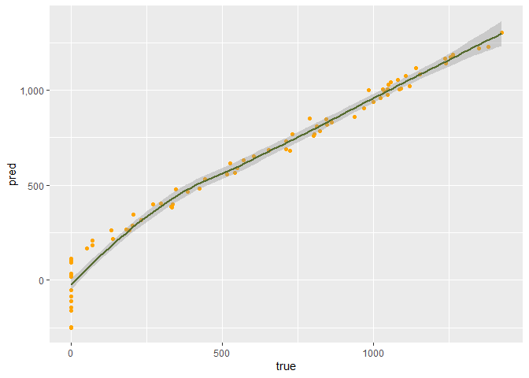
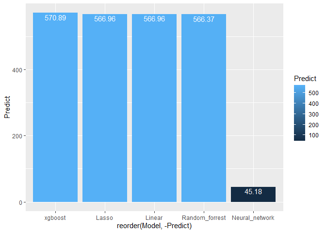

Different Technics to Analyze Credit Balance
================
Yoni
02 05, 2025

# Intro

How good can we predict Credit balance?

What is the best way to check it?

In order to check which method and models better, I will use the Credit
data from ILSR package.

In this project, I analyze credit risk data to predict loan default
using a statistical methods and deep learning approach in R

About this data:

“A simulated data set containing information on ten thousand customers.
The aim here is to predict which customers will default on their credit
card debt.”\*

<font size="2">\*[RDocumentation](https://www.rdocumentation.org/packages/ISLR/versions/1.2/topics/Credit)</font>

### set Data

First, let’s set the Environment

#### Main Libraries:

- tidymodels

- tidyverse

- Credit (the data)

- model’s packages- glmnet,randomForest, tensorflow, keras

- visual packages- viridis,hrbrthemes, knitr

Firs, I will see the data’s structure

6 top rows of our table:

``` r
head(Credit[,-1],6) %>%
  kbl() %>%
  kable_material(c("striped", "hover"))
```

<table class=" lightable-material lightable-striped lightable-hover" style="color: black; font-family: &quot;Source Sans Pro&quot;, helvetica, sans-serif; margin-left: auto; margin-right: auto;">
<thead>
<tr>
<th style="text-align:right;">
Income
</th>
<th style="text-align:right;">
Limit
</th>
<th style="text-align:right;">
Rating
</th>
<th style="text-align:right;">
Cards
</th>
<th style="text-align:right;">
Age
</th>
<th style="text-align:right;">
Education
</th>
<th style="text-align:left;">
Gender
</th>
<th style="text-align:left;">
Student
</th>
<th style="text-align:left;">
Married
</th>
<th style="text-align:left;">
Ethnicity
</th>
<th style="text-align:right;">
Balance
</th>
</tr>
</thead>
<tbody>
<tr>
<td style="text-align:right;">
14.891
</td>
<td style="text-align:right;">
3606
</td>
<td style="text-align:right;">
283
</td>
<td style="text-align:right;">
2
</td>
<td style="text-align:right;">
34
</td>
<td style="text-align:right;">
11
</td>
<td style="text-align:left;">
Male
</td>
<td style="text-align:left;">
No
</td>
<td style="text-align:left;">
Yes
</td>
<td style="text-align:left;">
Caucasian
</td>
<td style="text-align:right;">
333
</td>
</tr>
<tr>
<td style="text-align:right;">
106.025
</td>
<td style="text-align:right;">
6645
</td>
<td style="text-align:right;">
483
</td>
<td style="text-align:right;">
3
</td>
<td style="text-align:right;">
82
</td>
<td style="text-align:right;">
15
</td>
<td style="text-align:left;">
Female
</td>
<td style="text-align:left;">
Yes
</td>
<td style="text-align:left;">
Yes
</td>
<td style="text-align:left;">
Asian
</td>
<td style="text-align:right;">
903
</td>
</tr>
<tr>
<td style="text-align:right;">
104.593
</td>
<td style="text-align:right;">
7075
</td>
<td style="text-align:right;">
514
</td>
<td style="text-align:right;">
4
</td>
<td style="text-align:right;">
71
</td>
<td style="text-align:right;">
11
</td>
<td style="text-align:left;">
Male
</td>
<td style="text-align:left;">
No
</td>
<td style="text-align:left;">
No
</td>
<td style="text-align:left;">
Asian
</td>
<td style="text-align:right;">
580
</td>
</tr>
<tr>
<td style="text-align:right;">
148.924
</td>
<td style="text-align:right;">
9504
</td>
<td style="text-align:right;">
681
</td>
<td style="text-align:right;">
3
</td>
<td style="text-align:right;">
36
</td>
<td style="text-align:right;">
11
</td>
<td style="text-align:left;">
Female
</td>
<td style="text-align:left;">
No
</td>
<td style="text-align:left;">
No
</td>
<td style="text-align:left;">
Asian
</td>
<td style="text-align:right;">
964
</td>
</tr>
<tr>
<td style="text-align:right;">
55.882
</td>
<td style="text-align:right;">
4897
</td>
<td style="text-align:right;">
357
</td>
<td style="text-align:right;">
2
</td>
<td style="text-align:right;">
68
</td>
<td style="text-align:right;">
16
</td>
<td style="text-align:left;">
Male
</td>
<td style="text-align:left;">
No
</td>
<td style="text-align:left;">
Yes
</td>
<td style="text-align:left;">
Caucasian
</td>
<td style="text-align:right;">
331
</td>
</tr>
<tr>
<td style="text-align:right;">
80.180
</td>
<td style="text-align:right;">
8047
</td>
<td style="text-align:right;">
569
</td>
<td style="text-align:right;">
4
</td>
<td style="text-align:right;">
77
</td>
<td style="text-align:right;">
10
</td>
<td style="text-align:left;">
Male
</td>
<td style="text-align:left;">
No
</td>
<td style="text-align:left;">
No
</td>
<td style="text-align:left;">
Caucasian
</td>
<td style="text-align:right;">
1151
</td>
</tr>
</tbody>
</table>

Here a histogram of he credit balance:

``` r
Credit %>%
  ggplot(aes(x=Balance,fill= ..x..))+
  geom_histogram(color= alpha("black", 0.7) )+
  geom_vline(xintercept= mean(Balance), color= "blue",lty= "dashed", size= 1)+
  scale_fill_gradient(low = "red", high = "green2") +
  theme_bw()+
  labs(title = "Balance Histogram")+
  theme(plot.title = element_text(size=12,hjust = 0.5,face = "bold"),
        panel.grid = element_line(color = "gray70"))+
    scale_x_continuous(labels = comma)
```

<!-- -->
As you can see, $Balance$ is not normal, and has a right tail.

Trying to predict the Balance, one cal ask about race and/or gender
bias. Does this factor alone predict the result? and age?

``` r
Credit %>%
  mutate(age_group = cut(
    Age,
    breaks = seq(20, 100, by = 10),
    right = FALSE,
    include.lowest = TRUE,
    ordered_result = TRUE)) %>% 
  ggplot(aes(y=age_group, x=Balance,fill= age_group ))+
  scale_x_continuous(labels = comma)+
  geom_density_ridges(scale = 2) +
  theme_ridges() + theme(legend.position = "none")+
  labs(title = "Balance GLM by Age Group")+ theme(plot.title = element_text(size=12,hjust = 0.5,face = "bold"))
```

<!-- -->

``` r
Credit %>%
  ggplot(aes(y=Balance, x=Ethnicity,fill= Ethnicity))+
  geom_boxplot(size= 0.7, alpha= 0.9)+labs(x = "")+
  scale_y_continuous(labels = comma)+facet_wrap(~Gender)
```

<!-- -->

Prediction of Balance by race & gender

``` r
Credit %>%
  ggplot(aes(y=Balance,x= factor(Ethnicity),fill=factor(Gender) ))+
  geom_point(size= 0.7)+
  geom_boxplot(size= 0.7)+scale_fill_brewer(palette="Dark2")+
  labs(x= "", title = "Balance by Gender & Ethnicity")+theme(plot.title = element_text(size=12,hjust = 0.5,face = "bold"))+
  scale_y_continuous(labels = comma)+ scale_fill_brewer(palette = "Set1")
```

<!-- -->
Prediction of Balance by Education

``` r
Credit %>%
   mutate(Education_group = case_when(
    Education <= 6 ~ "basic",
    Education >= 7 & Education <= 11 ~ "mid",
    Education == 12 ~ "high school",
    Education >= 13 ~ "higher education"
  )) %>% 
  ggplot(aes(y=Balance,x= Gender,fill=Gender))+
  geom_boxplot()+
    labs(x= "", title = "Balance by Education & Gender")+theme(plot.title = element_text(size=12,hjust = 0.5,face = "bold"))+
  scale_y_continuous(labels = comma)+facet_wrap(~Education_group)+
  scale_fill_brewer(palette = "Set1")
```

<!-- -->

Again, there is no clear effect.

One can ask, can all of the weak predictors create a good one together?

For that purpose, I started to model this data using some common
relevant models. in addition, I will compare the result of the models in
order to choose the better ones.

## Models

### Setting the Data

I will ad some variables.

1.  High_deg= Years of High Education. I assume high education affect
    different than high school education
2.  Age_2= $Age^2$ in order to allow parabolic Age effect. I know from
    past data that age can have more perambulate effect.
3.  Bride= interaction of gender ans marriage. Marriage might change
    balance differently

Also, I will set seed and sample train & test.

``` r
Credit<- Credit%>%
  mutate(High_deg= pmax(Education - 12, 0),
         Age_2= Age^2,
         Bride= (Gender== 'Female')&(Married== 'Yes'))
```

``` r
credit_split<-       initial_split(Credit, prop = 0.8)
credit_train_split<- training(credit_split)
credit_test_split<-  testing(credit_split)

fun_recipe<- function(df) {
  recipe(data=  df, Balance~ . ) %>% 
  update_role(Balance, new_role = "outcome") %>%
  step_novel    (all_nominal(), -all_outcomes(),new_level= "the_rest")%>% 
  step_unknown  (all_nominal(), -all_outcomes(),new_level= "step_unknown" )%>%
  step_other    (all_nominal(), -all_outcomes(),other = 'step_other', threshold = 10)%>%
  step_nzv      (all_numeric(), -all_outcomes(),freq_cut = 99/1) %>% 
  step_normalize(all_numeric(), -all_outcomes())}

baked_credit_train<-credit_train_split%>% fun_recipe()%>% prep(credit_train_split)%>% bake(credit_train_split) 
baked_credit_test<- credit_train_split%>% fun_recipe()%>% prep(credit_train_split)%>% bake(credit_test_split)
```

Finally, I can predict with our models

### Modeling Balance of 0

Here I create logistic prediction of Balance=0 in order to use in as
another variable that I might consider using.

``` r
log_data<- baked_credit_train %>% 
  mutate(Balance =  (Balance==0) %>% as.factor())

log_fit <- 
  logistic_reg(mode = "classification") %>%
  set_engine(engine = "glm") %>% 
  fit(Balance ~ ., data =log_data)

log_pred<- predict(log_fit, new_data = baked_credit_test)

baked_credit_train<- cbind(baked_credit_train,log_data$Balance)
baked_credit_test<- cbind(baked_credit_test,log_pred )
```

### Linear

#### Classic LM

Assumption: knowing X matrix, Y distributed normal

$(Y|X) \sim N(BX,\sigma^2)$

``` r
lm_par <- linear_reg() %>% set_mode('regression') %>% 
  set_engine("lm")
lm_fit <- lm_par %>% fit(Balance ~ . , baked_credit_train)
lm_pred<- predict(lm_fit, new_data = baked_credit_test)
# abs(Credit$Balance[testid] - lmpred)

delta_lm<- lm_pred-baked_credit_test$Balance
delta_lm %>% abs() %>% unlist() %>% mean(na.rm= T)
```

    ## [1] 76.92834

``` r
cbind(lm_pred,baked_credit_test$Balance) %>%
  rename(pred= 1, true= 2) %>% 
  ggplot(aes(y=pred, x= true))+
  geom_point(color= "orange")+geom_smooth(color= "darkolivegreen")+
  scale_y_continuous(labels = comma)
```

<!-- -->

Now, what is our best predictors, if I filter our variables and prevent
over fitting?

#### Step wise method

Adding each time variable according to AIC method.

``` r
lmfit <- lm(Balance ~ ., data = credit_train_split)

null_model <- lm(Balance ~1, data =  credit_train_split) #null model for starting Stepwise
step_fit <- stepAIC (null_model,k= 2, direction = "forward",scope = list(lower= formula(null_model),upper= formula(lmfit) ) )
```

    ## Start:  AIC=3930.56
    ## Balance ~ 1
    ## 
    ##             Df Sum of Sq      RSS    AIC
    ## + Rating     1  50082650 18603961 3514.6
    ## + Limit      1  49933434 18753178 3517.1
    ## + Income     1  15049693 53636919 3853.4
    ## + Student    1   6298160 62388451 3901.8
    ## <none>                   68686611 3930.6
    ## + Cards      1     99228 68587383 3932.1
    ## + Bride      1     53174 68633438 3932.3
    ## + Married    1     45519 68641092 3932.3
    ## + ID         1     32374 68654237 3932.4
    ## + Education  1      7569 68679043 3932.5
    ## + Age        1      2683 68683929 3932.5
    ## + High_deg   1       558 68686053 3932.6
    ## + Age_2      1       259 68686352 3932.6
    ## + Gender     1         2 68686610 3932.6
    ## + Ethnicity  2    366364 68320248 3932.8
    ## 
    ## Step:  AIC=3514.58
    ## Balance ~ Rating
    ## 
    ##             Df Sum of Sq      RSS    AIC
    ## + Income     1   9644597  8959365 3282.8
    ## + Student    1   5345433 13258528 3408.2
    ## + Age_2      1    846124 17757837 3501.7
    ## + Age        1    771746 17832216 3503.0
    ## + Married    1    120052 18483910 3514.5
    ## <none>                   18603961 3514.6
    ## + Cards      1     73691 18530271 3515.3
    ## + ID         1     19633 18584328 3516.2
    ## + Limit      1     17340 18586621 3516.3
    ## + Education  1     15572 18588389 3516.3
    ## + High_deg   1     15558 18588403 3516.3
    ## + Gender     1     12456 18591506 3516.4
    ## + Bride      1      3024 18600937 3516.5
    ## + Ethnicity  2     26969 18576993 3518.1
    ## 
    ## Step:  AIC=3282.76
    ## Balance ~ Rating + Income
    ## 
    ##             Df Sum of Sq     RSS    AIC
    ## + Student    1   5507571 3451793 2979.5
    ## + Age_2      1    109697 8849668 3280.8
    ## + Limit      1    100227 8859138 3281.2
    ## + Age        1     91360 8868005 3281.5
    ## + Married    1     70449 8888915 3282.2
    ## <none>                   8959365 3282.8
    ## + Education  1     10532 8948833 3284.4
    ## + High_deg   1      8633 8950732 3284.5
    ## + Bride      1      4774 8954590 3284.6
    ## + Cards      1      2174 8957190 3284.7
    ## + Gender     1      1230 8958134 3284.7
    ## + ID         1       802 8958562 3284.7
    ## + Ethnicity  2     54429 8904936 3284.8
    ## 
    ## Step:  AIC=2979.55
    ## Balance ~ Rating + Income + Student
    ## 
    ##             Df Sum of Sq     RSS    AIC
    ## + Limit      1    143127 3308666 2968.0
    ## + Age        1     68836 3382957 2975.1
    ## + Age_2      1     66760 3385033 2975.3
    ## <none>                   3451793 2979.6
    ## + High_deg   1     16079 3435714 2980.1
    ## + ID         1     14942 3436852 2980.2
    ## + Married    1      8807 3442986 2980.7
    ## + Gender     1      8299 3443494 2980.8
    ## + Education  1      7558 3444236 2980.8
    ## + Cards      1      6543 3445250 2980.9
    ## + Bride      1       587 3451206 2981.5
    ## + Ethnicity  2      1066 3450727 2983.4
    ## 
    ## Step:  AIC=2968
    ## Balance ~ Rating + Income + Student + Limit
    ## 
    ##             Df Sum of Sq     RSS    AIC
    ## + Cards      1    120748 3187918 2958.1
    ## + Age        1     59533 3249133 2964.2
    ## + Age_2      1     59014 3249653 2964.2
    ## + High_deg   1     22416 3286250 2967.8
    ## <none>                   3308666 2968.0
    ## + Education  1     15016 3293651 2968.5
    ## + ID         1     14632 3294034 2968.6
    ## + Gender     1     11006 3297660 2968.9
    ## + Married    1      4290 3304376 2969.6
    ## + Bride      1      1235 3307432 2969.9
    ## + Ethnicity  2      1338 3307328 2971.9
    ## 
    ## Step:  AIC=2958.1
    ## Balance ~ Rating + Income + Student + Limit + Cards
    ## 
    ##             Df Sum of Sq     RSS    AIC
    ## + Age        1     69792 3118127 2953.0
    ## + Age_2      1     66786 3121132 2953.3
    ## + High_deg   1     20672 3167246 2958.0
    ## <none>                   3187918 2958.1
    ## + ID         1     18960 3168959 2958.2
    ## + Education  1     13949 3173969 2958.7
    ## + Gender     1      8842 3179077 2959.2
    ## + Married    1      1762 3186157 2959.9
    ## + Bride      1        20 3187898 2960.1
    ## + Ethnicity  2      1038 3186880 2962.0
    ## 
    ## Step:  AIC=2953.02
    ## Balance ~ Rating + Income + Student + Limit + Cards + Age
    ## 
    ##             Df Sum of Sq     RSS    AIC
    ## + ID         1   27163.5 3090963 2952.2
    ## + High_deg   1   19863.6 3098263 2953.0
    ## <none>                   3118127 2953.0
    ## + Education  1   12392.2 3105734 2953.7
    ## + Gender     1    7472.2 3110654 2954.2
    ## + Married    1    4336.1 3113791 2954.6
    ## + Age_2      1     353.8 3117773 2955.0
    ## + Bride      1     168.9 3117958 2955.0
    ## + Ethnicity  2     748.4 3117378 2956.9
    ## 
    ## Step:  AIC=2952.22
    ## Balance ~ Rating + Income + Student + Limit + Cards + Age + ID
    ## 
    ##             Df Sum of Sq     RSS    AIC
    ## + High_deg   1   19805.5 3071158 2952.2
    ## <none>                   3090963 2952.2
    ## + Education  1   11676.3 3079287 2953.0
    ## + Married    1    5298.3 3085665 2953.7
    ## + Gender     1    4378.7 3086584 2953.8
    ## + Age_2      1     458.1 3090505 2954.2
    ## + Bride      1       9.2 3090954 2954.2
    ## + Ethnicity  2     106.1 3090857 2956.2
    ## 
    ## Step:  AIC=2952.16
    ## Balance ~ Rating + Income + Student + Limit + Cards + Age + ID + 
    ##     High_deg
    ## 
    ##             Df Sum of Sq     RSS    AIC
    ## <none>                   3071158 2952.2
    ## + Married    1    5825.8 3065332 2953.6
    ## + Gender     1    4543.0 3066615 2953.7
    ## + Education  1    3480.0 3067678 2953.8
    ## + Age_2      1     569.9 3070588 2954.1
    ## + Bride      1      12.7 3071145 2954.2
    ## + Ethnicity  2      13.7 3071144 2956.2

``` r
step_pred <- predict(step_fit , credit_test_split)
err_step<- abs(credit_test_split$Balance - step_pred)
mean(abs(err_step))
```

    ## [1] 75.93476

The chosen model is
$$Balance ~ Rating + Income + Student + Limit + Cards$$ and I get sd of
80.94

Lets see the regression vs the step wise. it is clear that the AIC
method choose only the variables with P-value \< 5 %

``` r
tab_model(lmfit,step_fit, show.ci= F,show.se = T,show.loglik= T)
```

<table style="border-collapse:collapse; border:none;">
<tr>
<th style="border-top: double; text-align:center; font-style:normal; font-weight:bold; padding:0.2cm;  text-align:left; ">
 
</th>
<th colspan="3" style="border-top: double; text-align:center; font-style:normal; font-weight:bold; padding:0.2cm; ">
Balance
</th>
<th colspan="3" style="border-top: double; text-align:center; font-style:normal; font-weight:bold; padding:0.2cm; ">
Balance
</th>
</tr>
<tr>
<td style=" text-align:center; border-bottom:1px solid; font-style:italic; font-weight:normal;  text-align:left; ">
Predictors
</td>
<td style=" text-align:center; border-bottom:1px solid; font-style:italic; font-weight:normal;  ">
Estimates
</td>
<td style=" text-align:center; border-bottom:1px solid; font-style:italic; font-weight:normal;  ">
std. Error
</td>
<td style=" text-align:center; border-bottom:1px solid; font-style:italic; font-weight:normal;  ">
p
</td>
<td style=" text-align:center; border-bottom:1px solid; font-style:italic; font-weight:normal;  ">
Estimates
</td>
<td style=" text-align:center; border-bottom:1px solid; font-style:italic; font-weight:normal;  ">
std. Error
</td>
<td style=" text-align:center; border-bottom:1px solid; font-style:italic; font-weight:normal;  col7">
p
</td>
</tr>
<tr>
<td style=" padding:0.2cm; text-align:left; vertical-align:top; text-align:left; ">
(Intercept)
</td>
<td style=" padding:0.2cm; text-align:left; vertical-align:top; text-align:center;  ">
-479.30
</td>
<td style=" padding:0.2cm; text-align:left; vertical-align:top; text-align:center;  ">
85.87
</td>
<td style=" padding:0.2cm; text-align:left; vertical-align:top; text-align:center;  ">
<strong>\<0.001</strong>
</td>
<td style=" padding:0.2cm; text-align:left; vertical-align:top; text-align:center;  ">
-485.32
</td>
<td style=" padding:0.2cm; text-align:left; vertical-align:top; text-align:center;  ">
29.97
</td>
<td style=" padding:0.2cm; text-align:left; vertical-align:top; text-align:center;  col7">
<strong>\<0.001</strong>
</td>
</tr>
<tr>
<td style=" padding:0.2cm; text-align:left; vertical-align:top; text-align:left; ">
ID
</td>
<td style=" padding:0.2cm; text-align:left; vertical-align:top; text-align:center;  ">
0.08
</td>
<td style=" padding:0.2cm; text-align:left; vertical-align:top; text-align:center;  ">
0.05
</td>
<td style=" padding:0.2cm; text-align:left; vertical-align:top; text-align:center;  ">
0.110
</td>
<td style=" padding:0.2cm; text-align:left; vertical-align:top; text-align:center;  ">
0.08
</td>
<td style=" padding:0.2cm; text-align:left; vertical-align:top; text-align:center;  ">
0.05
</td>
<td style=" padding:0.2cm; text-align:left; vertical-align:top; text-align:center;  col7">
0.099
</td>
</tr>
<tr>
<td style=" padding:0.2cm; text-align:left; vertical-align:top; text-align:left; ">
Income
</td>
<td style=" padding:0.2cm; text-align:left; vertical-align:top; text-align:center;  ">
-7.87
</td>
<td style=" padding:0.2cm; text-align:left; vertical-align:top; text-align:center;  ">
0.26
</td>
<td style=" padding:0.2cm; text-align:left; vertical-align:top; text-align:center;  ">
<strong>\<0.001</strong>
</td>
<td style=" padding:0.2cm; text-align:left; vertical-align:top; text-align:center;  ">
-7.87
</td>
<td style=" padding:0.2cm; text-align:left; vertical-align:top; text-align:center;  ">
0.26
</td>
<td style=" padding:0.2cm; text-align:left; vertical-align:top; text-align:center;  col7">
<strong>\<0.001</strong>
</td>
</tr>
<tr>
<td style=" padding:0.2cm; text-align:left; vertical-align:top; text-align:left; ">
Limit
</td>
<td style=" padding:0.2cm; text-align:left; vertical-align:top; text-align:center;  ">
0.19
</td>
<td style=" padding:0.2cm; text-align:left; vertical-align:top; text-align:center;  ">
0.04
</td>
<td style=" padding:0.2cm; text-align:left; vertical-align:top; text-align:center;  ">
<strong>\<0.001</strong>
</td>
<td style=" padding:0.2cm; text-align:left; vertical-align:top; text-align:center;  ">
0.19
</td>
<td style=" padding:0.2cm; text-align:left; vertical-align:top; text-align:center;  ">
0.04
</td>
<td style=" padding:0.2cm; text-align:left; vertical-align:top; text-align:center;  col7">
<strong>\<0.001</strong>
</td>
</tr>
<tr>
<td style=" padding:0.2cm; text-align:left; vertical-align:top; text-align:left; ">
Rating
</td>
<td style=" padding:0.2cm; text-align:left; vertical-align:top; text-align:center;  ">
1.22
</td>
<td style=" padding:0.2cm; text-align:left; vertical-align:top; text-align:center;  ">
0.57
</td>
<td style=" padding:0.2cm; text-align:left; vertical-align:top; text-align:center;  ">
<strong>0.032</strong>
</td>
<td style=" padding:0.2cm; text-align:left; vertical-align:top; text-align:center;  ">
1.12
</td>
<td style=" padding:0.2cm; text-align:left; vertical-align:top; text-align:center;  ">
0.56
</td>
<td style=" padding:0.2cm; text-align:left; vertical-align:top; text-align:center;  col7">
<strong>0.045</strong>
</td>
</tr>
<tr>
<td style=" padding:0.2cm; text-align:left; vertical-align:top; text-align:left; ">
Cards
</td>
<td style=" padding:0.2cm; text-align:left; vertical-align:top; text-align:center;  ">
18.07
</td>
<td style=" padding:0.2cm; text-align:left; vertical-align:top; text-align:center;  ">
4.87
</td>
<td style=" padding:0.2cm; text-align:left; vertical-align:top; text-align:center;  ">
<strong>\<0.001</strong>
</td>
<td style=" padding:0.2cm; text-align:left; vertical-align:top; text-align:center;  ">
17.79
</td>
<td style=" padding:0.2cm; text-align:left; vertical-align:top; text-align:center;  ">
4.81
</td>
<td style=" padding:0.2cm; text-align:left; vertical-align:top; text-align:center;  col7">
<strong>\<0.001</strong>
</td>
</tr>
<tr>
<td style=" padding:0.2cm; text-align:left; vertical-align:top; text-align:left; ">
Age
</td>
<td style=" padding:0.2cm; text-align:left; vertical-align:top; text-align:center;  ">
-1.51
</td>
<td style=" padding:0.2cm; text-align:left; vertical-align:top; text-align:center;  ">
2.21
</td>
<td style=" padding:0.2cm; text-align:left; vertical-align:top; text-align:center;  ">
0.496
</td>
<td style=" padding:0.2cm; text-align:left; vertical-align:top; text-align:center;  ">
-0.92
</td>
<td style=" padding:0.2cm; text-align:left; vertical-align:top; text-align:center;  ">
0.33
</td>
<td style=" padding:0.2cm; text-align:left; vertical-align:top; text-align:center;  col7">
<strong>0.006</strong>
</td>
</tr>
<tr>
<td style=" padding:0.2cm; text-align:left; vertical-align:top; text-align:left; ">
Education
</td>
<td style=" padding:0.2cm; text-align:left; vertical-align:top; text-align:center;  ">
2.85
</td>
<td style=" padding:0.2cm; text-align:left; vertical-align:top; text-align:center;  ">
4.83
</td>
<td style=" padding:0.2cm; text-align:left; vertical-align:top; text-align:center;  ">
0.556
</td>
<td style=" padding:0.2cm; text-align:left; vertical-align:top; text-align:center;  ">
</td>
<td style=" padding:0.2cm; text-align:left; vertical-align:top; text-align:center;  ">
</td>
<td style=" padding:0.2cm; text-align:left; vertical-align:top; text-align:center;  col7">
</td>
</tr>
<tr>
<td style=" padding:0.2cm; text-align:left; vertical-align:top; text-align:left; ">
Gender \[Female\]
</td>
<td style=" padding:0.2cm; text-align:left; vertical-align:top; text-align:center;  ">
-32.26
</td>
<td style=" padding:0.2cm; text-align:left; vertical-align:top; text-align:center;  ">
18.40
</td>
<td style=" padding:0.2cm; text-align:left; vertical-align:top; text-align:center;  ">
0.080
</td>
<td style=" padding:0.2cm; text-align:left; vertical-align:top; text-align:center;  ">
</td>
<td style=" padding:0.2cm; text-align:left; vertical-align:top; text-align:center;  ">
</td>
<td style=" padding:0.2cm; text-align:left; vertical-align:top; text-align:center;  col7">
</td>
</tr>
<tr>
<td style=" padding:0.2cm; text-align:left; vertical-align:top; text-align:left; ">
Student \[Yes\]
</td>
<td style=" padding:0.2cm; text-align:left; vertical-align:top; text-align:center;  ">
439.65
</td>
<td style=" padding:0.2cm; text-align:left; vertical-align:top; text-align:center;  ">
18.80
</td>
<td style=" padding:0.2cm; text-align:left; vertical-align:top; text-align:center;  ">
<strong>\<0.001</strong>
</td>
<td style=" padding:0.2cm; text-align:left; vertical-align:top; text-align:center;  ">
441.75
</td>
<td style=" padding:0.2cm; text-align:left; vertical-align:top; text-align:center;  ">
18.44
</td>
<td style=" padding:0.2cm; text-align:left; vertical-align:top; text-align:center;  col7">
<strong>\<0.001</strong>
</td>
</tr>
<tr>
<td style=" padding:0.2cm; text-align:left; vertical-align:top; text-align:left; ">
Married \[Yes\]
</td>
<td style=" padding:0.2cm; text-align:left; vertical-align:top; text-align:center;  ">
-30.24
</td>
<td style=" padding:0.2cm; text-align:left; vertical-align:top; text-align:center;  ">
16.96
</td>
<td style=" padding:0.2cm; text-align:left; vertical-align:top; text-align:center;  ">
0.076
</td>
<td style=" padding:0.2cm; text-align:left; vertical-align:top; text-align:center;  ">
</td>
<td style=" padding:0.2cm; text-align:left; vertical-align:top; text-align:center;  ">
</td>
<td style=" padding:0.2cm; text-align:left; vertical-align:top; text-align:center;  col7">
</td>
</tr>
<tr>
<td style=" padding:0.2cm; text-align:left; vertical-align:top; text-align:left; ">
Ethnicity \[Asian\]
</td>
<td style=" padding:0.2cm; text-align:left; vertical-align:top; text-align:center;  ">
-1.54
</td>
<td style=" padding:0.2cm; text-align:left; vertical-align:top; text-align:center;  ">
16.31
</td>
<td style=" padding:0.2cm; text-align:left; vertical-align:top; text-align:center;  ">
0.925
</td>
<td style=" padding:0.2cm; text-align:left; vertical-align:top; text-align:center;  ">
</td>
<td style=" padding:0.2cm; text-align:left; vertical-align:top; text-align:center;  ">
</td>
<td style=" padding:0.2cm; text-align:left; vertical-align:top; text-align:center;  col7">
</td>
</tr>
<tr>
<td style=" padding:0.2cm; text-align:left; vertical-align:top; text-align:left; ">
Ethnicity \[Caucasian\]
</td>
<td style=" padding:0.2cm; text-align:left; vertical-align:top; text-align:center;  ">
-0.32
</td>
<td style=" padding:0.2cm; text-align:left; vertical-align:top; text-align:center;  ">
13.98
</td>
<td style=" padding:0.2cm; text-align:left; vertical-align:top; text-align:center;  ">
0.982
</td>
<td style=" padding:0.2cm; text-align:left; vertical-align:top; text-align:center;  ">
</td>
<td style=" padding:0.2cm; text-align:left; vertical-align:top; text-align:center;  ">
</td>
<td style=" padding:0.2cm; text-align:left; vertical-align:top; text-align:center;  col7">
</td>
</tr>
<tr>
<td style=" padding:0.2cm; text-align:left; vertical-align:top; text-align:left; ">
High deg
</td>
<td style=" padding:0.2cm; text-align:left; vertical-align:top; text-align:center;  ">
-8.01
</td>
<td style=" padding:0.2cm; text-align:left; vertical-align:top; text-align:center;  ">
6.83
</td>
<td style=" padding:0.2cm; text-align:left; vertical-align:top; text-align:center;  ">
0.242
</td>
<td style=" padding:0.2cm; text-align:left; vertical-align:top; text-align:center;  ">
-3.62
</td>
<td style=" padding:0.2cm; text-align:left; vertical-align:top; text-align:center;  ">
2.55
</td>
<td style=" padding:0.2cm; text-align:left; vertical-align:top; text-align:center;  col7">
0.158
</td>
</tr>
<tr>
<td style=" padding:0.2cm; text-align:left; vertical-align:top; text-align:left; ">
Age 2
</td>
<td style=" padding:0.2cm; text-align:left; vertical-align:top; text-align:center;  ">
0.01
</td>
<td style=" padding:0.2cm; text-align:left; vertical-align:top; text-align:center;  ">
0.02
</td>
<td style=" padding:0.2cm; text-align:left; vertical-align:top; text-align:center;  ">
0.796
</td>
<td style=" padding:0.2cm; text-align:left; vertical-align:top; text-align:center;  ">
</td>
<td style=" padding:0.2cm; text-align:left; vertical-align:top; text-align:center;  ">
</td>
<td style=" padding:0.2cm; text-align:left; vertical-align:top; text-align:center;  col7">
</td>
</tr>
<tr>
<td style=" padding:0.2cm; text-align:left; vertical-align:top; text-align:left; ">
BrideTRUE
</td>
<td style=" padding:0.2cm; text-align:left; vertical-align:top; text-align:center;  ">
41.31
</td>
<td style=" padding:0.2cm; text-align:left; vertical-align:top; text-align:center;  ">
23.75
</td>
<td style=" padding:0.2cm; text-align:left; vertical-align:top; text-align:center;  ">
0.083
</td>
<td style=" padding:0.2cm; text-align:left; vertical-align:top; text-align:center;  ">
</td>
<td style=" padding:0.2cm; text-align:left; vertical-align:top; text-align:center;  ">
</td>
<td style=" padding:0.2cm; text-align:left; vertical-align:top; text-align:center;  col7">
</td>
</tr>
<tr>
<td style=" padding:0.2cm; text-align:left; vertical-align:top; text-align:left; padding-top:0.1cm; padding-bottom:0.1cm; border-top:1px solid;">
Observations
</td>
<td style=" padding:0.2cm; text-align:left; vertical-align:top; padding-top:0.1cm; padding-bottom:0.1cm; text-align:left; border-top:1px solid;" colspan="3">
320
</td>
<td style=" padding:0.2cm; text-align:left; vertical-align:top; padding-top:0.1cm; padding-bottom:0.1cm; text-align:left; border-top:1px solid;" colspan="3">
320
</td>
</tr>
<tr>
<td style=" padding:0.2cm; text-align:left; vertical-align:top; text-align:left; padding-top:0.1cm; padding-bottom:0.1cm;">
R<sup>2</sup> / R<sup>2</sup> adjusted
</td>
<td style=" padding:0.2cm; text-align:left; vertical-align:top; padding-top:0.1cm; padding-bottom:0.1cm; text-align:left;" colspan="3">
0.956 / 0.954
</td>
<td style=" padding:0.2cm; text-align:left; vertical-align:top; padding-top:0.1cm; padding-bottom:0.1cm; text-align:left;" colspan="3">
0.955 / 0.954
</td>
</tr>
<tr>
<td style=" padding:0.2cm; text-align:left; vertical-align:top; text-align:left; padding-top:0.1cm; padding-bottom:0.1cm;">
log-Likelihood
</td>
<td style=" padding:0.2cm; text-align:left; vertical-align:top; padding-top:0.1cm; padding-bottom:0.1cm; text-align:left;" colspan="3">
-1918.815
</td>
<td style=" padding:0.2cm; text-align:left; vertical-align:top; padding-top:0.1cm; padding-bottom:0.1cm; text-align:left;" colspan="3">
-1921.139
</td>
</tr>
</table>

#### Lasso

Assumption

$(Y|X) \sim N(BX,\sigma^2)$ , like LM.

But this time I use shrinkage method in order to reduce variance & over
fitting. so our minimizing function define as

$RSS+ \lambda {\Sigma}_{j=1}^p |\beta_j|$

when $p=length( \beta)$ and $\lambda$ is a hyper parameter.

This time, I need to set our hipper parameter, $\lambda$ that lead to
the minimum mean cross-validated error\*

<font size="2"> \*[see
also](https://cran.r-project.org/web/packages/glmnet/vignettes/glmnet.pdf)
</font>

``` r
lasso_par <- linear_reg(mixture = 1,penalty = 0.01) %>% set_mode('regression') %>% 
  set_engine("glmnet")
lasso_fit <- lm_par %>% fit(Balance ~ . , baked_credit_train)
lasso_pred<- predict(lasso_fit, new_data = baked_credit_test)

delta_lasso<- lasso_pred-baked_credit_test$Balance
delta_lasso %>% abs() %>% unlist() %>% mean(na.rm= T)
```

    ## [1] 76.92834

``` r
cbind(lasso_pred,baked_credit_test$Balance) %>%
  rename(pred= 1, true= 2) %>% 
  ggplot(aes(y=pred, x= true))+
  geom_point()+geom_smooth(color= "coral4")+
  scale_y_continuous(labels = comma)
```

<!-- -->

### Trees

The main algorithm in random forest, adaboost, etc is splitting the data
each time into two samples, in the most effective way by reevaluating
the error function.

Mathematically, the tree assume a model of form

$f(x)= \sum^M_{m=1} c_m*I(x \in R_m) +\epsilon$

while $M$ is the numbers of groups, $R_m$ is the specific group & $c_m$
is the parameter of the model.

For a small tree,this is a very weak learner, but it can be used to
create deeper learning. A complicated tree can lead to over-feeting.

#### Random Forest

A mean of n-tree

``` r
rf_s<- rand_forest(mode = "regression", trees = 1500, min_n = 5)%>%
  set_mode("regression") %>% set_engine("randomForest")

rf_fit<- rf_s %>% fit(Balance ~ . , baked_credit_train)
rf_pred <- predict(rf_fit, new_data = baked_credit_test)

delta_rf<- rf_pred-baked_credit_test$Balance
delta_rf %>% abs() %>% unlist() %>% mean(na.rm= T)

cbind(rf_pred,baked_credit_test$Balance) %>%
  rename(pred= 1, true= 2) %>% 
  ggplot(aes(y=pred, x= true))+
  geom_point()+geom_smooth()+
  scale_y_continuous(labels = comma)
```

------------------------------------------------------------------------

``` r
rf_spec <- rand_forest(mode = "regression",
  trees = 800,
  min_n = tune(), mtry = tune() ) %>% 
  set_engine("randomForest") %>% set_mode("regression")
rf_spec
```

    ## Random Forest Model Specification (regression)
    ## 
    ## Main Arguments:
    ##   mtry = tune()
    ##   trees = 800
    ##   min_n = tune()
    ## 
    ## Computational engine: randomForest

``` r
rf_grid <- grid_latin_hypercube(
  min_n(),
  finalize(mtry(), baked_credit_train),
  size = 6)
rf_grid
```

    ## # A tibble: 6 × 2
    ##   min_n  mtry
    ##   <int> <int>
    ## 1    28     8
    ## 2    21     2
    ## 3     5    13
    ## 4    19     7
    ## 5    10    11
    ## 6    40     6

``` r
rf_wf <- workflow() %>%
  add_formula(Balance ~ .) %>%
  add_model(rf_spec)

vb_folds_rf <- vfold_cv(baked_credit_train, strata = Balance, v= 5)
```

``` r
set.seed(234)
rf_res <- tune_grid(
  rf_wf,
  resamples = vb_folds_rf,
  grid = rf_grid,
  control = control_grid(save_pred = TRUE) )
```

``` r
rf_res %>% #???
  collect_metrics() %>%
  filter(.metric == "rmse") %>%
  pivot_longer(mtry:min_n,
               values_to = "value",
               names_to = "parameter") %>%
  ggplot(aes(value, mean, color = parameter)) +
  geom_point(alpha = 0.8, show.legend = FALSE) +
  facet_wrap(~parameter, scales = "free_x") +
  labs(x = NULL, y = "rmse")+theme_linedraw()
```

<!-- -->

``` r
ggsave("photo_graph/myplot_rf.png")

show_best(rf_res,metric =  "rmse")
```

    ## # A tibble: 5 × 8
    ##    mtry min_n .metric .estimator  mean     n std_err .config             
    ##   <int> <int> <chr>   <chr>      <dbl> <int>   <dbl> <chr>               
    ## 1    13     5 rmse    standard    126.     5    6.31 Preprocessor1_Model3
    ## 2    11    10 rmse    standard    134.     5    5.91 Preprocessor1_Model5
    ## 3     7    19 rmse    standard    158.     5    6.43 Preprocessor1_Model4
    ## 4     8    28 rmse    standard    163.     5    5.59 Preprocessor1_Model1
    ## 5     6    40 rmse    standard    190.     5    6.39 Preprocessor1_Model6

``` r
best_tune_rf <- select_best(rf_res, metric = "rmse")
write_csv(best_tune_rf,"data/best_tune_rf.csv")
```


``` r
best_tune_rf<- read_csv("data/best_tune_rf.csv")
YG_tuned_boost <- rand_forest(mode = "regression", trees = 1500, min_n = best_tune_rf$min_n, mtry =best_tune_rf$mtry,
                           )%>%
  set_mode("regression") %>% set_engine("randomForest")

mod_boost_final<- YG_tuned_boost %>% fit(Balance~ ., data= baked_credit_train)
rf_pred<-   mod_boost_final %>% predict(new_data= baked_credit_test)%>% as.data.frame()

delta_rf<- rf_pred-baked_credit_test$Balance
delta_rf %>% abs() %>% unlist() %>% mean(na.rm= T)
```

    ## [1] 52.01785

``` r
cbind(rf_pred,baked_credit_test$Balance) %>%
  rename(pred= 1, true= 2) %>% 
  ggplot(aes(y=pred, x= true))+
  geom_point()+geom_smooth(color= "deeppink3")+
  scale_y_continuous(labels = comma)
```

<!-- -->
\_\_\_

#### XGBoost

Algorithm of gradient boosting trees

``` r
xgb_s<-boost_tree(mode = "regression",
                    trees= 1500, min_n= 5) %>%
  set_engine('xgboost') %>% set_mode("regression")
  
xgb_fit<- xgb_s %>% fit(Balance ~ . , baked_credit_train)

pred_xgb<-  predict(xgb_fit, new_data = baked_credit_test)
err_xgb<- pred_xgb-baked_credit_test$Balance
err_xgb %>% abs() %>% unlist() %>% mean(na.rm= T)

cbind(pred_xgb,baked_credit_test$Balance) %>%
  rename(pred= 1, true= 2) %>% 
  ggplot(aes(y=pred, x= true))+
  geom_point()+geom_smooth(color= "purple")+
  scale_y_continuous(labels = comma)
```

------------------------------------------------------------------------

``` r
xgb_spec <- boost_tree(mode = "regression",
  trees = 800, tree_depth = tune(),sample_size = 0.4,
  min_n = tune(), mtry = tune() ) %>% 
  set_engine("xgboost") %>% set_mode("regression")
xgb_spec
```

    ## Boosted Tree Model Specification (regression)
    ## 
    ## Main Arguments:
    ##   mtry = tune()
    ##   trees = 800
    ##   min_n = tune()
    ##   tree_depth = tune()
    ##   sample_size = 0.4
    ## 
    ## Computational engine: xgboost

``` r
xgb_grid <- grid_latin_hypercube(
  min_n(),tree_depth(),
  finalize(mtry(), baked_credit_train),
  size = 6)
xgb_grid
```

    ## # A tibble: 6 × 3
    ##   min_n tree_depth  mtry
    ##   <int>      <int> <int>
    ## 1    40          7     4
    ## 2    30         14     1
    ## 3     3          9    13
    ## 4    14          4    15
    ## 5    24          1     7
    ## 6    17         12     9

``` r
xgb_wf <- workflow() %>%
  add_formula(Balance ~ .) %>%
  add_model(xgb_spec)

vb_folds_xgb <- vfold_cv(baked_credit_train, strata = Balance, v= 5)
```

``` r
set.seed(234)
xgb_res <- tune_grid(
  xgb_wf,
  resamples = vb_folds_xgb,
  grid = xgb_grid,
  control = control_grid(save_pred = TRUE) )
```

``` r
xgb_res %>%
  collect_metrics() %>%
  filter(.metric == "rmse") %>%
  pivot_longer(mtry:tree_depth,
               values_to = "value",
               names_to = "parameter") %>%
  ggplot(aes(value, mean, color = parameter)) +
  geom_point(alpha = 0.8, show.legend = FALSE) +
  facet_wrap(~parameter, scales = "free_x") +
  labs(x = NULL, y = "rmse")+theme_linedraw()+
  scale_y_continuous(labels = comma)
```

<!-- -->

``` r
ggsave("photo_graph/myplot_xgb.png")

show_best(xgb_res, metric = "rmse")
```

    ## # A tibble: 5 × 9
    ##    mtry min_n tree_depth .metric .estimator  mean     n std_err .config         
    ##   <int> <int>      <int> <chr>   <chr>      <dbl> <int>   <dbl> <chr>           
    ## 1    13     3          9 rmse    standard    123.     5    5.62 Preprocessor1_M…
    ## 2    15    14          4 rmse    standard    177.     5    6.06 Preprocessor1_M…
    ## 3     9    17         12 rmse    standard    216.     5    4.48 Preprocessor1_M…
    ## 4     7    24          1 rmse    standard    232.     5   10.9  Preprocessor1_M…
    ## 5     1    30         14 rmse    standard    252.     5   13.5  Preprocessor1_M…

``` r
best_tune_XGB <- select_best(xgb_res, metric = "rmse")
write_csv(best_tune_XGB,"data/best_tune_XGB.csv") #in any case, I save them to cut reproducing
```


``` r
best_tune_XGB<- read_csv("data/best_tune_XGB.csv")
YG_tuned_boost <- boost_tree(mode = "regression", trees = 1500, min_n = best_tune_XGB$min_n, mtry =best_tune_XGB$mtry,
                           tree_depth= best_tune_XGB$tree_depth )%>%
  set_mode("regression") %>% set_engine("xgboost")

mod_boost_final<- YG_tuned_boost %>% fit(Balance~ ., data= baked_credit_train)
pred_xgb<-   mod_boost_final %>% predict(new_data= baked_credit_test)%>% as.data.frame()
err_xgb<- pred_xgb-baked_credit_test$Balance
err_xgb %>% abs() %>% unlist() %>% mean(na.rm= T)
```

    ## [1] 51.55204

``` r
cbind(pred_xgb,baked_credit_test$Balance) %>%
  rename(pred= 1, true= 2) %>% 
  ggplot(aes(y=pred, x= true))+
  geom_point()+geom_smooth(color= "chocolate4")+
  scale_y_continuous(labels = comma)
```

<!-- -->

### Neural Network

Creating of network of nonlinear function and weights, that evaluate the
prediction.

This method is the hardest to present due to the complexitivity of the
net.

#### set seed

I set our net using 2 layers of relu and then a dropout

``` r
credit_nn_split<- initial_split(baked_credit_train, prop = 0.8)
credit_nn_train<- training(credit_nn_split)
credit_nn_test<-  testing(credit_nn_split)

x <- model.matrix(Balance ~ . - 1, data = credit_nn_train)
x_test<- model.matrix(Balance ~ . - 1, data = credit_nn_test)
y <- credit_nn_train$Balance
y_test<- credit_nn_test$Balance

modnn <- keras_model_sequential () %>%
  layer_dense(units = 50, activation = "relu",
              input_shape = ncol(x)) %>%
  layer_dropout(rate = 0.4) %>%
  layer_dense(units = 20, activation = 'relu') %>%
  layer_dense(units = 4, activation = 'sigmoid') %>%
  layer_dropout(rate = 0.2) %>%
  layer_dense(units = 1, activation = 'relu')

modnn %>% compile(loss = "mse",
                  optimizer = optimizer_rmsprop (),
                  metrics = list("mean_absolute_error"))
modnn
```

    ## Model: "sequential"
    ## ┌───────────────────────────────────┬──────────────────────────┬───────────────
    ## │ Layer (type)                      │ Output Shape             │       Param # 
    ## ├───────────────────────────────────┼──────────────────────────┼───────────────
    ## │ dense (Dense)                     │ (None, 50)               │         1,050 
    ## ├───────────────────────────────────┼──────────────────────────┼───────────────
    ## │ dropout (Dropout)                 │ (None, 50)               │             0 
    ## ├───────────────────────────────────┼──────────────────────────┼───────────────
    ## │ dense_1 (Dense)                   │ (None, 20)               │         1,020 
    ## ├───────────────────────────────────┼──────────────────────────┼───────────────
    ## │ dense_2 (Dense)                   │ (None, 4)                │            84 
    ## ├───────────────────────────────────┼──────────────────────────┼───────────────
    ## │ dropout_1 (Dropout)               │ (None, 4)                │             0 
    ## ├───────────────────────────────────┼──────────────────────────┼───────────────
    ## │ dense_3 (Dense)                   │ (None, 1)                │             5 
    ## └───────────────────────────────────┴──────────────────────────┴───────────────
    ##  Total params: 2,159 (8.43 KB)
    ##  Trainable params: 2,159 (8.43 KB)
    ##  Non-trainable params: 0 (0.00 B)

Using the net:

``` r
mod_Credit <- modnn %>% fit(
  x, y, epochs = 1600, batch_size = 32, validation_data = list(x_test, y_test))
```

### Keras result

``` r
mod_Credit
```

    ## 
    ## Final epoch (plot to see history):
    ##                    loss: 434,263
    ##     mean_absolute_error: 498.2
    ##                val_loss: 443,423
    ## val_mean_absolute_error: 491.3

``` r
plot(mod_Credit)+theme_gray()+
  theme(plot.caption = element_text(size = 6,hjust= 0),
        legend.position = c(.95, .95),
    legend.justification = c("right", "top"),
    legend.box.just = "right")#,
```

<!-- -->

``` r
baked_credit_test_nn<- model.matrix(Balance ~ . - 1, data = baked_credit_test)
y <- baked_credit_test$Balance

nnpred <- predict(modnn ,baked_credit_test_nn ) %>% as.data.frame()
```

    ## 3/3 - 0s - 51ms/step

``` r
err_nn<- abs(y_test - nnpred)
err_nn %>% unlist() %>% mean(na.rm= T)
```

    ## [1] 500.482

### Sum all Result

I use the same seed to test all methods, so now I can compare the error
of each data.

- Each time this script were running, I got different result, due to
  randomness of $testid$ , and of the deep learning models

``` r
modl_nam<-c("Balance", "Linear", "Lasso", "Random_forrest","xgboost","Neural_network")
order_script<- order(modl_nam[-1])+1

my_pred<- data.frame(cbind(baked_credit_test$Balance,lm_pred,lasso_pred,rf_pred,pred_xgb,nnpred)) %>%  #pred data frame
   `colnames<-`(modl_nam) %>% 
  pivot_longer(cols = 2:6, names_to = "Model")

colnames(my_pred)[3]<- "Predict"

my_err<- my_pred %>% mutate(Delta= Predict- Balance) %>% 
  group_by(Model) %>% summarise_at(2, mean)

script_base<- map2_chr(my_err$Model, my_err$Predict, function(x,y) {paste0(x, " is ", round(y,3) )})
script<- "SD: "
for (i in script_base) {
  script<- paste(script, ",", i)}
script<- str_remove(script, ", ")

my_pred %>%
  ggplot( aes(x= Model ,y=Balance-Predict, fill= Model)) +
  geom_violin()+
  scale_fill_viridis(discrete = TRUE, alpha=0.6) +
  geom_jitter(color="black", size=0.45) +
  theme_dark() +
  theme(
    legend.position="none",
    plot.title = element_text(size=12,hjust = 0.5,face = "bold"),
    plot.caption = element_text(size = 8,hjust= 0),
    axis.title = element_text(size = 8))+ ylab("Error")+
  labs(title = "Error Violin",caption = script)+
  scale_y_continuous(labels = comma)
```

<!-- -->

``` r
my_err %>% 
  ggplot(aes(x= reorder(Model, -Predict), y= Predict, fill= Predict))+
  geom_bar(stat = "identity")+
  geom_text(aes(label = round(Predict,2))  , vjust = +1.2, color= "White")
```

<!-- -->

## Discussion

For simplicity of explanation, the best model is the linear model. and
indeed, most models did not get any major improvement. However, the NN
model gave such a better performance, that I would recommend using it as
well.

Amazingly, <b>the LM did nothing compare to the NN</b>, with only almost
quarter of the linear’s error.

At the same time, Lasso(var 81) did only slightly better then the liner,
both better than the ADB(var 85).

Another clear effect is this of the ADB comparing to the RF(var 101),
which had the worse prediction variance. The effect if weights is the
main advantage of ADB over RF.

To sum it up, though rerunning of this script might create a different
result, this modeling comparing to data frame prediction show us how
<b>using weights or regulation in models can get better models comparing
to the same model. In contrast, some time different models create worse
prediction than the unregulated ones</b>, like RF and LM. The most
complex model, NN, overcome all models, and known to have huge
potential, as long as understanding the effect of each variable is not
needed. .
