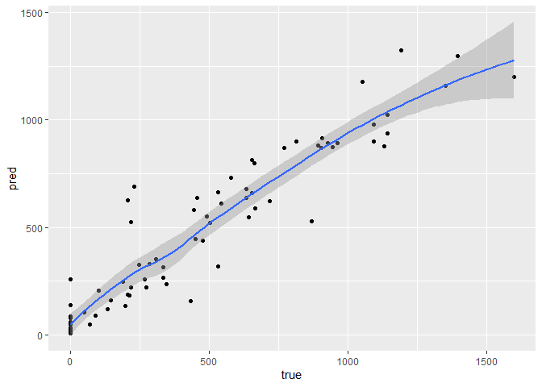
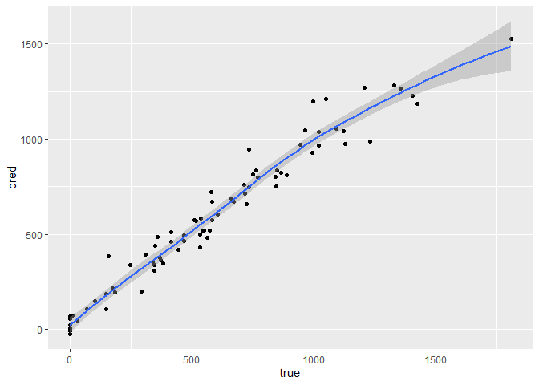

Different Techniches to Analyze Credit Balance
================

How good can we predict Credit balance?

What is the best way to check it?

In order to race our models, we will use the Credit data from ILSR
package.

About this data:

“A simulated data set containing information on ten thousand customers.
The aim here is to predict which customers will default on their credit
card debt.”\*

<font size="2">\*[RDocumentation](https://www.rdocumentation.org/packages/ISLR/versions/1.2/topics/Credit)</font>

# prologue

## set Data

first, let’s set the Environment

libraries:

``` r
library(easypackages)
library(tidymodels)
library(tidyverse)
#collect data:
library(ISLR)
attach(Credit)
#random Forest
library(randomForest)
#other models
libraries('glmnet','Rcmdr','MASS')
#neural network
libraries('tensorflow','keras')
#install_tensorflow() #install_keras() #install_minicomda
#data tools:
libraries('dplyr','tidyr')
libraries('Matrix','scales')
#visual
libraries('hrbrthemes','viridis')
libraries('knitr','kableExtra','sjPlot')
```

Now we will see the data’s structure

6 top rows of our table:

``` r
head(Credit[,-1],6) %>%
  kbl() %>%
  kable_material(c("striped", "hover"))
```

<table class=" lightable-material lightable-striped lightable-hover" style="font-family: &quot;Source Sans Pro&quot;, helvetica, sans-serif; margin-left: auto; margin-right: auto;">
<thead>
<tr>
<th style="text-align:right;">
Income
</th>
<th style="text-align:right;">
Limit
</th>
<th style="text-align:right;">
Rating
</th>
<th style="text-align:right;">
Cards
</th>
<th style="text-align:right;">
Age
</th>
<th style="text-align:right;">
Education
</th>
<th style="text-align:left;">
Gender
</th>
<th style="text-align:left;">
Student
</th>
<th style="text-align:left;">
Married
</th>
<th style="text-align:left;">
Ethnicity
</th>
<th style="text-align:right;">
Balance
</th>
</tr>
</thead>
<tbody>
<tr>
<td style="text-align:right;">
14.891
</td>
<td style="text-align:right;">
3606
</td>
<td style="text-align:right;">
283
</td>
<td style="text-align:right;">
2
</td>
<td style="text-align:right;">
34
</td>
<td style="text-align:right;">
11
</td>
<td style="text-align:left;">
Male
</td>
<td style="text-align:left;">
No
</td>
<td style="text-align:left;">
Yes
</td>
<td style="text-align:left;">
Caucasian
</td>
<td style="text-align:right;">
333
</td>
</tr>
<tr>
<td style="text-align:right;">
106.025
</td>
<td style="text-align:right;">
6645
</td>
<td style="text-align:right;">
483
</td>
<td style="text-align:right;">
3
</td>
<td style="text-align:right;">
82
</td>
<td style="text-align:right;">
15
</td>
<td style="text-align:left;">
Female
</td>
<td style="text-align:left;">
Yes
</td>
<td style="text-align:left;">
Yes
</td>
<td style="text-align:left;">
Asian
</td>
<td style="text-align:right;">
903
</td>
</tr>
<tr>
<td style="text-align:right;">
104.593
</td>
<td style="text-align:right;">
7075
</td>
<td style="text-align:right;">
514
</td>
<td style="text-align:right;">
4
</td>
<td style="text-align:right;">
71
</td>
<td style="text-align:right;">
11
</td>
<td style="text-align:left;">
Male
</td>
<td style="text-align:left;">
No
</td>
<td style="text-align:left;">
No
</td>
<td style="text-align:left;">
Asian
</td>
<td style="text-align:right;">
580
</td>
</tr>
<tr>
<td style="text-align:right;">
148.924
</td>
<td style="text-align:right;">
9504
</td>
<td style="text-align:right;">
681
</td>
<td style="text-align:right;">
3
</td>
<td style="text-align:right;">
36
</td>
<td style="text-align:right;">
11
</td>
<td style="text-align:left;">
Female
</td>
<td style="text-align:left;">
No
</td>
<td style="text-align:left;">
No
</td>
<td style="text-align:left;">
Asian
</td>
<td style="text-align:right;">
964
</td>
</tr>
<tr>
<td style="text-align:right;">
55.882
</td>
<td style="text-align:right;">
4897
</td>
<td style="text-align:right;">
357
</td>
<td style="text-align:right;">
2
</td>
<td style="text-align:right;">
68
</td>
<td style="text-align:right;">
16
</td>
<td style="text-align:left;">
Male
</td>
<td style="text-align:left;">
No
</td>
<td style="text-align:left;">
Yes
</td>
<td style="text-align:left;">
Caucasian
</td>
<td style="text-align:right;">
331
</td>
</tr>
<tr>
<td style="text-align:right;">
80.180
</td>
<td style="text-align:right;">
8047
</td>
<td style="text-align:right;">
569
</td>
<td style="text-align:right;">
4
</td>
<td style="text-align:right;">
77
</td>
<td style="text-align:right;">
10
</td>
<td style="text-align:left;">
Male
</td>
<td style="text-align:left;">
No
</td>
<td style="text-align:left;">
No
</td>
<td style="text-align:left;">
Caucasian
</td>
<td style="text-align:right;">
1151
</td>
</tr>
</tbody>
</table>

Here a histogram of he credit balance:

``` r
Credit %>%
  ggplot(aes(x=Balance))+
  geom_histogram(color= alpha("black", 0.7),fill= alpha("darkgreen", 0.8) )+
  geom_vline(xintercept= mean(Balance), color= "red",lty= "dashed")+
  theme_bw()+labs(title = "Balance Histogram")+ theme(plot.title = element_text(size=12,hjust = 0.5,face = "bold"))
```

<!-- -->
As we can see,

is not normal, and has a right tail.

trying to predict the Balance, one cal ask about race and/or gender
bias. Does this factor alone predict the result? and age?

``` r
Credit %>%
  ggplot(aes(y=Balance, x=Age,fill= factor(Ethnicity) ))+
  geom_point(size= 0.7)+
  geom_smooth(method = "glm", level= 0.9, color= "black")+ylim(min(Balance), max(1500))+
  labs(title = "Balance GLM by Age & Ethnicity")+ theme(plot.title = element_text(size=12,hjust = 0.5,face = "bold"))
```

<!-- -->

``` r
Credit %>%
  ggplot(aes(y=Balance, x=Ethnicity,fill= Ethnicity))+
  geom_boxplot(size= 0.7)+labs(x = "")
```

<!-- -->

and what if we will predict by race & gender?

``` r
Credit %>%
  ggplot(aes(y=Balance,x= factor(Ethnicity),fill=factor(Gender) ))+
  geom_point(size= 0.7)+
  geom_boxplot(size= 0.7)+scale_fill_brewer(palette="Dark2")+
  labs(x= "", title = "Balance by Gender & Ethnicity")+theme(plot.title = element_text(size=12,hjust = 0.5,face = "bold"))
```

<!-- -->
Again, there is no clear effect.

One can ask, can all of the weak predictors create a good one together?

So let’s start!

We will ad some variables.

1.  High_deg=
    
    if got more than 12 years of education
2.  Age_2=
    
    in order to allaw parabolic age effect
3.  Bride= interaction of gender ans marriage

also, we will set seed and sample train & test.

``` r
Credit<- Credit%>%
  mutate(High_deg= Education>=13,
  Age_2= Age^2,
  Bride= (Gender== 'Female')&(Married== 'Yes'))
```

``` r
credit_split<- initial_split(Credit, prop = 0.8)
credit_train_split<- training(credit_split)
credit_test_split<-  testing(credit_split)

dolche_de_leche<- function(df) {
  recipe(data=  df, Balance~.) %>% 
  update_role(Balance, new_role = "outcome") %>%
  step_novel    (all_nominal(), -all_outcomes(),  new_level = "the_rest")%>% 
  step_unknown  (all_nominal(), -all_outcomes(),  new_level= "step_unknown" )%>%
  step_other    (all_nominal(), -all_outcomes(), other = 'step_other', threshold = 10)%>%
  step_nzv      (all_numeric(), -all_outcomes(),freq_cut = 99/1) %>% 
  step_normalize(all_numeric(), -all_outcomes())
  }

dolche_credit_train<-credit_train_split%>% dolche_de_leche()%>% prep(credit_train_split)%>% bake(credit_train_split) 
dolche_credit_test<- credit_train_split%>% dolche_de_leche()%>% prep(credit_train_split)%>% bake(credit_test_split)
```

Finally, we can predict with our models

# Models

## Linear

### Classic LM

Assumption: knowing X matrix, Y distributed normal:
 \sim N(BX,\sigma^2)")

``` r
lm_par <- linear_reg() %>% set_mode('regression') %>% 
  set_engine("lm")
lm_fit <- lm_par %>% fit(Balance ~ . , dolche_credit_train)
lm_pred<- predict(lm_fit, new_data = dolche_credit_test)
# abs(Credit$Balance[testid] - lmpred)

delta_lm<- lm_pred-dolche_credit_test$Balance
delta_lm %>% abs() %>% unlist() %>% mean(na.rm= T)
```

    ## [1] 82.03422

``` r
cbind(lm_pred,dolche_credit_test$Balance) %>%
  rename(pred= 1, true= 2) %>% 
  ggplot(aes(y=pred, x= true))+
  geom_point()+geom_smooth()
```

    ## `geom_smooth()` using method = 'loess' and formula 'y ~ x'

<!-- -->

Now, what is our best predictors, if we filter our variables and prevent
over fitting?

### step wise method

Adding each time variable according to AIC method.

``` r
lmfit <- lm(Balance ~ ., data = credit_train_split)

null_model <- lm(Balance ~1, data =  credit_train_split) #null model for starting Stepwise
step_fit <- stepAIC (null_model,k= 2, direction = "forward",scope = list(lower= formula(null_model),upper= formula(lmfit) ) )
```

    ## Start:  AIC=3919.26
    ## Balance ~ 1
    ## 
    ##             Df Sum of Sq      RSS    AIC
    ## + Rating     1  49076033 17228831 3490.0
    ## + Limit      1  48744461 17560403 3496.1
    ## + Income     1  13195465 53109399 3850.3
    ## + Student    1   5580299 60724565 3893.1
    ## + Cards      1    644265 65660599 3918.1
    ## + Bride      1    429332 65875532 3919.2
    ## <none>                   66304864 3919.3
    ## + High_deg   1    287056 66017808 3919.9
    ## + Ethnicity  2    507648 65797216 3920.8
    ## + Education  1     40409 66264455 3921.1
    ## + Gender     1     31094 66273770 3921.1
    ## + ID         1     23033 66281831 3921.2
    ## + Age_2      1      8783 66296081 3921.2
    ## + Married    1       829 66304035 3921.3
    ## + Age        1        21 66304843 3921.3
    ## 
    ## Step:  AIC=3490.01
    ## Balance ~ Rating
    ## 
    ##             Df Sum of Sq      RSS    AIC
    ## + Income     1   8745585  8483246 3265.3
    ## + Student    1   4752568 12476263 3388.7
    ## + Age_2      1    688404 16540427 3479.0
    ## + Age        1    592966 16635865 3480.8
    ## + Cards      1    234951 16993880 3487.6
    ## <none>                   17228831 3490.0
    ## + Married    1     81820 17147011 3490.5
    ## + Ethnicity  2    122635 17106195 3491.7
    ## + ID         1       744 17228087 3492.0
    ## + Education  1       495 17228336 3492.0
    ## + Bride      1        30 17228801 3492.0
    ## + Gender     1        13 17228818 3492.0
    ## + Limit      1         3 17228828 3492.0
    ## + High_deg   1         0 17228831 3492.0
    ## 
    ## Step:  AIC=3265.29
    ## Balance ~ Rating + Income
    ## 
    ##             Df Sum of Sq     RSS    AIC
    ## + Student    1   5160404 3322842 2967.4
    ## + Age_2      1    100098 8383148 3263.5
    ## + Age        1     90890 8392355 3263.8
    ## + Married    1     82281 8400965 3264.2
    ## + Limit      1     80638 8402608 3264.2
    ## + High_deg   1     58471 8424774 3265.1
    ## <none>                   8483246 3265.3
    ## + Ethnicity  2     87984 8395261 3266.0
    ## + Education  1     20300 8462945 3266.5
    ## + Cards      1     11723 8471522 3266.8
    ## + Bride      1      5983 8477262 3267.1
    ## + ID         1      1894 8481352 3267.2
    ## + Gender     1       269 8482977 3267.3
    ## 
    ## Step:  AIC=2967.36
    ## Balance ~ Rating + Income + Student
    ## 
    ##             Df Sum of Sq     RSS    AIC
    ## + Limit      1    157491 3165350 2953.8
    ## + Age        1     69685 3253157 2962.6
    ## + Age_2      1     67849 3254993 2962.8
    ## <none>                   3322842 2967.4
    ## + Married    1     16274 3306568 2967.8
    ## + Cards      1     11277 3311565 2968.3
    ## + Bride      1     11118 3311724 2968.3
    ## + Gender     1     10310 3312532 2968.4
    ## + Ethnicity  2     30368 3292473 2968.4
    ## + High_deg   1      7211 3315631 2968.7
    ## + ID         1      6320 3316521 2968.8
    ## + Education  1        84 3322758 2969.4
    ## 
    ## Step:  AIC=2953.83
    ## Balance ~ Rating + Income + Student + Limit
    ## 
    ##             Df Sum of Sq     RSS    AIC
    ## + Cards      1    134552 3030799 2941.9
    ## + Age        1     62107 3103243 2949.5
    ## + Age_2      1     61416 3103935 2949.6
    ## <none>                   3165350 2953.8
    ## + Bride      1     12898 3152453 2954.5
    ## + Gender     1     12268 3153082 2954.6
    ## + Married    1      9413 3155937 2954.9
    ## + Ethnicity  2     24395 3140955 2955.3
    ## + High_deg   1      3360 3161990 2955.5
    ## + ID         1      3195 3162155 2955.5
    ## + Education  1       534 3164816 2955.8
    ## 
    ## Step:  AIC=2941.93
    ## Balance ~ Rating + Income + Student + Limit + Cards
    ## 
    ##             Df Sum of Sq     RSS    AIC
    ## + Age        1     62027 2968772 2937.3
    ## + Age_2      1     59422 2971376 2937.6
    ## <none>                   3030799 2941.9
    ## + Gender     1     10149 3020650 2942.8
    ## + Bride      1      6830 3023969 2943.2
    ## + ID         1      4884 3025914 2943.4
    ## + High_deg   1      4262 3026536 2943.5
    ## + Married    1      3855 3026943 2943.5
    ## + Education  1       255 3030544 2943.9
    ## + Ethnicity  2     18210 3012589 2944.0
    ## 
    ## Step:  AIC=2937.31
    ## Balance ~ Rating + Income + Student + Limit + Cards + Age
    ## 
    ##             Df Sum of Sq     RSS    AIC
    ## <none>                   2968772 2937.3
    ## + Gender     1    9393.6 2959378 2938.3
    ## + Bride      1    8715.8 2960056 2938.4
    ## + Married    1    6526.4 2962245 2938.6
    ## + ID         1    6032.9 2962739 2938.7
    ## + High_deg   1    3942.8 2964829 2938.9
    ## + Age_2      1     356.4 2968415 2939.3
    ## + Education  1     163.8 2968608 2939.3
    ## + Ethnicity  2   11907.8 2956864 2940.0

``` r
step_pred <- predict(step_fit , credit_test_split)
err_step<- abs(credit_test_split$Balance - step_pred)
mean(abs(err_step))
```

    ## [1] 80.76765

the chosen model is


and we get sd of 80.94

lets see the regression vs the step wise. it is clear that the AIC
method choose only the variables with P-value \< 5 %

``` r
tab_model(lmfit,step_fit, show.ci= F,show.se = T,show.loglik= T)
```

<table style="border-collapse:collapse; border:none;">
<tr>
<th style="border-top: double; text-align:center; font-style:normal; font-weight:bold; padding:0.2cm;  text-align:left; ">
 
</th>
<th colspan="3" style="border-top: double; text-align:center; font-style:normal; font-weight:bold; padding:0.2cm; ">
Balance
</th>
<th colspan="3" style="border-top: double; text-align:center; font-style:normal; font-weight:bold; padding:0.2cm; ">
Balance
</th>
</tr>
<tr>
<td style=" text-align:center; border-bottom:1px solid; font-style:italic; font-weight:normal;  text-align:left; ">
Predictors
</td>
<td style=" text-align:center; border-bottom:1px solid; font-style:italic; font-weight:normal;  ">
Estimates
</td>
<td style=" text-align:center; border-bottom:1px solid; font-style:italic; font-weight:normal;  ">
std. Error
</td>
<td style=" text-align:center; border-bottom:1px solid; font-style:italic; font-weight:normal;  ">
p
</td>
<td style=" text-align:center; border-bottom:1px solid; font-style:italic; font-weight:normal;  ">
Estimates
</td>
<td style=" text-align:center; border-bottom:1px solid; font-style:italic; font-weight:normal;  ">
std. Error
</td>
<td style=" text-align:center; border-bottom:1px solid; font-style:italic; font-weight:normal;  col7">
p
</td>
</tr>
<tr>
<td style=" padding:0.2cm; text-align:left; vertical-align:top; text-align:left; ">
(Intercept)
</td>
<td style=" padding:0.2cm; text-align:left; vertical-align:top; text-align:center;  ">
-440.13
</td>
<td style=" padding:0.2cm; text-align:left; vertical-align:top; text-align:center;  ">
75.20
</td>
<td style=" padding:0.2cm; text-align:left; vertical-align:top; text-align:center;  ">
<strong>\<0.001</strong>
</td>
<td style=" padding:0.2cm; text-align:left; vertical-align:top; text-align:center;  ">
-491.90
</td>
<td style=" padding:0.2cm; text-align:left; vertical-align:top; text-align:center;  ">
27.34
</td>
<td style=" padding:0.2cm; text-align:left; vertical-align:top; text-align:center;  col7">
<strong>\<0.001</strong>
</td>
</tr>
<tr>
<td style=" padding:0.2cm; text-align:left; vertical-align:top; text-align:left; ">
ID
</td>
<td style=" padding:0.2cm; text-align:left; vertical-align:top; text-align:center;  ">
0.03
</td>
<td style=" padding:0.2cm; text-align:left; vertical-align:top; text-align:center;  ">
0.05
</td>
<td style=" padding:0.2cm; text-align:left; vertical-align:top; text-align:center;  ">
0.547
</td>
<td style=" padding:0.2cm; text-align:left; vertical-align:top; text-align:center;  ">
</td>
<td style=" padding:0.2cm; text-align:left; vertical-align:top; text-align:center;  ">
</td>
<td style=" padding:0.2cm; text-align:left; vertical-align:top; text-align:center;  col7">
</td>
</tr>
<tr>
<td style=" padding:0.2cm; text-align:left; vertical-align:top; text-align:left; ">
Income
</td>
<td style=" padding:0.2cm; text-align:left; vertical-align:top; text-align:center;  ">
-7.80
</td>
<td style=" padding:0.2cm; text-align:left; vertical-align:top; text-align:center;  ">
0.26
</td>
<td style=" padding:0.2cm; text-align:left; vertical-align:top; text-align:center;  ">
<strong>\<0.001</strong>
</td>
<td style=" padding:0.2cm; text-align:left; vertical-align:top; text-align:center;  ">
-7.76
</td>
<td style=" padding:0.2cm; text-align:left; vertical-align:top; text-align:center;  ">
0.26
</td>
<td style=" padding:0.2cm; text-align:left; vertical-align:top; text-align:center;  col7">
<strong>\<0.001</strong>
</td>
</tr>
<tr>
<td style=" padding:0.2cm; text-align:left; vertical-align:top; text-align:left; ">
Limit
</td>
<td style=" padding:0.2cm; text-align:left; vertical-align:top; text-align:center;  ">
0.18
</td>
<td style=" padding:0.2cm; text-align:left; vertical-align:top; text-align:center;  ">
0.04
</td>
<td style=" padding:0.2cm; text-align:left; vertical-align:top; text-align:center;  ">
<strong>\<0.001</strong>
</td>
<td style=" padding:0.2cm; text-align:left; vertical-align:top; text-align:center;  ">
0.19
</td>
<td style=" padding:0.2cm; text-align:left; vertical-align:top; text-align:center;  ">
0.03
</td>
<td style=" padding:0.2cm; text-align:left; vertical-align:top; text-align:center;  col7">
<strong>\<0.001</strong>
</td>
</tr>
<tr>
<td style=" padding:0.2cm; text-align:left; vertical-align:top; text-align:left; ">
Rating
</td>
<td style=" padding:0.2cm; text-align:left; vertical-align:top; text-align:center;  ">
1.30
</td>
<td style=" padding:0.2cm; text-align:left; vertical-align:top; text-align:center;  ">
0.53
</td>
<td style=" padding:0.2cm; text-align:left; vertical-align:top; text-align:center;  ">
<strong>0.015</strong>
</td>
<td style=" padding:0.2cm; text-align:left; vertical-align:top; text-align:center;  ">
1.20
</td>
<td style=" padding:0.2cm; text-align:left; vertical-align:top; text-align:center;  ">
0.52
</td>
<td style=" padding:0.2cm; text-align:left; vertical-align:top; text-align:center;  col7">
<strong>0.022</strong>
</td>
</tr>
<tr>
<td style=" padding:0.2cm; text-align:left; vertical-align:top; text-align:left; ">
Cards
</td>
<td style=" padding:0.2cm; text-align:left; vertical-align:top; text-align:center;  ">
18.10
</td>
<td style=" padding:0.2cm; text-align:left; vertical-align:top; text-align:center;  ">
5.07
</td>
<td style=" padding:0.2cm; text-align:left; vertical-align:top; text-align:center;  ">
<strong>\<0.001</strong>
</td>
<td style=" padding:0.2cm; text-align:left; vertical-align:top; text-align:center;  ">
18.69
</td>
<td style=" padding:0.2cm; text-align:left; vertical-align:top; text-align:center;  ">
4.96
</td>
<td style=" padding:0.2cm; text-align:left; vertical-align:top; text-align:center;  col7">
<strong>\<0.001</strong>
</td>
</tr>
<tr>
<td style=" padding:0.2cm; text-align:left; vertical-align:top; text-align:left; ">
Age
</td>
<td style=" padding:0.2cm; text-align:left; vertical-align:top; text-align:center;  ">
-1.90
</td>
<td style=" padding:0.2cm; text-align:left; vertical-align:top; text-align:center;  ">
2.28
</td>
<td style=" padding:0.2cm; text-align:left; vertical-align:top; text-align:center;  ">
0.405
</td>
<td style=" padding:0.2cm; text-align:left; vertical-align:top; text-align:center;  ">
-0.82
</td>
<td style=" padding:0.2cm; text-align:left; vertical-align:top; text-align:center;  ">
0.32
</td>
<td style=" padding:0.2cm; text-align:left; vertical-align:top; text-align:center;  col7">
<strong>0.011</strong>
</td>
</tr>
<tr>
<td style=" padding:0.2cm; text-align:left; vertical-align:top; text-align:left; ">
Education
</td>
<td style=" padding:0.2cm; text-align:left; vertical-align:top; text-align:center;  ">
-3.60
</td>
<td style=" padding:0.2cm; text-align:left; vertical-align:top; text-align:center;  ">
3.18
</td>
<td style=" padding:0.2cm; text-align:left; vertical-align:top; text-align:center;  ">
0.259
</td>
<td style=" padding:0.2cm; text-align:left; vertical-align:top; text-align:center;  ">
</td>
<td style=" padding:0.2cm; text-align:left; vertical-align:top; text-align:center;  ">
</td>
<td style=" padding:0.2cm; text-align:left; vertical-align:top; text-align:center;  col7">
</td>
</tr>
<tr>
<td style=" padding:0.2cm; text-align:left; vertical-align:top; text-align:left; ">
Gender \[Female\]
</td>
<td style=" padding:0.2cm; text-align:left; vertical-align:top; text-align:center;  ">
-13.04
</td>
<td style=" padding:0.2cm; text-align:left; vertical-align:top; text-align:center;  ">
18.03
</td>
<td style=" padding:0.2cm; text-align:left; vertical-align:top; text-align:center;  ">
0.470
</td>
<td style=" padding:0.2cm; text-align:left; vertical-align:top; text-align:center;  ">
</td>
<td style=" padding:0.2cm; text-align:left; vertical-align:top; text-align:center;  ">
</td>
<td style=" padding:0.2cm; text-align:left; vertical-align:top; text-align:center;  col7">
</td>
</tr>
<tr>
<td style=" padding:0.2cm; text-align:left; vertical-align:top; text-align:left; ">
Student \[Yes\]
</td>
<td style=" padding:0.2cm; text-align:left; vertical-align:top; text-align:center;  ">
432.81
</td>
<td style=" padding:0.2cm; text-align:left; vertical-align:top; text-align:center;  ">
18.76
</td>
<td style=" padding:0.2cm; text-align:left; vertical-align:top; text-align:center;  ">
<strong>\<0.001</strong>
</td>
<td style=" padding:0.2cm; text-align:left; vertical-align:top; text-align:center;  ">
434.55
</td>
<td style=" padding:0.2cm; text-align:left; vertical-align:top; text-align:center;  ">
18.45
</td>
<td style=" padding:0.2cm; text-align:left; vertical-align:top; text-align:center;  col7">
<strong>\<0.001</strong>
</td>
</tr>
<tr>
<td style=" padding:0.2cm; text-align:left; vertical-align:top; text-align:left; ">
Married \[Yes\]
</td>
<td style=" padding:0.2cm; text-align:left; vertical-align:top; text-align:center;  ">
-12.42
</td>
<td style=" padding:0.2cm; text-align:left; vertical-align:top; text-align:center;  ">
16.07
</td>
<td style=" padding:0.2cm; text-align:left; vertical-align:top; text-align:center;  ">
0.440
</td>
<td style=" padding:0.2cm; text-align:left; vertical-align:top; text-align:center;  ">
</td>
<td style=" padding:0.2cm; text-align:left; vertical-align:top; text-align:center;  ">
</td>
<td style=" padding:0.2cm; text-align:left; vertical-align:top; text-align:center;  col7">
</td>
</tr>
<tr>
<td style=" padding:0.2cm; text-align:left; vertical-align:top; text-align:left; ">
Ethnicity \[Asian\]
</td>
<td style=" padding:0.2cm; text-align:left; vertical-align:top; text-align:center;  ">
20.26
</td>
<td style=" padding:0.2cm; text-align:left; vertical-align:top; text-align:center;  ">
16.27
</td>
<td style=" padding:0.2cm; text-align:left; vertical-align:top; text-align:center;  ">
0.214
</td>
<td style=" padding:0.2cm; text-align:left; vertical-align:top; text-align:center;  ">
</td>
<td style=" padding:0.2cm; text-align:left; vertical-align:top; text-align:center;  ">
</td>
<td style=" padding:0.2cm; text-align:left; vertical-align:top; text-align:center;  col7">
</td>
</tr>
<tr>
<td style=" padding:0.2cm; text-align:left; vertical-align:top; text-align:left; ">
Ethnicity \[Caucasian\]
</td>
<td style=" padding:0.2cm; text-align:left; vertical-align:top; text-align:center;  ">
11.54
</td>
<td style=" padding:0.2cm; text-align:left; vertical-align:top; text-align:center;  ">
13.79
</td>
<td style=" padding:0.2cm; text-align:left; vertical-align:top; text-align:center;  ">
0.403
</td>
<td style=" padding:0.2cm; text-align:left; vertical-align:top; text-align:center;  ">
</td>
<td style=" padding:0.2cm; text-align:left; vertical-align:top; text-align:center;  ">
</td>
<td style=" padding:0.2cm; text-align:left; vertical-align:top; text-align:center;  col7">
</td>
</tr>
<tr>
<td style=" padding:0.2cm; text-align:left; vertical-align:top; text-align:left; ">
High degTRUE
</td>
<td style=" padding:0.2cm; text-align:left; vertical-align:top; text-align:center;  ">
26.07
</td>
<td style=" padding:0.2cm; text-align:left; vertical-align:top; text-align:center;  ">
20.82
</td>
<td style=" padding:0.2cm; text-align:left; vertical-align:top; text-align:center;  ">
0.211
</td>
<td style=" padding:0.2cm; text-align:left; vertical-align:top; text-align:center;  ">
</td>
<td style=" padding:0.2cm; text-align:left; vertical-align:top; text-align:center;  ">
</td>
<td style=" padding:0.2cm; text-align:left; vertical-align:top; text-align:center;  col7">
</td>
</tr>
<tr>
<td style=" padding:0.2cm; text-align:left; vertical-align:top; text-align:left; ">
Age 2
</td>
<td style=" padding:0.2cm; text-align:left; vertical-align:top; text-align:center;  ">
0.01
</td>
<td style=" padding:0.2cm; text-align:left; vertical-align:top; text-align:center;  ">
0.02
</td>
<td style=" padding:0.2cm; text-align:left; vertical-align:top; text-align:center;  ">
0.621
</td>
<td style=" padding:0.2cm; text-align:left; vertical-align:top; text-align:center;  ">
</td>
<td style=" padding:0.2cm; text-align:left; vertical-align:top; text-align:center;  ">
</td>
<td style=" padding:0.2cm; text-align:left; vertical-align:top; text-align:center;  col7">
</td>
</tr>
<tr>
<td style=" padding:0.2cm; text-align:left; vertical-align:top; text-align:left; ">
BrideTRUE
</td>
<td style=" padding:0.2cm; text-align:left; vertical-align:top; text-align:center;  ">
3.46
</td>
<td style=" padding:0.2cm; text-align:left; vertical-align:top; text-align:center;  ">
23.04
</td>
<td style=" padding:0.2cm; text-align:left; vertical-align:top; text-align:center;  ">
0.881
</td>
<td style=" padding:0.2cm; text-align:left; vertical-align:top; text-align:center;  ">
</td>
<td style=" padding:0.2cm; text-align:left; vertical-align:top; text-align:center;  ">
</td>
<td style=" padding:0.2cm; text-align:left; vertical-align:top; text-align:center;  col7">
</td>
</tr>
<tr>
<td style=" padding:0.2cm; text-align:left; vertical-align:top; text-align:left; padding-top:0.1cm; padding-bottom:0.1cm; border-top:1px solid;">
Observations
</td>
<td style=" padding:0.2cm; text-align:left; vertical-align:top; padding-top:0.1cm; padding-bottom:0.1cm; text-align:left; border-top:1px solid;" colspan="3">
320
</td>
<td style=" padding:0.2cm; text-align:left; vertical-align:top; padding-top:0.1cm; padding-bottom:0.1cm; text-align:left; border-top:1px solid;" colspan="3">
320
</td>
</tr>
<tr>
<td style=" padding:0.2cm; text-align:left; vertical-align:top; text-align:left; padding-top:0.1cm; padding-bottom:0.1cm;">
R<sup>2</sup> / R<sup>2</sup> adjusted
</td>
<td style=" padding:0.2cm; text-align:left; vertical-align:top; padding-top:0.1cm; padding-bottom:0.1cm; text-align:left;" colspan="3">
0.956 / 0.954
</td>
<td style=" padding:0.2cm; text-align:left; vertical-align:top; padding-top:0.1cm; padding-bottom:0.1cm; text-align:left;" colspan="3">
0.955 / 0.954
</td>
</tr>
<tr>
<td style=" padding:0.2cm; text-align:left; vertical-align:top; text-align:left; padding-top:0.1cm; padding-bottom:0.1cm;">
log-Likelihood
</td>
<td style=" padding:0.2cm; text-align:left; vertical-align:top; padding-top:0.1cm; padding-bottom:0.1cm; text-align:left;" colspan="3">
-1912.839
</td>
<td style=" padding:0.2cm; text-align:left; vertical-align:top; padding-top:0.1cm; padding-bottom:0.1cm; text-align:left;" colspan="3">
-1915.714
</td>
</tr>
</table>

### lasso

Assumption

 \sim N(BX,\sigma^2)")
, like LM.

But this time we use shrinkage method in order to reduce variance & over
fitting. so our minimizing function define as


when
")
and

is a hyper parameter.

This time, we need to set our hipper parameter,

that lead to the minimum mean cross-validated error\*

<font size="2"> \*[see
also](https://cran.r-project.org/web/packages/glmnet/vignettes/glmnet.pdf)
</font>

``` r
lasso_par <- linear_reg(mixture = 1,penalty = 0.01) %>% set_mode('regression') %>% 
  set_engine("glmnet")
lasso_fit <- lm_par %>% fit(Balance ~ . , dolche_credit_train)
lasso_pred<- predict(lasso_fit, new_data = dolche_credit_test)
# abs(Credit$Balance[testid] - lmpred)

delta_lasso<- lasso_pred-dolche_credit_test$Balance
delta_lasso %>% abs() %>% unlist() %>% mean(na.rm= T)
```

    ## [1] 82.03422

``` r
cbind(lasso_pred,dolche_credit_test$Balance) %>%
  rename(pred= 1, true= 2) %>% 
  ggplot(aes(y=pred, x= true))+
  geom_point()+geom_smooth()
```

    ## `geom_smooth()` using method = 'loess' and formula 'y ~ x'

<!-- -->

## Trees

The main algorithm in random forest, adaboost, etc is splitting the data
each time into two samples, in the most effective way by reevaluating
the error function.

Mathematically, the tree assume a model of form

= \sum^M_{m=1} c_m*I(x \in R_m) +\epsilon")

while

is the numbers of groups,

is the specific group &

is the parameter of the model.

For a small tree,this is a very weak learner, but it can be used to
create deeper learning. A complicated tree can lead to over-feeting.

### Random Forest

A mean of n-tree

``` r
rf_s<- rand_forest(mode = "regression", trees = 1500, min_n = 5)%>%
  set_mode("regression") %>% set_engine("randomForest")

rf_fit<- rf_s %>% fit(Balance ~ . , dolche_credit_train)
rf_pred <- predict(rf_fit, new_data = dolche_credit_test)

delta_rf<- rf_pred-dolche_credit_test$Balance
delta_rf %>% abs() %>% unlist() %>% mean(na.rm= T)
```

    ## [1] 100.0581

``` r
cbind(rf_pred,dolche_credit_test$Balance) %>%
  rename(pred= 1, true= 2) %>% 
  ggplot(aes(y=pred, x= true))+
  geom_point()+geom_smooth()
```

    ## `geom_smooth()` using method = 'loess' and formula 'y ~ x'

<!-- -->

``` r
rf_s<- randomForest(formula= Balance ~ ., data = dolche_credit_train,
                    ntree= 1500, mtry= 6, na.action = na.omit )

pred_s<- predict(rf_s,newdata = dolche_credit_test )
rf_pred <- predict(rf_s , dolche_credit_test, s = "lambda.min")
err_rf<- abs(dolche_credit_test$Balance - rf_pred)
mean(abs(err_rf))
```

### XGBoost

Algorithm of gradient boosting trees

``` r
xgb_s<-boost_tree(mode = "regression",
                    trees= 1500, min_n= 5) %>%
  set_engine('xgboost') %>% set_mode("regression")
  
xgb_fit<- xgb_s %>% fit(Balance ~ . , dolche_credit_train)
#rf_pred <- predict(rf_fit, new_data = dolche_credit_test)

pred_xgb<-  predict(xgb_fit, new_data = dolche_credit_test)
err_xgb<- pred_xgb-dolche_credit_test$Balance
err_xgb %>% abs() %>% unlist() %>% mean(na.rm= T)
```

    ## [1] 56.51138

``` r
cbind(pred_xgb,dolche_credit_test$Balance) %>%
  rename(pred= 1, true= 2) %>% 
  ggplot(aes(y=pred, x= true))+
  geom_point()+geom_smooth()
```

    ## `geom_smooth()` using method = 'loess' and formula 'y ~ x'

<!-- -->

``` r
norm_y<- 2*y/(max(y)+min(y))-1

adb_s<-randomForest(formula= Balance ~ ., data = Credit[-testid , ],
                    ntree= 1500, mtry= 14, na.action = na.omit, importance= T )

pred_abs <- predict(adb_s , Credit[testid , ], s = "lambda.min")
pred_abs<- head(as.vector(pred_abs),133)
err_adb<- abs(y[testid] - pred_abs)
mean(abs(err_adb))
```

## Neural Network

Creating of network of nonlinear function and weights, that evaluate the
prediction.

This method is the hardest to present due to the complexitivity of the
net.

### set seed

we set our net using 2 layers of relu and then a dropout

``` r
x <- model.matrix(Balance ~ . - 1, data = dolche_credit_train)
x_test<- model.matrix(Balance ~ . - 1, data = dolche_credit_test)
y <- dolche_credit_train$Balance
y_test<- dolche_credit_test$Balance

modnn <- keras_model_sequential () %>%
  layer_dense(units = 50, activation = "relu",
              input_shape = ncol(x)) %>%
  layer_dropout(rate = 0.4) %>%
  layer_dense(units = 20, activation = 'relu') %>%
  layer_dropout(rate = 0.2) %>%
  layer_dense(units = 1)
```

    ## Loaded Tensorflow version 2.9.1

``` r
modnn %>% compile(loss = "mse",
                  optimizer = optimizer_rmsprop (),
                  metrics = list("mean_absolute_error")
                  )
modnn
```

    ## Model: "sequential"
    ## ________________________________________________________________________________
    ##  Layer (type)                       Output Shape                    Param #     
    ## ================================================================================
    ##  dense_2 (Dense)                    (None, 50)                      1050        
    ##  dropout_1 (Dropout)                (None, 50)                      0           
    ##  dense_1 (Dense)                    (None, 20)                      1020        
    ##  dropout (Dropout)                  (None, 20)                      0           
    ##  dense (Dense)                      (None, 1)                       21          
    ## ================================================================================
    ## Total params: 2,091
    ## Trainable params: 2,091
    ## Non-trainable params: 0
    ## ________________________________________________________________________________

Using the net:

``` r
mod_Credit <- modnn %>% fit(
  x, y, epochs = 1000, batch_size = 32,
  validation_data = list(x_test, y_test))
```

### Keras result

``` r
summary(mod_Credit)
```

    ##         Length Class  Mode
    ## params  3      -none- list
    ## metrics 4      -none- list

``` r
plot(mod_Credit)+theme_gray()+
  theme(plot.caption = element_text(size = 6,hjust= 0),
        legend.position = c(.95, .95),
    legend.justification = c("right", "top"),
    legend.box.just = "right")#,
```

<!-- -->

``` r
    #legend.margin = margin(6, 6, 6, 6))

nnpred <- predict(modnn , x_test) %>% as.data.frame()
err_nn<- abs(y_test - nnpred)
err_nn %>% unlist() %>% mean(na.rm= T)
```

    ## [1] 23.31748

## Sum all result

We used the same seed to test all methods, so now we can compare the
error of each data.

-   Each time this scipt were running, we got different result, due to
    randomness of
    
    , and of the deep learning models

``` r
modl_nam<-c('Balance', "Linear", "Lasso", "Random_forrest","xgboost","Neural_network")
order_script<- order(modl_nam[-1])+1

my_pred<- data.frame(cbind(dolche_credit_test$Balance,lm_pred,lasso_pred,rf_pred,pred_xgb,nnpred)) %>%  #pred data frame
   `colnames<-`(modl_nam) %>% 
  pivot_longer(cols = 2:6, names_to = "Model")

colnames(my_pred)[3]<- "Predict"

my_err<- my_pred %>% mutate(Delta= Predict- Balance) %>% 
  group_by(Model) %>% summarise_at(2, mean)

#caption- var of the models alphabetically

script_base<- map2_chr(my_err$Model, my_err$Predict, function(x,y) {paste0(x, " is ", round(y,3) )})
script<- "SD of models: "
for (i in script_base) {
  script<- paste(script, ",", i)}
script<- str_remove(script, ", ")

my_pred %>%
  ggplot( aes(x= Model ,y=Balance-Predict, fill= Model)) +
  geom_violin()+
  scale_fill_viridis(discrete = TRUE, alpha=0.6) +
  geom_jitter(color="black", size=0.45) +
  theme_dark() +
  theme(
    legend.position="none",
    plot.title = element_text(size=12,hjust = 0.5,face = "bold"),
    plot.caption = element_text(size = 8,hjust= 0),
    axis.title = element_text(size = 8))+ ylab("Error")+
  labs(title = "Error Violin",caption = script)
```

<!-- -->
\# Discussion

If the winner of the error in prediction were not that clear, our

would will be the linear model, since it’s prediction is the easiest to
understand and present.

Amazingly, <b>the LM(var 82) did nothing compare to the NN(var 22)</b>,
with only almost quarter of the linear’s error.

At the same time, Lasso(var 81) did only slightly better then the liner,
both better than the ADB(var 85).

Another clear effect is this of the ADB comparing to the RF(var 101),
which had the worse prediction variance. The effect if weights is the
main advantage of ADB over RF.

To sum it up, though rerunning of this script might create a different
result, this modeling comparing to data frame prediction show us how
<b>using weights or regulation in models can get better models comparing
to the same model. In contrast, some time different models create worse
prediction than the unregulated ones</b>, like RF and LM. The most
complex model, NN, overcome all models, and known to have huge
potential, as long as understanding the effect of each variable is not
needed.

<b>In my opinion, the best models to predict with here are the Lasso and
the Neural network.</b>

.
