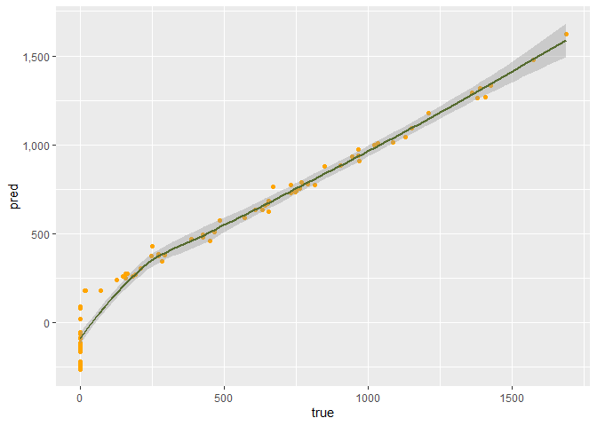

Different Techniches to Analyze Credit Balance
================
Yoni

# Intro

How good can we predict Credit balance?

What is the best way to check it?

In order to check which method and models better, we will use the Credit
data from ILSR package.

About this data:

“A simulated data set containing information on ten thousand customers.
The aim here is to predict which customers will default on their credit
card debt.”\*

<font size="2">\*[RDocumentation](https://www.rdocumentation.org/packages/ISLR/versions/1.2/topics/Credit)</font>

## set Data

First, let’s set the Environment

### Main Libraries:

# tidymodels

# tidyverse

# Credit (the data)

# model’s packages- glmnet,randomForest, tensorflow, keras

# visual packages- viridis,hrbrthemes, knitr

Now we will see the data’s structure

6 top rows of our table:

``` r
head(Credit[,-1],6) %>%
  kbl() %>%
  kable_material(c("striped", "hover"))
```

<table class=" lightable-material lightable-striped lightable-hover" style="color: black; font-family: &quot;Source Sans Pro&quot;, helvetica, sans-serif; margin-left: auto; margin-right: auto;">
<thead>
<tr>
<th style="text-align:right;">
Income
</th>
<th style="text-align:right;">
Limit
</th>
<th style="text-align:right;">
Rating
</th>
<th style="text-align:right;">
Cards
</th>
<th style="text-align:right;">
Age
</th>
<th style="text-align:right;">
Education
</th>
<th style="text-align:left;">
Gender
</th>
<th style="text-align:left;">
Student
</th>
<th style="text-align:left;">
Married
</th>
<th style="text-align:left;">
Ethnicity
</th>
<th style="text-align:right;">
Balance
</th>
</tr>
</thead>
<tbody>
<tr>
<td style="text-align:right;">
14.891
</td>
<td style="text-align:right;">
3606
</td>
<td style="text-align:right;">
283
</td>
<td style="text-align:right;">
2
</td>
<td style="text-align:right;">
34
</td>
<td style="text-align:right;">
11
</td>
<td style="text-align:left;">
Male
</td>
<td style="text-align:left;">
No
</td>
<td style="text-align:left;">
Yes
</td>
<td style="text-align:left;">
Caucasian
</td>
<td style="text-align:right;">
333
</td>
</tr>
<tr>
<td style="text-align:right;">
106.025
</td>
<td style="text-align:right;">
6645
</td>
<td style="text-align:right;">
483
</td>
<td style="text-align:right;">
3
</td>
<td style="text-align:right;">
82
</td>
<td style="text-align:right;">
15
</td>
<td style="text-align:left;">
Female
</td>
<td style="text-align:left;">
Yes
</td>
<td style="text-align:left;">
Yes
</td>
<td style="text-align:left;">
Asian
</td>
<td style="text-align:right;">
903
</td>
</tr>
<tr>
<td style="text-align:right;">
104.593
</td>
<td style="text-align:right;">
7075
</td>
<td style="text-align:right;">
514
</td>
<td style="text-align:right;">
4
</td>
<td style="text-align:right;">
71
</td>
<td style="text-align:right;">
11
</td>
<td style="text-align:left;">
Male
</td>
<td style="text-align:left;">
No
</td>
<td style="text-align:left;">
No
</td>
<td style="text-align:left;">
Asian
</td>
<td style="text-align:right;">
580
</td>
</tr>
<tr>
<td style="text-align:right;">
148.924
</td>
<td style="text-align:right;">
9504
</td>
<td style="text-align:right;">
681
</td>
<td style="text-align:right;">
3
</td>
<td style="text-align:right;">
36
</td>
<td style="text-align:right;">
11
</td>
<td style="text-align:left;">
Female
</td>
<td style="text-align:left;">
No
</td>
<td style="text-align:left;">
No
</td>
<td style="text-align:left;">
Asian
</td>
<td style="text-align:right;">
964
</td>
</tr>
<tr>
<td style="text-align:right;">
55.882
</td>
<td style="text-align:right;">
4897
</td>
<td style="text-align:right;">
357
</td>
<td style="text-align:right;">
2
</td>
<td style="text-align:right;">
68
</td>
<td style="text-align:right;">
16
</td>
<td style="text-align:left;">
Male
</td>
<td style="text-align:left;">
No
</td>
<td style="text-align:left;">
Yes
</td>
<td style="text-align:left;">
Caucasian
</td>
<td style="text-align:right;">
331
</td>
</tr>
<tr>
<td style="text-align:right;">
80.180
</td>
<td style="text-align:right;">
8047
</td>
<td style="text-align:right;">
569
</td>
<td style="text-align:right;">
4
</td>
<td style="text-align:right;">
77
</td>
<td style="text-align:right;">
10
</td>
<td style="text-align:left;">
Male
</td>
<td style="text-align:left;">
No
</td>
<td style="text-align:left;">
No
</td>
<td style="text-align:left;">
Caucasian
</td>
<td style="text-align:right;">
1151
</td>
</tr>
</tbody>
</table>

Here a histogram of he credit balance:

``` r
Credit %>%
  ggplot(aes(x=Balance))+
  geom_histogram(color= alpha("black", 0.7),fill= alpha("darkgreen", 0.8) )+
  geom_vline(xintercept= mean(Balance), color= "red",lty= "dashed")+
  theme_bw()+labs(title = "Balance Histogram")+ theme(plot.title = element_text(size=12,hjust = 0.5,face = "bold"))
```

<!-- -->
As we can see, $Balance$ is not normal, and has a right tail.

Trying to predict the Balance, one cal ask about race and/or gender
bias. Does this factor alone predict the result? and age?

``` r
Credit %>%
  ggplot(aes(y=Balance, x=Age,fill= factor(Ethnicity) ))+
  geom_point(size= 0.7)+
  geom_smooth(method = "glm", level= 0.9, color= "black")+ylim(min(Balance), max(1500))+
  labs(title = "Balance GLM by Age & Ethnicity")+ theme(plot.title = element_text(size=12,hjust = 0.5,face = "bold"))
```

<!-- -->

``` r
Credit %>%
  ggplot(aes(y=Balance, x=Ethnicity,fill= Ethnicity))+
  geom_boxplot(size= 0.7)+labs(x = "")
```

<!-- -->

Prediction of Balance by race & gender

``` r
Credit %>%
  ggplot(aes(y=Balance,x= factor(Ethnicity),fill=factor(Gender) ))+
  geom_point(size= 0.7)+
  geom_boxplot(size= 0.7)+scale_fill_brewer(palette="Dark2")+
  labs(x= "", title = "Balance by Gender & Ethnicity")+theme(plot.title = element_text(size=12,hjust = 0.5,face = "bold"))
```

<!-- -->

Again, there is no clear effect.

One can ask, can all of the weak predictors create a good one together?

# Models

## Setting the Data

So let’s start!

We will ad some variables.

1.  High_deg= $T$ if got more than 12 years of education
2.  Age_2= $Age^2$ in order to allaw parabolic age effect
3.  Bride= interaction of gender ans marriage

Also, we will set seed and sample train & test.

``` r
Credit<- Credit%>%
  mutate(High_deg= Education>=13,
  Age_2= Age^2,
  Bride= (Gender== 'Female')&(Married== 'Yes'))
```

``` r
credit_split<- initial_split(Credit, prop = 0.8)
credit_train_split<- training(credit_split)
credit_test_split<-  testing(credit_split)

dolche_de_leche<- function(df) {
  recipe(data=  df, Balance~.) %>% 
  update_role(Balance, new_role = "outcome") %>%
  step_novel    (all_nominal(), -all_outcomes(),  new_level = "the_rest")%>% 
  step_unknown  (all_nominal(), -all_outcomes(),  new_level= "step_unknown" )%>%
  step_other    (all_nominal(), -all_outcomes(), other = 'step_other', threshold = 10)%>%
  step_nzv      (all_numeric(), -all_outcomes(),freq_cut = 99/1) %>% 
  step_normalize(all_numeric(), -all_outcomes())
  }

dolche_credit_train<-credit_train_split%>% dolche_de_leche()%>% prep(credit_train_split)%>% bake(credit_train_split) 
dolche_credit_test<- credit_train_split%>% dolche_de_leche()%>% prep(credit_train_split)%>% bake(credit_test_split)
```

Finally, we can predict with our models

## Modeling Balance of 0

Here I create logistic prediction of Balance=0 in order to use in as
another variable that we might consider using.

``` r
log_data<- dolche_credit_train %>% 
  mutate(Balance =  (Balance==0) %>% as.factor())

log_fit <- 
  logistic_reg(mode = "classification") %>%
  set_engine(engine = "glm") %>% 
  fit(Balance ~ ., data =log_data)

log_pred<- predict(log_fit, new_data = dolche_credit_test)

dolche_credit_train<- cbind(dolche_credit_train,log_data$Balance)
dolche_credit_test<- cbind(dolche_credit_test,log_pred )
```

## Linear

### Classic LM

Assumption: knowing X matrix, Y distributed normal:

$(Y|X) \sim N(BX,\sigma^2)$

``` r
lm_par <- linear_reg() %>% set_mode('regression') %>% 
  set_engine("lm")
lm_fit <- lm_par %>% fit(Balance ~ . , dolche_credit_train)
lm_pred<- predict(lm_fit, new_data = dolche_credit_test)
# abs(Credit$Balance[testid] - lmpred)

delta_lm<- lm_pred-dolche_credit_test$Balance
delta_lm %>% abs() %>% unlist() %>% mean(na.rm= T)
```

    ## [1] 76.33295

``` r
cbind(lm_pred,dolche_credit_test$Balance) %>%
  rename(pred= 1, true= 2) %>% 
  ggplot(aes(y=pred, x= true))+
  geom_point()+geom_smooth()
```

    ## `geom_smooth()` using method = 'loess' and formula = 'y ~ x'

<!-- -->

Now, what is our best predictors, if we filter our variables and prevent
over fitting?

### step wise method

Adding each time variable according to AIC method.

``` r
lmfit <- lm(Balance ~ ., data = credit_train_split)

null_model <- lm(Balance ~1, data =  credit_train_split) #null model for starting Stepwise
step_fit <- stepAIC (null_model,k= 2, direction = "forward",scope = list(lower= formula(null_model),upper= formula(lmfit) ) )
```

    ## Start:  AIC=3934.86
    ## Balance ~ 1
    ## 
    ##             Df Sum of Sq      RSS    AIC
    ## + Rating     1  50953599 18661789 3515.6
    ## + Limit      1  50798907 18816481 3518.2
    ## + Income     1  14214109 55401279 3863.8
    ## + Student    1   5503434 64111954 3910.5
    ## + Cards      1    435141 69180247 3934.8
    ## <none>                   69615388 3934.9
    ## + Bride      1    308476 69306912 3935.4
    ## + ID         1     22714 69592674 3936.8
    ## + Age        1     13720 69601667 3936.8
    ## + High_deg   1     11055 69604333 3936.8
    ## + Age_2      1     10287 69605101 3936.8
    ## + Education  1      7673 69607715 3936.8
    ## + Gender     1      3386 69612002 3936.8
    ## + Married    1      1793 69613595 3936.8
    ## + Ethnicity  2     88356 69527032 3938.4
    ## 
    ## Step:  AIC=3515.57
    ## Balance ~ Rating
    ## 
    ##             Df Sum of Sq      RSS    AIC
    ## + Income     1   9683475  8978314 3283.4
    ## + Student    1   5627357 13034432 3402.7
    ## + Age_2      1    891053 17770736 3501.9
    ## + Age        1    754561 17907228 3504.4
    ## + Cards      1    178222 18483567 3514.5
    ## <none>                   18661789 3515.6
    ## + Married    1     70818 18590971 3516.4
    ## + ID         1     59212 18602578 3516.6
    ## + Education  1     35255 18626534 3517.0
    ## + Limit      1     18646 18643143 3517.3
    ## + Bride      1     12530 18649259 3517.4
    ## + High_deg   1      2637 18659152 3517.5
    ## + Gender     1      1020 18660769 3517.6
    ## + Ethnicity  2     72134 18589655 3518.3
    ## 
    ## Step:  AIC=3283.44
    ## Balance ~ Rating + Income
    ## 
    ##             Df Sum of Sq     RSS    AIC
    ## + Student    1   5608359 3369955 2971.9
    ## + Age_2      1    139135 8839180 3280.4
    ## + Age        1    113600 8864714 3281.4
    ## + Limit      1    107847 8870468 3281.6
    ## <none>                   8978314 3283.4
    ## + Married    1     51606 8926709 3283.6
    ## + Cards      1     10119 8968195 3285.1
    ## + High_deg   1      6819 8971495 3285.2
    ## + Education  1      3718 8974597 3285.3
    ## + Bride      1      1154 8977160 3285.4
    ## + ID         1       441 8977873 3285.4
    ## + Gender     1       256 8978058 3285.4
    ## + Ethnicity  2     21896 8956418 3286.7
    ## 
    ## Step:  AIC=2971.87
    ## Balance ~ Rating + Income + Student
    ## 
    ##             Df Sum of Sq     RSS    AIC
    ## + Limit      1    135073 3234882 2960.8
    ## + Age_2      1     61629 3308327 2968.0
    ## + Age        1     57271 3312684 2968.4
    ## <none>                   3369955 2971.9
    ## + Cards      1     15142 3354814 2972.4
    ## + Married    1     10200 3359755 2972.9
    ## + ID         1     10189 3359766 2972.9
    ## + Education  1      3868 3366088 2973.5
    ## + Gender     1      3472 3366483 2973.5
    ## + Bride      1       121 3369835 2973.9
    ## + High_deg   1        13 3369942 2973.9
    ## + Ethnicity  2     19055 3350901 2974.1
    ## 
    ## Step:  AIC=2960.78
    ## Balance ~ Rating + Income + Student + Limit
    ## 
    ##             Df Sum of Sq     RSS    AIC
    ## + Cards      1    148867 3086016 2947.7
    ## + Age_2      1     48843 3186039 2957.9
    ## + Age        1     44806 3190076 2958.3
    ## <none>                   3234882 2960.8
    ## + Education  1     12905 3221977 2961.5
    ## + ID         1     10085 3224797 2961.8
    ## + Gender     1      4667 3230215 2962.3
    ## + Married    1      3832 3231051 2962.4
    ## + High_deg   1      1821 3233061 2962.6
    ## + Bride      1       183 3234700 2962.8
    ## + Ethnicity  2     18129 3216753 2963.0
    ## 
    ## Step:  AIC=2947.7
    ## Balance ~ Rating + Income + Student + Limit + Cards
    ## 
    ##             Df Sum of Sq     RSS    AIC
    ## + Age_2      1     48851 3037165 2944.6
    ## + Age        1     48021 3037994 2944.7
    ## <none>                   3086016 2947.7
    ## + Education  1     13778 3072238 2948.3
    ## + ID         1     10516 3075500 2948.6
    ## + Gender     1      3695 3082321 2949.3
    ## + Married    1      1262 3084753 2949.6
    ## + High_deg   1      1213 3084803 2949.6
    ## + Bride      1       285 3085731 2949.7
    ## + Ethnicity  2     17644 3068372 2949.9
    ## 
    ## Step:  AIC=2944.6
    ## Balance ~ Rating + Income + Student + Limit + Cards + Age_2
    ## 
    ##             Df Sum of Sq     RSS    AIC
    ## <none>                   3037165 2944.6
    ## + ID         1   11301.0 3025864 2945.4
    ## + Education  1   11265.2 3025900 2945.4
    ## + Gender     1    3492.6 3033672 2946.2
    ## + Married    1    3340.3 3033824 2946.2
    ## + High_deg   1     914.6 3036250 2946.5
    ## + Bride      1     110.9 3037054 2946.6
    ## + Age        1      14.7 3037150 2946.6
    ## + Ethnicity  2   13578.7 3023586 2947.2

``` r
step_pred <- predict(step_fit , credit_test_split)
err_step<- abs(credit_test_split$Balance - step_pred)
mean(abs(err_step))
```

    ## [1] 76.23023

the chosen model is
$$Balance ~ Rating + Income + Student + Limit + Cards$$ and we get sd of
80.94

lets see the regression vs the step wise. it is clear that the AIC
method choose only the variables with P-value \< 5 %

``` r
tab_model(lmfit,step_fit, show.ci= F,show.se = T,show.loglik= T)
```

<table style="border-collapse:collapse; border:none;">
<tr>
<th style="border-top: double; text-align:center; font-style:normal; font-weight:bold; padding:0.2cm;  text-align:left; ">
 
</th>
<th colspan="3" style="border-top: double; text-align:center; font-style:normal; font-weight:bold; padding:0.2cm; ">
Balance
</th>
<th colspan="3" style="border-top: double; text-align:center; font-style:normal; font-weight:bold; padding:0.2cm; ">
Balance
</th>
</tr>
<tr>
<td style=" text-align:center; border-bottom:1px solid; font-style:italic; font-weight:normal;  text-align:left; ">
Predictors
</td>
<td style=" text-align:center; border-bottom:1px solid; font-style:italic; font-weight:normal;  ">
Estimates
</td>
<td style=" text-align:center; border-bottom:1px solid; font-style:italic; font-weight:normal;  ">
std. Error
</td>
<td style=" text-align:center; border-bottom:1px solid; font-style:italic; font-weight:normal;  ">
p
</td>
<td style=" text-align:center; border-bottom:1px solid; font-style:italic; font-weight:normal;  ">
Estimates
</td>
<td style=" text-align:center; border-bottom:1px solid; font-style:italic; font-weight:normal;  ">
std. Error
</td>
<td style=" text-align:center; border-bottom:1px solid; font-style:italic; font-weight:normal;  col7">
p
</td>
</tr>
<tr>
<td style=" padding:0.2cm; text-align:left; vertical-align:top; text-align:left; ">
(Intercept)
</td>
<td style=" padding:0.2cm; text-align:left; vertical-align:top; text-align:center;  ">
-455.43
</td>
<td style=" padding:0.2cm; text-align:left; vertical-align:top; text-align:center;  ">
75.38
</td>
<td style=" padding:0.2cm; text-align:left; vertical-align:top; text-align:center;  ">
<strong>\<0.001</strong>
</td>
<td style=" padding:0.2cm; text-align:left; vertical-align:top; text-align:center;  ">
-521.67
</td>
<td style=" padding:0.2cm; text-align:left; vertical-align:top; text-align:center;  ">
23.54
</td>
<td style=" padding:0.2cm; text-align:left; vertical-align:top; text-align:center;  col7">
<strong>\<0.001</strong>
</td>
</tr>
<tr>
<td style=" padding:0.2cm; text-align:left; vertical-align:top; text-align:left; ">
ID
</td>
<td style=" padding:0.2cm; text-align:left; vertical-align:top; text-align:center;  ">
0.04
</td>
<td style=" padding:0.2cm; text-align:left; vertical-align:top; text-align:center;  ">
0.05
</td>
<td style=" padding:0.2cm; text-align:left; vertical-align:top; text-align:center;  ">
0.380
</td>
<td style=" padding:0.2cm; text-align:left; vertical-align:top; text-align:center;  ">
</td>
<td style=" padding:0.2cm; text-align:left; vertical-align:top; text-align:center;  ">
</td>
<td style=" padding:0.2cm; text-align:left; vertical-align:top; text-align:center;  col7">
</td>
</tr>
<tr>
<td style=" padding:0.2cm; text-align:left; vertical-align:top; text-align:left; ">
Income
</td>
<td style=" padding:0.2cm; text-align:left; vertical-align:top; text-align:center;  ">
-7.86
</td>
<td style=" padding:0.2cm; text-align:left; vertical-align:top; text-align:center;  ">
0.26
</td>
<td style=" padding:0.2cm; text-align:left; vertical-align:top; text-align:center;  ">
<strong>\<0.001</strong>
</td>
<td style=" padding:0.2cm; text-align:left; vertical-align:top; text-align:center;  ">
-7.83
</td>
<td style=" padding:0.2cm; text-align:left; vertical-align:top; text-align:center;  ">
0.26
</td>
<td style=" padding:0.2cm; text-align:left; vertical-align:top; text-align:center;  col7">
<strong>\<0.001</strong>
</td>
</tr>
<tr>
<td style=" padding:0.2cm; text-align:left; vertical-align:top; text-align:left; ">
Limit
</td>
<td style=" padding:0.2cm; text-align:left; vertical-align:top; text-align:center;  ">
0.19
</td>
<td style=" padding:0.2cm; text-align:left; vertical-align:top; text-align:center;  ">
0.04
</td>
<td style=" padding:0.2cm; text-align:left; vertical-align:top; text-align:center;  ">
<strong>\<0.001</strong>
</td>
<td style=" padding:0.2cm; text-align:left; vertical-align:top; text-align:center;  ">
0.19
</td>
<td style=" padding:0.2cm; text-align:left; vertical-align:top; text-align:center;  ">
0.04
</td>
<td style=" padding:0.2cm; text-align:left; vertical-align:top; text-align:center;  col7">
<strong>\<0.001</strong>
</td>
</tr>
<tr>
<td style=" padding:0.2cm; text-align:left; vertical-align:top; text-align:left; ">
Rating
</td>
<td style=" padding:0.2cm; text-align:left; vertical-align:top; text-align:center;  ">
1.18
</td>
<td style=" padding:0.2cm; text-align:left; vertical-align:top; text-align:center;  ">
0.56
</td>
<td style=" padding:0.2cm; text-align:left; vertical-align:top; text-align:center;  ">
<strong>0.037</strong>
</td>
<td style=" padding:0.2cm; text-align:left; vertical-align:top; text-align:center;  ">
1.21
</td>
<td style=" padding:0.2cm; text-align:left; vertical-align:top; text-align:center;  ">
0.55
</td>
<td style=" padding:0.2cm; text-align:left; vertical-align:top; text-align:center;  col7">
<strong>0.028</strong>
</td>
</tr>
<tr>
<td style=" padding:0.2cm; text-align:left; vertical-align:top; text-align:left; ">
Cards
</td>
<td style=" padding:0.2cm; text-align:left; vertical-align:top; text-align:center;  ">
19.24
</td>
<td style=" padding:0.2cm; text-align:left; vertical-align:top; text-align:center;  ">
4.83
</td>
<td style=" padding:0.2cm; text-align:left; vertical-align:top; text-align:center;  ">
<strong>\<0.001</strong>
</td>
<td style=" padding:0.2cm; text-align:left; vertical-align:top; text-align:center;  ">
18.55
</td>
<td style=" padding:0.2cm; text-align:left; vertical-align:top; text-align:center;  ">
4.74
</td>
<td style=" padding:0.2cm; text-align:left; vertical-align:top; text-align:center;  col7">
<strong>\<0.001</strong>
</td>
</tr>
<tr>
<td style=" padding:0.2cm; text-align:left; vertical-align:top; text-align:left; ">
Age
</td>
<td style=" padding:0.2cm; text-align:left; vertical-align:top; text-align:center;  ">
-0.61
</td>
<td style=" padding:0.2cm; text-align:left; vertical-align:top; text-align:center;  ">
2.24
</td>
<td style=" padding:0.2cm; text-align:left; vertical-align:top; text-align:center;  ">
0.787
</td>
<td style=" padding:0.2cm; text-align:left; vertical-align:top; text-align:center;  ">
</td>
<td style=" padding:0.2cm; text-align:left; vertical-align:top; text-align:center;  ">
</td>
<td style=" padding:0.2cm; text-align:left; vertical-align:top; text-align:center;  col7">
</td>
</tr>
<tr>
<td style=" padding:0.2cm; text-align:left; vertical-align:top; text-align:left; ">
Education
</td>
<td style=" padding:0.2cm; text-align:left; vertical-align:top; text-align:center;  ">
-4.76
</td>
<td style=" padding:0.2cm; text-align:left; vertical-align:top; text-align:center;  ">
3.28
</td>
<td style=" padding:0.2cm; text-align:left; vertical-align:top; text-align:center;  ">
0.148
</td>
<td style=" padding:0.2cm; text-align:left; vertical-align:top; text-align:center;  ">
</td>
<td style=" padding:0.2cm; text-align:left; vertical-align:top; text-align:center;  ">
</td>
<td style=" padding:0.2cm; text-align:left; vertical-align:top; text-align:center;  col7">
</td>
</tr>
<tr>
<td style=" padding:0.2cm; text-align:left; vertical-align:top; text-align:left; ">
Gender \[Female\]
</td>
<td style=" padding:0.2cm; text-align:left; vertical-align:top; text-align:center;  ">
-27.42
</td>
<td style=" padding:0.2cm; text-align:left; vertical-align:top; text-align:center;  ">
18.29
</td>
<td style=" padding:0.2cm; text-align:left; vertical-align:top; text-align:center;  ">
0.135
</td>
<td style=" padding:0.2cm; text-align:left; vertical-align:top; text-align:center;  ">
</td>
<td style=" padding:0.2cm; text-align:left; vertical-align:top; text-align:center;  ">
</td>
<td style=" padding:0.2cm; text-align:left; vertical-align:top; text-align:center;  col7">
</td>
</tr>
<tr>
<td style=" padding:0.2cm; text-align:left; vertical-align:top; text-align:left; ">
Student \[Yes\]
</td>
<td style=" padding:0.2cm; text-align:left; vertical-align:top; text-align:center;  ">
436.37
</td>
<td style=" padding:0.2cm; text-align:left; vertical-align:top; text-align:center;  ">
18.40
</td>
<td style=" padding:0.2cm; text-align:left; vertical-align:top; text-align:center;  ">
<strong>\<0.001</strong>
</td>
<td style=" padding:0.2cm; text-align:left; vertical-align:top; text-align:center;  ">
435.78
</td>
<td style=" padding:0.2cm; text-align:left; vertical-align:top; text-align:center;  ">
18.14
</td>
<td style=" padding:0.2cm; text-align:left; vertical-align:top; text-align:center;  col7">
<strong>\<0.001</strong>
</td>
</tr>
<tr>
<td style=" padding:0.2cm; text-align:left; vertical-align:top; text-align:left; ">
Married \[Yes\]
</td>
<td style=" padding:0.2cm; text-align:left; vertical-align:top; text-align:center;  ">
-23.38
</td>
<td style=" padding:0.2cm; text-align:left; vertical-align:top; text-align:center;  ">
16.54
</td>
<td style=" padding:0.2cm; text-align:left; vertical-align:top; text-align:center;  ">
0.159
</td>
<td style=" padding:0.2cm; text-align:left; vertical-align:top; text-align:center;  ">
</td>
<td style=" padding:0.2cm; text-align:left; vertical-align:top; text-align:center;  ">
</td>
<td style=" padding:0.2cm; text-align:left; vertical-align:top; text-align:center;  col7">
</td>
</tr>
<tr>
<td style=" padding:0.2cm; text-align:left; vertical-align:top; text-align:left; ">
Ethnicity \[Asian\]
</td>
<td style=" padding:0.2cm; text-align:left; vertical-align:top; text-align:center;  ">
14.24
</td>
<td style=" padding:0.2cm; text-align:left; vertical-align:top; text-align:center;  ">
15.71
</td>
<td style=" padding:0.2cm; text-align:left; vertical-align:top; text-align:center;  ">
0.366
</td>
<td style=" padding:0.2cm; text-align:left; vertical-align:top; text-align:center;  ">
</td>
<td style=" padding:0.2cm; text-align:left; vertical-align:top; text-align:center;  ">
</td>
<td style=" padding:0.2cm; text-align:left; vertical-align:top; text-align:center;  col7">
</td>
</tr>
<tr>
<td style=" padding:0.2cm; text-align:left; vertical-align:top; text-align:left; ">
Ethnicity \[Caucasian\]
</td>
<td style=" padding:0.2cm; text-align:left; vertical-align:top; text-align:center;  ">
9.55
</td>
<td style=" padding:0.2cm; text-align:left; vertical-align:top; text-align:center;  ">
13.68
</td>
<td style=" padding:0.2cm; text-align:left; vertical-align:top; text-align:center;  ">
0.486
</td>
<td style=" padding:0.2cm; text-align:left; vertical-align:top; text-align:center;  ">
</td>
<td style=" padding:0.2cm; text-align:left; vertical-align:top; text-align:center;  ">
</td>
<td style=" padding:0.2cm; text-align:left; vertical-align:top; text-align:center;  col7">
</td>
</tr>
<tr>
<td style=" padding:0.2cm; text-align:left; vertical-align:top; text-align:left; ">
High degTRUE
</td>
<td style=" padding:0.2cm; text-align:left; vertical-align:top; text-align:center;  ">
20.73
</td>
<td style=" padding:0.2cm; text-align:left; vertical-align:top; text-align:center;  ">
21.21
</td>
<td style=" padding:0.2cm; text-align:left; vertical-align:top; text-align:center;  ">
0.329
</td>
<td style=" padding:0.2cm; text-align:left; vertical-align:top; text-align:center;  ">
</td>
<td style=" padding:0.2cm; text-align:left; vertical-align:top; text-align:center;  ">
</td>
<td style=" padding:0.2cm; text-align:left; vertical-align:top; text-align:center;  col7">
</td>
</tr>
<tr>
<td style=" padding:0.2cm; text-align:left; vertical-align:top; text-align:left; ">
Age 2
</td>
<td style=" padding:0.2cm; text-align:left; vertical-align:top; text-align:center;  ">
-0.00
</td>
<td style=" padding:0.2cm; text-align:left; vertical-align:top; text-align:center;  ">
0.02
</td>
<td style=" padding:0.2cm; text-align:left; vertical-align:top; text-align:center;  ">
0.958
</td>
<td style=" padding:0.2cm; text-align:left; vertical-align:top; text-align:center;  ">
-0.01
</td>
<td style=" padding:0.2cm; text-align:left; vertical-align:top; text-align:center;  ">
0.00
</td>
<td style=" padding:0.2cm; text-align:left; vertical-align:top; text-align:center;  col7">
<strong>0.026</strong>
</td>
</tr>
<tr>
<td style=" padding:0.2cm; text-align:left; vertical-align:top; text-align:left; ">
BrideTRUE
</td>
<td style=" padding:0.2cm; text-align:left; vertical-align:top; text-align:center;  ">
34.90
</td>
<td style=" padding:0.2cm; text-align:left; vertical-align:top; text-align:center;  ">
23.51
</td>
<td style=" padding:0.2cm; text-align:left; vertical-align:top; text-align:center;  ">
0.139
</td>
<td style=" padding:0.2cm; text-align:left; vertical-align:top; text-align:center;  ">
</td>
<td style=" padding:0.2cm; text-align:left; vertical-align:top; text-align:center;  ">
</td>
<td style=" padding:0.2cm; text-align:left; vertical-align:top; text-align:center;  col7">
</td>
</tr>
<tr>
<td style=" padding:0.2cm; text-align:left; vertical-align:top; text-align:left; padding-top:0.1cm; padding-bottom:0.1cm; border-top:1px solid;">
Observations
</td>
<td style=" padding:0.2cm; text-align:left; vertical-align:top; padding-top:0.1cm; padding-bottom:0.1cm; text-align:left; border-top:1px solid;" colspan="3">
320
</td>
<td style=" padding:0.2cm; text-align:left; vertical-align:top; padding-top:0.1cm; padding-bottom:0.1cm; text-align:left; border-top:1px solid;" colspan="3">
320
</td>
</tr>
<tr>
<td style=" padding:0.2cm; text-align:left; vertical-align:top; text-align:left; padding-top:0.1cm; padding-bottom:0.1cm;">
R<sup>2</sup> / R<sup>2</sup> adjusted
</td>
<td style=" padding:0.2cm; text-align:left; vertical-align:top; padding-top:0.1cm; padding-bottom:0.1cm; text-align:left;" colspan="3">
0.957 / 0.955
</td>
<td style=" padding:0.2cm; text-align:left; vertical-align:top; padding-top:0.1cm; padding-bottom:0.1cm; text-align:left;" colspan="3">
0.956 / 0.956
</td>
</tr>
<tr>
<td style=" padding:0.2cm; text-align:left; vertical-align:top; text-align:left; padding-top:0.1cm; padding-bottom:0.1cm;">
log-Likelihood
</td>
<td style=" padding:0.2cm; text-align:left; vertical-align:top; padding-top:0.1cm; padding-bottom:0.1cm; text-align:left;" colspan="3">
-1915.525
</td>
<td style=" padding:0.2cm; text-align:left; vertical-align:top; padding-top:0.1cm; padding-bottom:0.1cm; text-align:left;" colspan="3">
-1919.359
</td>
</tr>
</table>

### lasso

Assumption

$(Y|X) \sim N(BX,\sigma^2)$ , like LM.

But this time we use shrinkage method in order to reduce variance & over
fitting. so our minimizing function define as

$RSS+ \lambda {\Sigma}_{j=1}^p |\beta_j|$

when $p=length( \beta)$ and $\lambda$ is a hyper parameter.

This time, we need to set our hipper parameter, $\lambda$ that lead to
the minimum mean cross-validated error\*

<font size="2"> \*[see
also](https://cran.r-project.org/web/packages/glmnet/vignettes/glmnet.pdf)
</font>

``` r
lasso_par <- linear_reg(mixture = 1,penalty = 0.01) %>% set_mode('regression') %>% 
  set_engine("glmnet")
lasso_fit <- lm_par %>% fit(Balance ~ . , dolche_credit_train)
lasso_pred<- predict(lasso_fit, new_data = dolche_credit_test)
# abs(Credit$Balance[testid] - lmpred)

delta_lasso<- lasso_pred-dolche_credit_test$Balance
delta_lasso %>% abs() %>% unlist() %>% mean(na.rm= T)
```

    ## [1] 76.33295

``` r
cbind(lasso_pred,dolche_credit_test$Balance) %>%
  rename(pred= 1, true= 2) %>% 
  ggplot(aes(y=pred, x= true))+
  geom_point()+geom_smooth()
```

    ## `geom_smooth()` using method = 'loess' and formula = 'y ~ x'

<!-- -->

## Trees

The main algorithm in random forest, adaboost, etc is splitting the data
each time into two samples, in the most effective way by reevaluating
the error function.

Mathematically, the tree assume a model of form

$f(x)= \sum^M_{m=1} c_m*I(x \in R_m) +\epsilon$

while $M$ is the numbers of groups, $R_m$ is the specific group & $c_m$
is the parameter of the model.

For a small tree,this is a very weak learner, but it can be used to
create deeper learning. A complicated tree can lead to over-feeting.

### Random Forest

A mean of n-tree

``` r
rf_s<- rand_forest(mode = "regression", trees = 1500, min_n = 5)%>%
  set_mode("regression") %>% set_engine("randomForest")

rf_fit<- rf_s %>% fit(Balance ~ . , dolche_credit_train)
rf_pred <- predict(rf_fit, new_data = dolche_credit_test)

delta_rf<- rf_pred-dolche_credit_test$Balance
delta_rf %>% abs() %>% unlist() %>% mean(na.rm= T)

cbind(rf_pred,dolche_credit_test$Balance) %>%
  rename(pred= 1, true= 2) %>% 
  ggplot(aes(y=pred, x= true))+
  geom_point()+geom_smooth()
```

------------------------------------------------------------------------

``` r
rf_spec <- rand_forest(mode = "regression",
  trees = 800,
  min_n = tune(), mtry = tune() ) %>% 
  set_engine("randomForest") %>% set_mode("regression")
rf_spec
```

    ## Random Forest Model Specification (regression)
    ## 
    ## Main Arguments:
    ##   mtry = tune()
    ##   trees = 800
    ##   min_n = tune()
    ## 
    ## Computational engine: randomForest

``` r
rf_grid <- grid_latin_hypercube(
  min_n(),
  finalize(mtry(), dolche_credit_train),
  size = 6)
rf_grid
```

    ## # A tibble: 6 × 2
    ##   min_n  mtry
    ##   <int> <int>
    ## 1    39    13
    ## 2    20     2
    ## 3    23     7
    ## 4     4    10
    ## 5    12     5
    ## 6    31    11

``` r
rf_wf <- workflow() %>%
  add_formula(Balance ~ .) %>%
  add_model(rf_spec)

vb_folds_rf <- vfold_cv(dolche_credit_train, strata = Balance, v= 5)
```

``` r
set.seed(234)
rf_res <- tune_grid(
  rf_wf,
  resamples = vb_folds_rf,
  grid = rf_grid,
  control = control_grid(save_pred = TRUE) )
```

``` r
rf_res %>% #???
  collect_metrics() %>%
  filter(.metric == "rmse") %>%
  #select(mean, mtry:tree_depth) %>%
  pivot_longer(mtry:min_n,
               values_to = "value",
               names_to = "parameter") %>%
  ggplot(aes(value, mean, color = parameter)) +
  geom_point(alpha = 0.8, show.legend = FALSE) +
  facet_wrap(~parameter, scales = "free_x") +
  labs(x = NULL, y = "rmse")+theme_linedraw()
```

<!-- -->

``` r
ggsave("photo_graph/myplot_rf.png")

show_best(rf_res,metric =  "rmse")# %>% select(-.estimator,-n,-.metric)
```

    ## # A tibble: 5 × 8
    ##    mtry min_n .metric .estimator  mean     n std_err .config             
    ##   <int> <int> <chr>   <chr>      <dbl> <int>   <dbl> <chr>               
    ## 1    10     4 rmse    standard    132.     5    13.7 Preprocessor1_Model4
    ## 2    11    31 rmse    standard    157.     5    11.7 Preprocessor1_Model6
    ## 3    13    39 rmse    standard    164.     5    12.5 Preprocessor1_Model1
    ## 4     7    23 rmse    standard    166.     5    12.6 Preprocessor1_Model3
    ## 5     5    12 rmse    standard    167.     5    13.7 Preprocessor1_Model5

``` r
best_tune_rf <- select_best(rf_res, metric = "rmse")
write_csv(best_tune_rf,"data/best_tune_rf.csv") #in any case, I save them to cut reproducing
```


``` r
best_tune_rf<- read_csv("data/best_tune_rf.csv")
```

    ## Rows: 1 Columns: 3
    ## ── Column specification ────────────────────────────────────────────────────────
    ## Delimiter: ","
    ## chr (1): .config
    ## dbl (2): mtry, min_n
    ## 
    ## ℹ Use `spec()` to retrieve the full column specification for this data.
    ## ℹ Specify the column types or set `show_col_types = FALSE` to quiet this message.

``` r
YG_tuned_boost <- rand_forest(mode = "regression", trees = 1500, min_n = best_tune_rf$min_n, mtry =best_tune_rf$mtry,
                           )%>%
  set_mode("regression") %>% set_engine("randomForest")

mod_boost_final<- YG_tuned_boost %>% fit(Balance~ ., data= dolche_credit_train)
rf_pred<-   mod_boost_final %>% predict(new_data= dolche_credit_test)%>% as.data.frame()

delta_rf<- rf_pred-dolche_credit_test$Balance
delta_rf %>% abs() %>% unlist() %>% mean(na.rm= T)
```

    ## [1] 63.84714

``` r
cbind(rf_pred,dolche_credit_test$Balance) %>%
  rename(pred= 1, true= 2) %>% 
  ggplot(aes(y=pred, x= true))+
  geom_point()+geom_smooth()
```

    ## `geom_smooth()` using method = 'loess' and formula = 'y ~ x'

<!-- -->
\_\_\_

### XGBoost

Algorithm of gradient boosting trees

``` r
xgb_s<-boost_tree(mode = "regression",
                    trees= 1500, min_n= 5) %>%
  set_engine('xgboost') %>% set_mode("regression")
  
xgb_fit<- xgb_s %>% fit(Balance ~ . , dolche_credit_train)
#rf_pred <- predict(rf_fit, new_data = dolche_credit_test)

pred_xgb<-  predict(xgb_fit, new_data = dolche_credit_test)
err_xgb<- pred_xgb-dolche_credit_test$Balance
err_xgb %>% abs() %>% unlist() %>% mean(na.rm= T)


cbind(pred_xgb,dolche_credit_test$Balance) %>%
  rename(pred= 1, true= 2) %>% 
  ggplot(aes(y=pred, x= true))+
  geom_point()+geom_smooth()
```

------------------------------------------------------------------------

``` r
xgb_spec <- boost_tree(mode = "regression",
  trees = 800, tree_depth = tune(),sample_size = 0.4,
  min_n = tune(), mtry = tune() ) %>% 
  set_engine("xgboost") %>% set_mode("regression")
xgb_spec
```

    ## Boosted Tree Model Specification (regression)
    ## 
    ## Main Arguments:
    ##   mtry = tune()
    ##   trees = 800
    ##   min_n = tune()
    ##   tree_depth = tune()
    ##   sample_size = 0.4
    ## 
    ## Computational engine: xgboost

``` r
xgb_grid <- grid_latin_hypercube(
  min_n(),tree_depth(),
  finalize(mtry(), dolche_credit_train),
  size = 6)
xgb_grid
```

    ## # A tibble: 6 × 3
    ##   min_n tree_depth  mtry
    ##   <int>      <int> <int>
    ## 1    38         10    15
    ## 2    22          3     9
    ## 3     6         14    11
    ## 4    28          1     7
    ## 5    14         12     5
    ## 6    20          6     3

``` r
xgb_wf <- workflow() %>%
  add_formula(Balance ~ .) %>%
  add_model(xgb_spec)

vb_folds_xgb <- vfold_cv(dolche_credit_train, strata = Balance, v= 5)
```

``` r
set.seed(234)
xgb_res <- tune_grid(
  xgb_wf,
  resamples = vb_folds_xgb,
  grid = xgb_grid,
  control = control_grid(save_pred = TRUE) )
```

``` r
#abc<- 
xgb_res %>%
  collect_metrics() %>%
  filter(.metric == "rmse") %>%
  #select(mean, mtry:tree_depth) %>%
  pivot_longer(mtry:tree_depth,
               values_to = "value",
               names_to = "parameter") %>%
  ggplot(aes(value, mean, color = parameter)) +
  geom_point(alpha = 0.8, show.legend = FALSE) +
  facet_wrap(~parameter, scales = "free_x") +
  labs(x = NULL, y = "rmse")+theme_linedraw()
```

<!-- -->

``` r
ggsave("photo_graph/myplot_xgb.png")

show_best(xgb_res, metric = "rmse")# %>% select(-.estimator,-n,-.metric)
```

    ## # A tibble: 5 × 9
    ##    mtry min_n tree_depth .metric .estimator  mean     n std_err .config         
    ##   <int> <int>      <int> <chr>   <chr>      <dbl> <int>   <dbl> <chr>           
    ## 1    11     6         14 rmse    standard    124.     5    6.41 Preprocessor1_M…
    ## 2     5    14         12 rmse    standard    206.     5    9.50 Preprocessor1_M…
    ## 3     7    28          1 rmse    standard    235.     5   10.9  Preprocessor1_M…
    ## 4     3    20          6 rmse    standard    246.     5    6.01 Preprocessor1_M…
    ## 5     9    22          3 rmse    standard    254.     5   10.4  Preprocessor1_M…

``` r
best_tune_XGB <- select_best(xgb_res, metric = "rmse")
write_csv(best_tune_XGB,"data/best_tune_XGB.csv") #in any case, I save them to cut reproducing
```


``` r
best_tune_XGB<- read_csv("data/best_tune_XGB.csv")
YG_tuned_boost <- boost_tree(mode = "regression", trees = 1500, min_n = best_tune_XGB$min_n, mtry =best_tune_XGB$mtry,
                           tree_depth= best_tune_XGB$tree_depth )%>%
  set_mode("regression") %>% set_engine("xgboost")

mod_boost_final<- YG_tuned_boost %>% fit(Balance~ ., data= dolche_credit_train)
pred_xgb<-   mod_boost_final %>% predict(new_data= dolche_credit_test)%>% as.data.frame()
err_xgb<- pred_xgb-dolche_credit_test$Balance
err_xgb %>% abs() %>% unlist() %>% mean(na.rm= T)
```

    ## [1] 57.61945

``` r
cbind(pred_xgb,dolche_credit_test$Balance) %>%
  rename(pred= 1, true= 2) %>% 
  ggplot(aes(y=pred, x= true))+
  geom_point()+geom_smooth()
```

<!-- -->
\_\_\_

``` r
#norm_y<- 2*y/(max(y)+min(y))-1
#
#adb_s<-randomForest(formula= Balance ~ ., data = Credit[-testid , ],
                    ntree= 1500, mtry= 14, na.action = na.omit, importance= T )

#pred_abs <- predict(adb_s , Credit[testid , ], s = "lambda.min")
#pred_abs<- head(as.vector(pred_abs),133)
#err_adb<- abs(y[testid] - pred_abs)
#mean(abs(err_adb))
```

## Neural Network

Creating of network of nonlinear function and weights, that evaluate the
prediction.

This method is the hardest to present due to the complexitivity of the
net.

### set seed

we set our net using 2 layers of relu and then a dropout

``` r
library(keras3)
credit_nn_split<- initial_split(dolche_credit_train, prop = 0.8)
credit_nn_train<- training(credit_nn_split)
credit_nn_test<-  testing(credit_nn_split)

x <- model.matrix(Balance ~ . - 1, data = credit_nn_train)
x_test<- model.matrix(Balance ~ . - 1, data = credit_nn_test)
y <- credit_nn_train$Balance
y_test<- credit_nn_test$Balance

modnn <- keras_model_sequential () %>%
  layer_dense(units = 50, activation = "relu",
              input_shape = ncol(x)) %>%
  layer_dropout(rate = 0.4) %>%
  layer_dense(units = 20, activation = 'relu') %>%
  layer_dense(units = 4, activation = 'sigmoid') %>%
  layer_dropout(rate = 0.2) %>%
  layer_dense(units = 1, activation = 'relu')

modnn %>% compile(loss = "mse",
                  optimizer = optimizer_rmsprop (),
                  metrics = list("mean_absolute_error")
                  )
modnn
```

    ## Model: "sequential"
    ## ┌───────────────────────────────────┬──────────────────────────┬───────────────
    ## │ Layer (type)                      │ Output Shape             │       Param # 
    ## ├───────────────────────────────────┼──────────────────────────┼───────────────
    ## │ dense (Dense)                     │ (None, 50)               │         1,050 
    ## ├───────────────────────────────────┼──────────────────────────┼───────────────
    ## │ dropout (Dropout)                 │ (None, 50)               │             0 
    ## ├───────────────────────────────────┼──────────────────────────┼───────────────
    ## │ dense_1 (Dense)                   │ (None, 20)               │         1,020 
    ## ├───────────────────────────────────┼──────────────────────────┼───────────────
    ## │ dense_2 (Dense)                   │ (None, 4)                │            84 
    ## ├───────────────────────────────────┼──────────────────────────┼───────────────
    ## │ dropout_1 (Dropout)               │ (None, 4)                │             0 
    ## ├───────────────────────────────────┼──────────────────────────┼───────────────
    ## │ dense_3 (Dense)                   │ (None, 1)                │             5 
    ## └───────────────────────────────────┴──────────────────────────┴───────────────
    ##  Total params: 2,159 (8.43 KB)
    ##  Trainable params: 2,159 (8.43 KB)
    ##  Non-trainable params: 0 (0.00 B)

Using the net:

``` r
mod_Credit <- modnn %>% fit(
  x, y, epochs = 1500, batch_size = 32,
  validation_data = list(x_test, y_test))
```

### Keras result

``` r
mod_Credit
```

    ## 
    ## Final epoch (plot to see history):
    ##                    loss: 463,597
    ##     mean_absolute_error: 501.5
    ##                val_loss: 401,168
    ## val_mean_absolute_error: 464.4

``` r
plot(mod_Credit)+theme_gray()+
  theme(plot.caption = element_text(size = 6,hjust= 0),
        legend.position = c(.95, .95),
    legend.justification = c("right", "top"),
    legend.box.just = "right")#,
```

    ## Warning: A numeric `legend.position` argument in `theme()` was deprecated in ggplot2
    ## 3.5.0.
    ## ℹ Please use the `legend.position.inside` argument of `theme()` instead.
    ## This warning is displayed once every 8 hours.
    ## Call `lifecycle::last_lifecycle_warnings()` to see where this warning was
    ## generated.

<!-- -->

``` r
    #legend.margin = margin(6, 6, 6, 6))

dolche_credit_test_nn<- model.matrix(Balance ~ . - 1, data = dolche_credit_test)
y <- dolche_credit_test$Balance

nnpred <- predict(modnn ,dolche_credit_test_nn ) %>% as.data.frame()
```

    ## 3/3 - 0s - 37ms/step

``` r
err_nn<- abs(y_test - nnpred)
err_nn %>% unlist() %>% mean(na.rm= T)
```

    ## [1] 470.777

## Sum all result

We used the same seed to test all methods, so now we can compare the
error of each data.

- Each time this scipt were running, we got different result, due to
  randomness of $testid$ , and of the deep learning models

``` r
modl_nam<-c('Balance', "Linear", "Lasso", "Random_forrest","xgboost","Neural_network")
order_script<- order(modl_nam[-1])+1

my_pred<- data.frame(cbind(dolche_credit_test$Balance,lm_pred,lasso_pred,rf_pred,pred_xgb,nnpred)) %>%  #pred data frame
   `colnames<-`(modl_nam) %>% 
  pivot_longer(cols = 2:6, names_to = "Model")

colnames(my_pred)[3]<- "Predict"

my_err<- my_pred %>% mutate(Delta= Predict- Balance) %>% 
  group_by(Model) %>% summarise_at(2, mean)

#caption- var of the models alphabetically

script_base<- map2_chr(my_err$Model, my_err$Predict, function(x,y) {paste0(x, " is ", round(y,3) )})
script<- "SD: "
for (i in script_base) {
  script<- paste(script, ",", i)}
script<- str_remove(script, ", ")

my_pred %>%
  ggplot( aes(x= Model ,y=Balance-Predict, fill= Model)) +
  geom_violin()+
  scale_fill_viridis(discrete = TRUE, alpha=0.6) +
  geom_jitter(color="black", size=0.45) +
  theme_dark() +
  theme(
    legend.position="none",
    plot.title = element_text(size=12,hjust = 0.5,face = "bold"),
    plot.caption = element_text(size = 8,hjust= 0),
    axis.title = element_text(size = 8))+ ylab("Error")+
  labs(title = "Error Violin",caption = script)
```

<!-- -->

``` r
my_err %>% 
  ggplot(aes(x= reorder(Model, -Predict), y= Predict, fill= Predict))+
  geom_bar(stat = "identity")+
  geom_text(aes(label = round(Predict,2))  , vjust = +1.2, color= "White")
```

<!-- -->

# Discussion

For simplicity of explanation, the best model is the linear model. and
indeed, most models did not get any major improvement. Hoever, the NN
model gave such a better performance, that I would recommend using it as
well.

Amazingly, <b>the LM did nothing compare to the NN</b>, with only almost
quarter of the linear’s error.

At the same time, Lasso(var 81) did only slightly better then the liner,
both better than the ADB(var 85).

Another clear effect is this of the ADB comparing to the RF(var 101),
which had the worse prediction variance. The effect if weights is the
main advantage of ADB over RF.

To sum it up, though rerunning of this script might create a different
result, this modeling comparing to data frame prediction show us how
<b>using weights or regulation in models can get better models comparing
to the same model. In contrast, some time different models create worse
prediction than the unregulated ones</b>, like RF and LM. The most
complex model, NN, overcome all models, and known to have huge
potential, as long as understanding the effect of each variable is not
needed.

.
